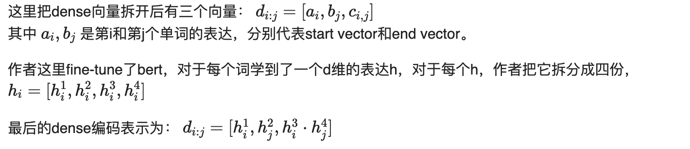

代码：https://github.com/uwnlp/piqa

## Motivation

传统的QA系统的劣势：

- pipeline结构，先要经过搜索，然后再经过RC抽取出答案。性能会受到搜索结果的上界影响。
- 阅读理解部分的bert模型的computationally cost很大

本文提出了 Dense-Sparse Phrase Index，一个indexable query-agnostic phrase representation model 。

这里为了消除pipeline结构，dense-sparse phrase index包含了dense vector和sparse vector。dense vector编码语法和语义特征，而sparse vector则编码词汇的term frequencies信息等。

这里phrase index我翻译过来大概是短语的索引，通过对短语进行索引，通过一个搜索，可以直接得出答案来。

下图左为传统的open-domain QA方法，右为phrase-index的方法。

## Problem Definition

## Dense 模型

## Sparse 模型

这里用了2-gram的tf-idf，大概是16M的维度。

## 搜索

这里要做最近邻搜索，通过[Faiss](https://github.com/facebookresearch/faiss)这个开源工具实现的。

这里搜索也不是直接按照dense搜索的，而是先搜索开始位置start vector ai , 对于每个开始，找到一个最好的结束位置。

## 实验结果

### SQuAD v1.1数据集

这个数据集比较小，作者直接没做搜索，在全局上面进行的answer抽取。
这里可以看到作者的方法比DrQA要好，比BERT差一些，但是速度分别是两种方法的6000倍和50万倍。

### SQuAD-Open

下面是正常的open-domain QA的数据集，对于其他方法，通过2-gram tf-idf抽取出结果，然后再做RC。这里可以看到作者的速度是其他方法的几十倍，而且效果也还行。

