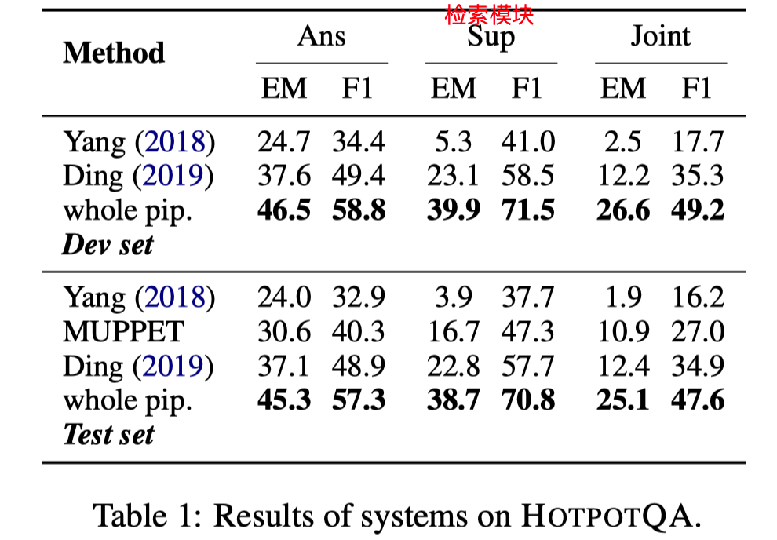
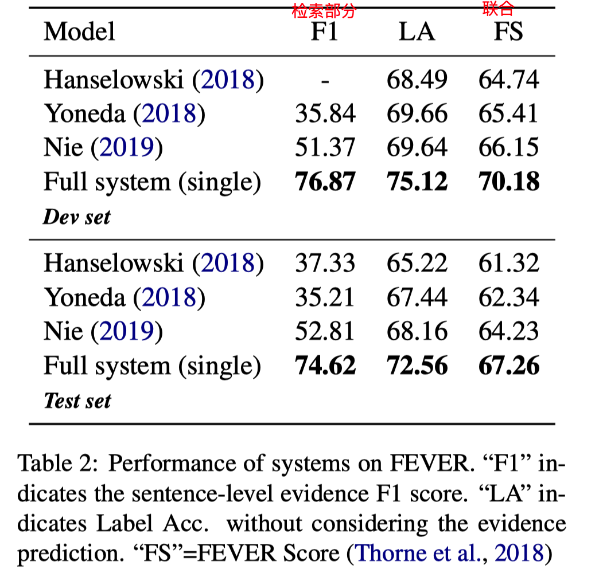
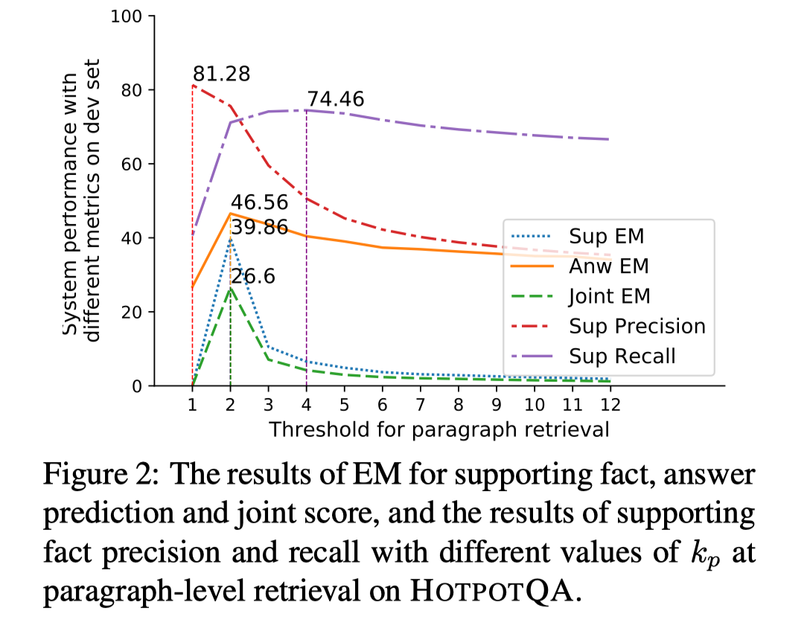
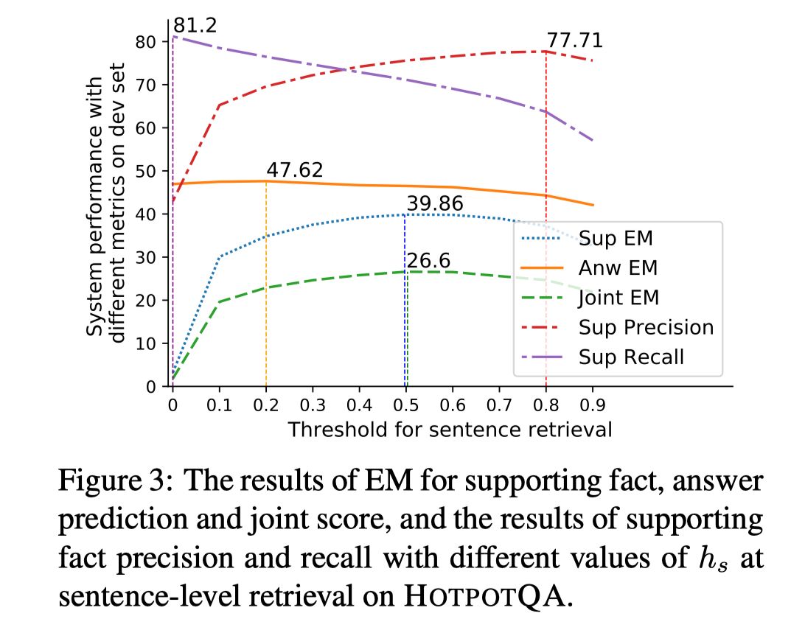
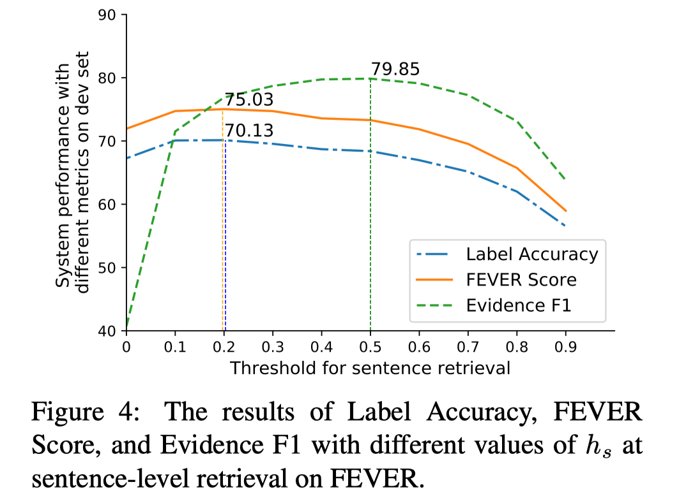

> >EMNLP2019

## 背景

本文提出目前很少有工作探究Mechine Reading at Scale（MRS）中retrieval module和reader module之间的关系。

在MRS中，中间的**语义检索**模块是很重要的，不仅可以对上游数据进行过滤，节省下游的计算成本；还可以shape 上游的数据分布，为下游建模提供更相关和高质量的数据。（目前在这一块的做法通常关注于尽力覆盖下游所需的信息，以便提高下游的性能上界，而不是找到更精确的信息。）

本文建立了一个pipeline系统，包括：

- term-based retrieval module
- 基于neural的 paragraph-level retrieval and sentence-level retrieval
- 基于neural的 下游任务模块

> 注：本文使用了 semantic retrieval 的概念。

## 方法

##### 问题描述

输入：query、外部知识源（Wikipedia）

输出：答案，supporting sentence

##### 整体模型

- term-based retrieval module

  基于TF-IDF 和 关键词匹配的方法 缩小相关段落的范围，得到候选集合。

- paragraph-level retrieval

  计算query 和每个候选段落的匹配度。选择超过规定阈值的topk个段落。

  （具体模型使用Bert_base，用cls处的表示通过一层全连接进行二分类。。。ground truth的段落是指包括数据集给定的evidence的段落。。损失函数用cross entropy loss）

- sentence-level retrieval

  把得到的段落打散，计算query和每个句子的匹配度。选择超过规定阈值的topN个句子 $S$。

  （具体模型使用Bert_base，用cls处的表示通过一层全连接进行二分类。。。ground truth的句子是数据集给定的evidence。。损失函数用cross entropy loss）

- 下游任务模块

  把得到的句子拼接起来，和query一起预测答案。

  （注：训练的时候，是把ground truth sentence和部分从 $S$ 中采样的句子一起拼接作为输入）

## 实验

##### 数据集

HotpotQA

FEVER：是一个事实验证的数据集，类似于给定一个句子，判断该句子是否是真的。将其形式化为NLI任务，即从外部知识源中检索一些supporting sentence，再进行推理判断。（数据集中给出了fact sentence，最后的判断结果是三分类）

##### 实验结果

1. 主实验

2. 选择的paragraph数的影响

   

   - 可以看出对reader部分和整体性能，是有峰值存在的，并不是越多越好

3. 选择的句子阈值的影响

   

   

   - 可以看出对reader部分和整体性能，是有峰值存在的，并不是越多越好，也不是recall/precision越大越好.

## 思考

- 首先肯定了semantic retrieval的作用很重要 （但是本文的做法依然使用term-based retrieval作为第一步）
- 其次从结果看，并不是检索部分的recall越大，后面reader的性能越好。。也说明我们还需要探索retrieval阶段和reader阶段性能之间的关系，找到其中最好的一个点。 