> > ACL2019

## 背景

- 长文本的阅读理解处理起来较为困难，去除信息过多会导致答案不可预见，去除信息过少则会造成计算复杂，文本冗余。
- 模拟人在阅读理解过程当中，反复的对文档和问题进行斟酌。

## 基本思路

- 提出一种**课程学习**的方法，让机器学会从简单到困难进行阅读理解，并且使用指针生成网络，即使答案未出现在文本当中，也能够很好的对其进行生成
- 使用Introspective Alignment Layer (IAL)**充分的融合对齐**，得到更深层次的语义信息

## 方法

##### 整体模型

主要包括三个部分，首先对故事去进行信息检索，将得到的内容和问题通过IAL reader模型，最后通过指针生成网络生成答案。

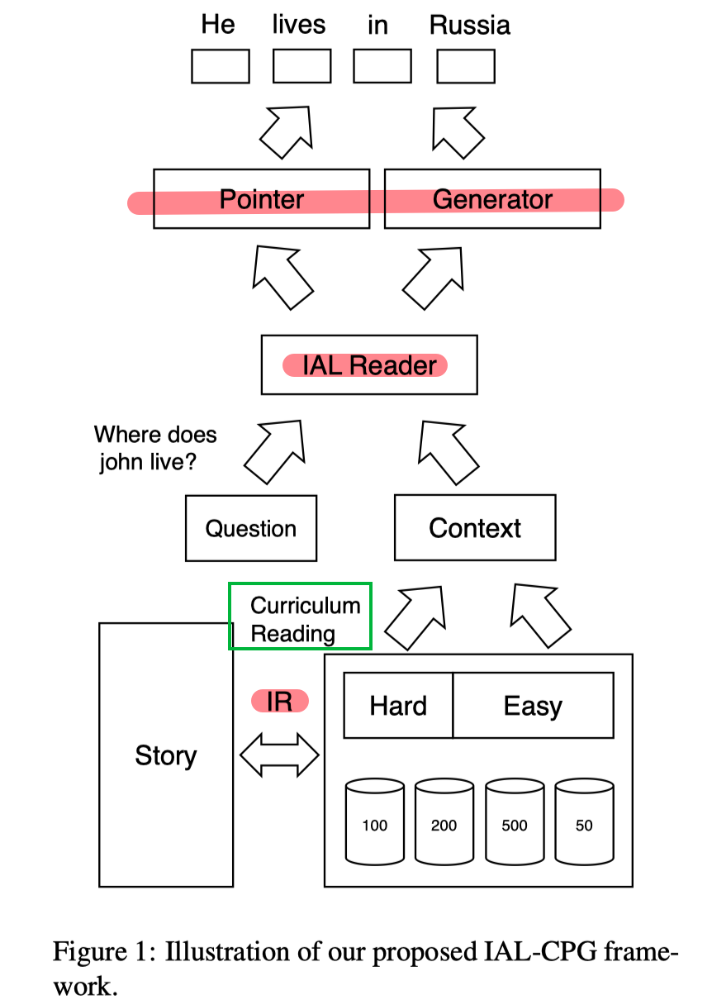

- IAL Reader

  输入是文档和问题，输出是生成的答案。

  首先经过LSTM得到文档和问题的表示:

  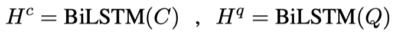

  通过一种对齐方式计算attention，F表示具有非线性激活函数的全连接层。然后得到融合了问题的文章表示$A$:

  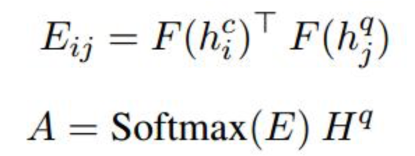

  引入Reasoning over Alignments，计算self-attention：

  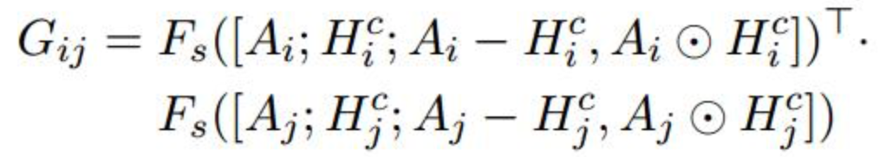

  随后进行一个基于block的局部self attention，考虑到文章的长度过长，经常可能会超过2000，如果对所有的tokens都进行self attention，那么必然会造成计算复杂度过大，因此加入限制 $|i-j| \leq b$（b是超参数，仅在限制范围内计算attention score）。因为之前在做attention的时候已经考虑了全局的信息，所以这个地方为了计算力，只在窗口内进行一个局部的self attention。

  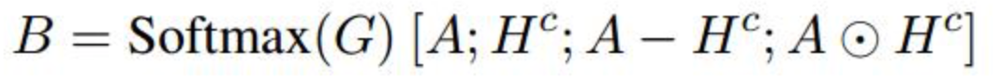
  
  最后再将得到的新的表示进行一个双向lstm得到最终的token级别的表示：
  
  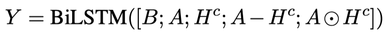

- pointer-generator Network

  在解码时刻，进行attention得到 $y_t$ ，

  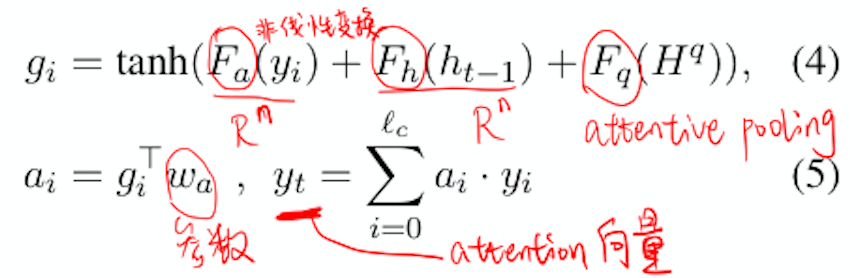
  
  解码：
  
  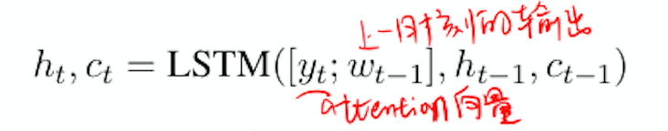
  
  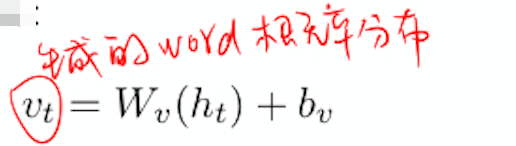
  
  copy机制：
  
  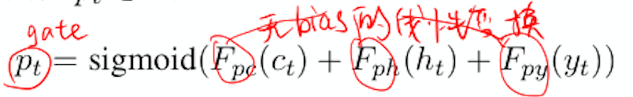
  
  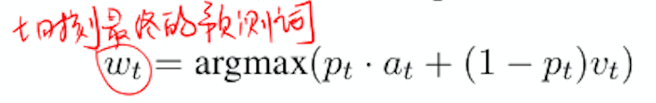

- 课程学习

  课程学习的目的就是让机器先从简单的开始进行学习，然后再复杂化。人在进行阅读理解的时候，可以先通过看答案，了解不同的问题所需要回答的答案的形式以及方法。随后再根据问题去文章当中寻找或者总结答案。

  本文提出两个过程，第1个过程就是可回答性，第2个过程是可理解性。

  - 可回答性：通过用答案去进行片段检索和用问题去进行片段检索，作为简单和困难的两个方面。对于一个sample来说，基于question抽取的就是hard setting；基于answer的则是easy setting。

  - 可解释性：依据document的长度来划分。预定义好的几个size={50,100,200,500}。

    对每个size，按照size划分corpus，然后用检索函数F分别得到easy和hard两个chunk，n表示chunk的大小。

    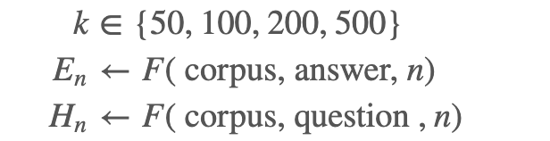

  具体训练过程：

  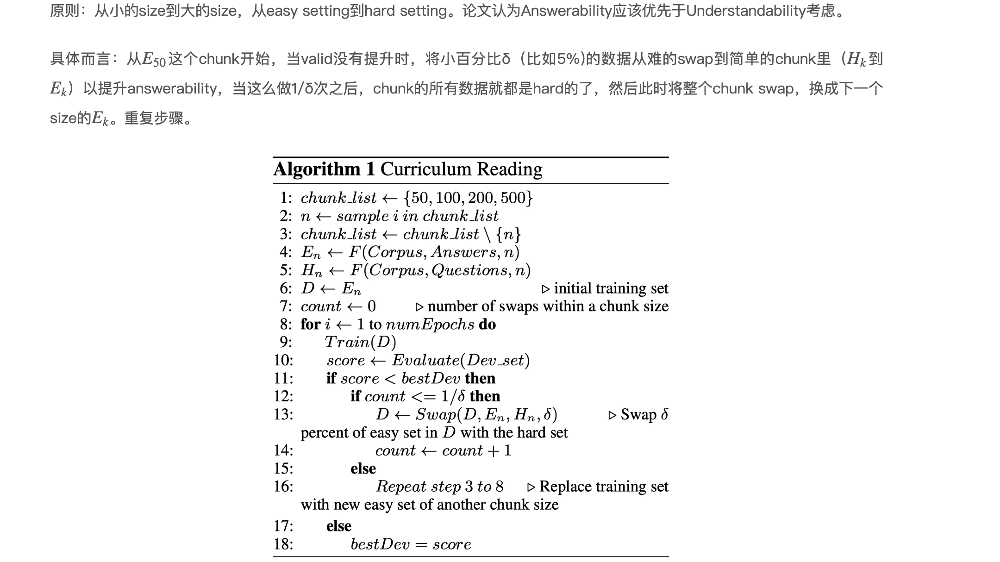

## 实验

数据集：NarrativeQA

结果：

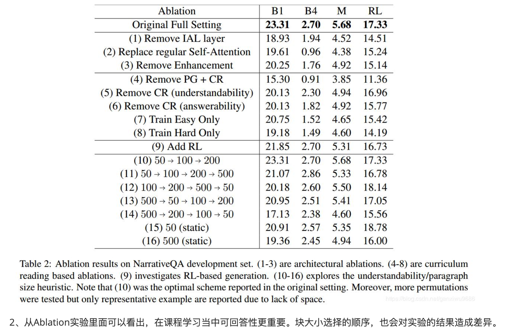

## 思考

- 这篇文章主要提出了用课程学习的方法，让机器能够循序渐进，从简单到困难的一个学习过程。
- 对文档和融合文档的问题的表示进行反复的融合，更充分的挖掘语义信息。
- 用生成方法去进行阅读理解，虽然能够解决oov的问题，也能够增加答案的多样性，但是生成的语言会存在流畅性和逻辑性的问题。

