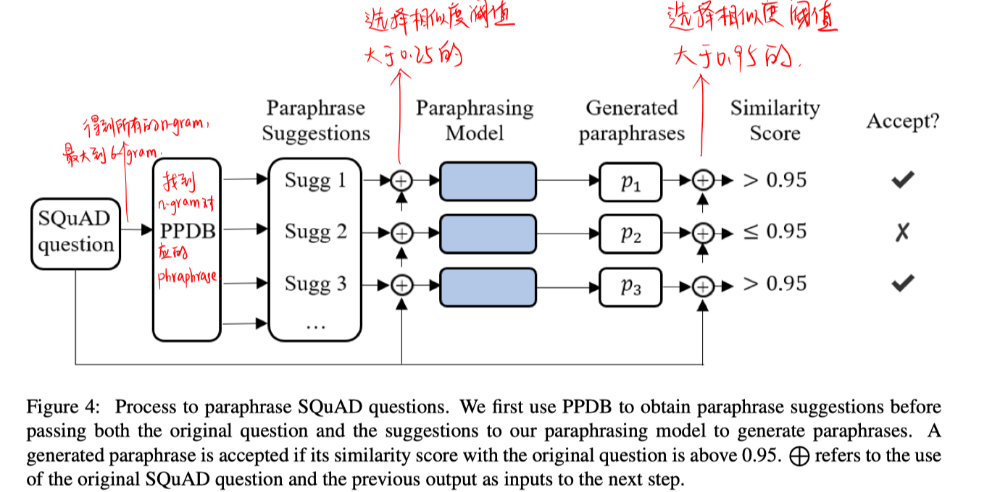
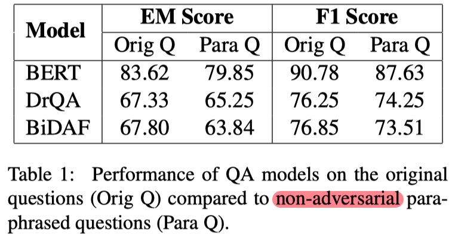
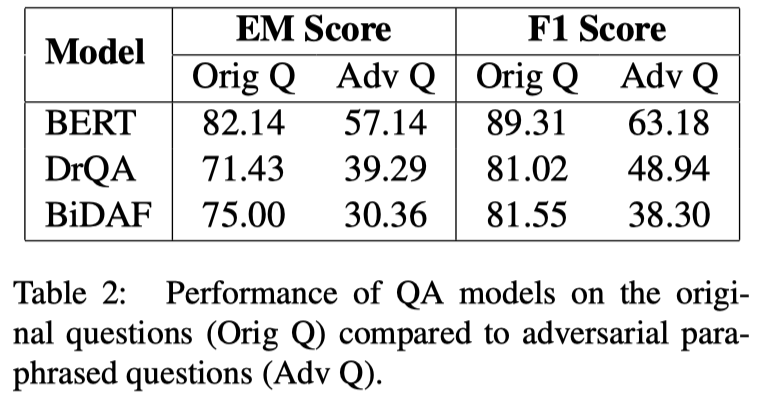
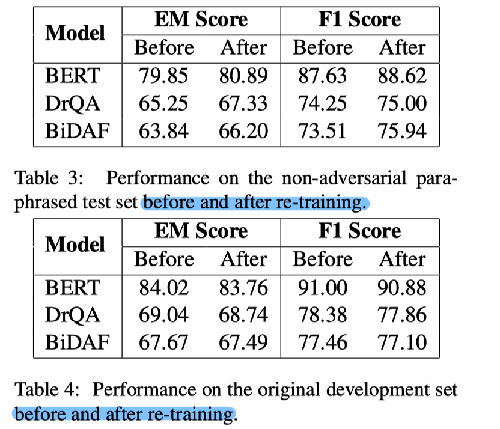
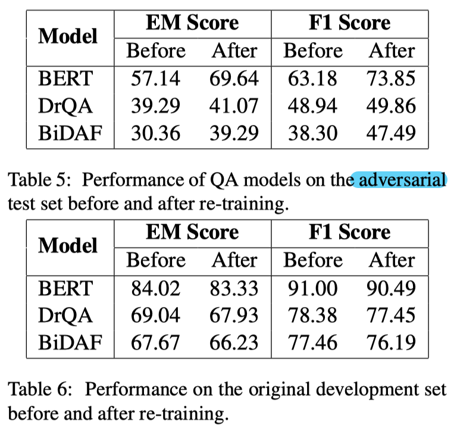

> > ACL2019，MRC，鲁棒性

新发布的数据集：https://github.com/nusnlp/paraphrasing-squad

## 背景

虽然目前QA系统有很大的进步，但其泛化性仍然有很大问题。

本文创建了两个包含paraphrased SQuAD question的测试集来探究QA模型的鲁棒性：1）非对抗测试集：第一个测试集是和原始问题很相似的，用于测试QA模型的over-sensitivity；2）对抗测试集：第二个测试集是使用不正确候选答案的上下文重写source question，用来扰乱QA模型。

本文提出使用一个neural paraphrasing模型，根据给定的source question和paraphrase suggestion生成paraphrased question，用作数据增强的方法来re-train QA模型，从而提高模型对question paraphrasing的鲁棒性。

## 方法

#### neural paraphrasing network

- 模型架构

  基于transformer的模型，decoder部分加入copy机制。

  输入形式：<suggestion><sep><source question>

- 训练数据集准备

  选自 WikiAnswer dataset 的 350000 question pair + 选自QQP dataset 的280000 question pair。

  对于来自 WikiAnswer dataset 的 question pair：进行短语对齐操作，选择出现在target question且不出现在source question的alignment pairs作为candidate suggestion集合。每个候选suggestion集合中选出一个suggestion构造<source question, suggestion, target question>训练样本。

  对于来自 QQP dataset 的 question pair：首先使用TextRank分别得到source question和target question中的关键词，suggestion即为排序最高的出现在target中且未出现在source中的关键词。

#### paraphrased SQuAD test set generation

- 非对抗的测试数据集生成

  

  根据图示步骤，对SQuAD开发集中的每个source question，生成多个paraphrased question。

  对于生成的paraphrased question，只有2个标注者都认为和原问题语义相同的，才被加入到test set。若一个原问题对应多个paraphrased question，则随机选择一个。最终得到**1062**个paraphrased question。

- 对抗的测试数据集生成

  选择和原问题正确答案的类型相似的不正确的候选答案，选择其附近的词来rewrite原问题。最终得到**56**个paraphrased question。

## 实验

数据集：在生成的两个数据集上进行实验

实验结果：

1. 在原问题和生成的2个测试集上的对比结果

   

   - 结果说明，QA模型的确鲁棒性较差。

2. 对SQuAD训练集中的原问题生成25000个非对抗数据集，和原问题一起训练模型

   

3. 对SQuAD训练集中的原问题生成25000个对抗数据集，和原问题一起训练模型

   

## 思考

1. 本文只是解决了在paraphrased question方面的鲁邦性，QA模型应该还存在其他方面的鲁邦性问题。