# 主要内容

#### 基础：（第2-4章）

1. RC问题的发展历史、形式定义、分类及评估指标
2. 阅读理解系统的关键部件
3. 目前的RC模型究竟学到了什么、还无法做到什么、未来的方向

#### 应用：（第5-6章）

1. 开放域问答
2. 对话式问答

# 第一章（引言）

# 第二章（概述）

#### RC任务的发展历史

1. 脚本框架

2. 基于规则的方法

3. 基于传统机器学习的方法（监督学习任务、统计模型）

   1）该阶段出现的数据集：

   - **MCTest（2013）**（4项选择的RC任务）
   - **ProcessBank（2014）**（二分类的RC任务）

   2）传统机器学习方法的缺陷：

   - 强烈依赖现有的语言学工具，例如依存分析、语义角色标注。由于这些工具的不完美型，容易在特征中引入噪声。
   - 很难去基于人进行阅读理解的角度构造特征。
   - 数据集太小，难以支持具有表达力的统计模型。

4. 基于neural models

   1）该阶段出现的数据集：

   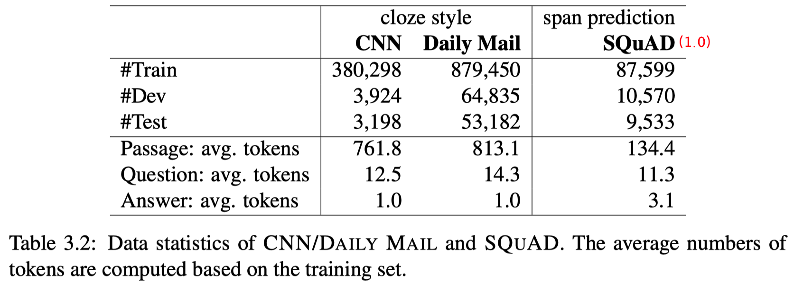
   
   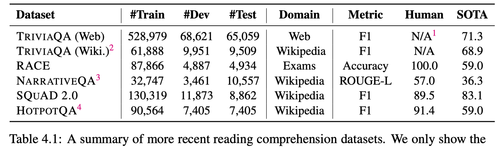
   
   - **CNN/DailyMail（2015）**（使用的是半自动的数据集构造方式：把新闻的一些子标题抠掉一个实体作为question，把对应新闻文本中的实体经过实体识别/共指消解后用占位符代替，以便模型能够真正的理解文本，而不是通过world knowledge或语言模型来得到答案。。。但是这种数据集构造方式的缺陷在于会由于共指消解错误等原因混入过多的噪声。）
   
   - **SQuAD（2016）**（数据集构造方式：在536篇wikipedia文章构造的107785个question-answer pair，问题是由众包产生的，每个问题的答案是对应passage中的一个片段。。。该数据集的缺陷在于问题一定是基于passage中的单个span可回答的，而且大部分问题非常简单，并不需要复杂的推理。）
   
   - **TriviaQA（2017）**（数据集构造方式：先收集问答对，再收集证据文本。Gathered 95k question-answer pairs from trivia and quiz-league websites and collected textual evidence which contained the answer from either Web search results or Wikipedia pages corresponding to the entities which are mentioned in the question. Totally collected 650k (passage, question, answer) triples in total. The passages used in this dataset are mostly long documents, the average document length is 2,895 words. 。。。但这种半自动的数据集构造方式也存在缺陷，there is no guarantee that the passage really provides the answer to the question and this influences the quality of the training data.）
   
   - **RACE（2017）**（数据集构造方式：中国初高中英语考试的阅读理解题，4项选择。26%的问题需要多个句子的推理)
   
   - **SQuAD2.0（2018）**（数据集构造方式：新增53775个不可回答的问题。）
   
   - **HotpotQA（2018）**（数据集构造方式：目的是构造需要多个支持文档的问题。由众包人员基于两个相关的wikipedia paragraph提出问题。一种设置是根据10个passage（2个相关，8个干扰）回答问题，另一种是开放域的，根据全wikipedia回答问题。）
   
   - **NarrativeQA（2018）**（数据集构造方式：由众包人员根据book或movie的摘要提问题，答案要求是自由形式的。一种设置是根据摘要（平均长度659）回答问题，另一种是根据全book或全movie的脚本（平均长度62528）回答问题。）
   
   - **MS MARCO（2016）、QAngaroo（2018）、MultiRC（2018）**
   
     > 这些新数据集带来的挑战：
     >
     > 1. 问题是独立于passage的
     > 2. 问题需要结合多个文档才能回答
     > 3. 问题是基于长文档、甚至整本书的
     > 4. 问题可能是基于passage不可回答的
   
   2）neural model的优势：
   
   - 不依赖于下游语言特征，所有的特征都是在端到端的框架下学习的。
   - 传统的符号式NLP系统容易遭受数据稀疏、泛化能力差的问题，但neural model基于word embedding可以通过相似词之间共享统计特性来缓解稀疏问题。
   - 省去了人工构造特征的劳力。

#### RC任务的分类（根据答案类型来分）

- Cloze style：答案是从预定义的集合或词典中选择的。

  代表数据集：CNN/DailyMail

- Multiple choice：正确答案是从给定的几个候选中选择的。

  代表数据集：MCTest、RACE

- span prediction：又称抽取式QA，答案是passage中的一个span。

  代表数据集：SQuAD、TriviaQA

- free-form answer：答案是自由形式的。

  代表数据集：NarrativeQA、MS MARCO

#### 评估指标

- 对于Cloze style 和 Multiple choice 类型的RC任务：Acc
- 对于span prediction类型：EM、F1（通常计算F1时会做词干化、去标点等操作）
- 对于free-form answer类型：BLEU、ROUGE、Meteor

#### RC任务和QA任务的区别

RC任务是QA任务的一个特例，但两者强调的重点不同。

1. QA任务可以依赖的资源包括结构化知识库、非结构化文本集合、半结构化表格等。QA系统需要关注的问题包括：1）如何搜索和识别相关的资源；2）如何根据不同的信息片段整合得到答案；3）研究哪类问题是真实世界中常问的。

2. RC任务更多的是强调对文本的理解，用回答问题的能力来作为衡量语言理解的一个标准。回答问题所用的全部信息都来自于passage本身。

#### RC领域数据集和模型的迭代发展历程

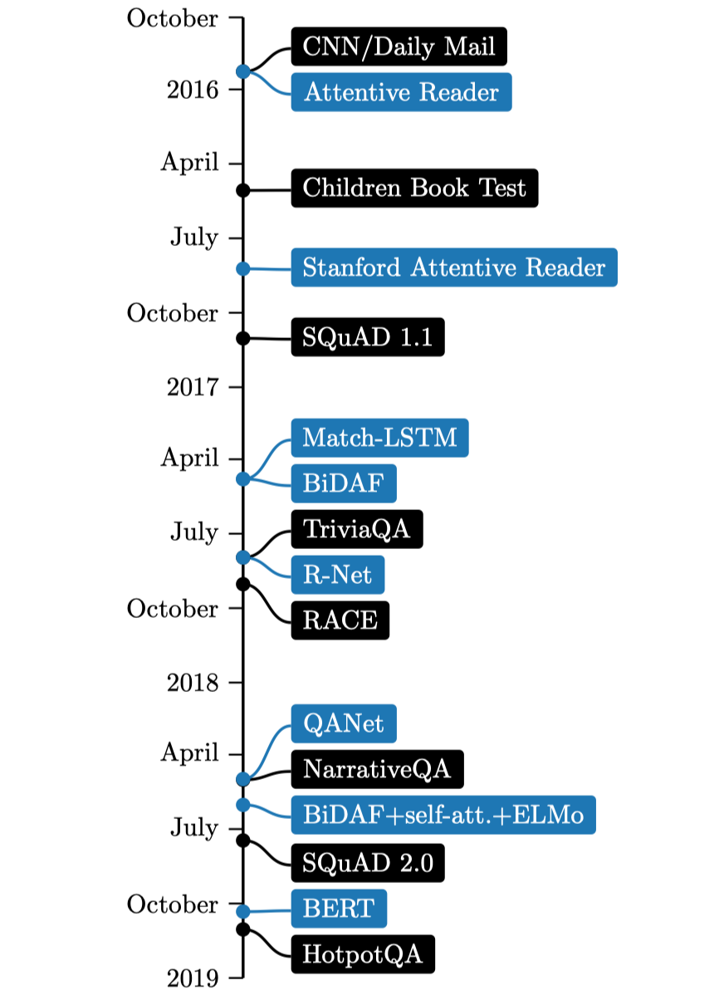

# 第三章（模型）

#### 基于特征的模型

这类模型的关键在于如何设置合适的特征向量，再用一些分类器进行判别。

- 以（陈，2016，[A Thorough Examination of the CNN/Daily Mail Reading Comprehension Task](javascript:void(0))）为例：主要是为了解决以CNN/DailyMail数据集为例的Cloze Style的RC任务。

- 针对SQuAD数据集（span prediction）提出的基于特征的模型：
- 针对TriviaQA数据集（span prediction）提出的基于特征的模型：
- 针对MCTest数据（多选类型）提出的基于特征的模型：

#### 基于neural的模型

- 以（陈，2017，DrQA[Reading Wikipedia to Answer Open-Domain Questions](javascript:void(0))）为例：主要为了解决以SQuAD数据集为例的span prediction的RC任务。
- 把该模型扩展到其他类型的RC任务上。

#### 实验及结果分析

- 实验结果

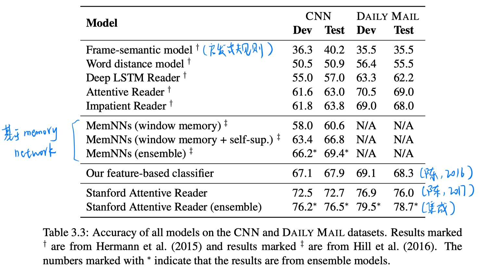

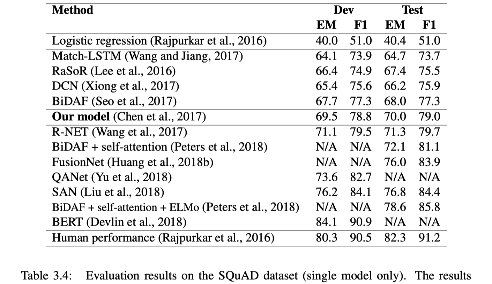

- 在CNN dataset上进行case study：
  - 只有2%的问题需要进行推理。
  - 在最简单和最复杂的情况下，基于特征和基于neural的模型没多大差别，关键区别在于第2类和第三类情况。基于neural的模型的确可以学到语义匹配或词汇的变体。

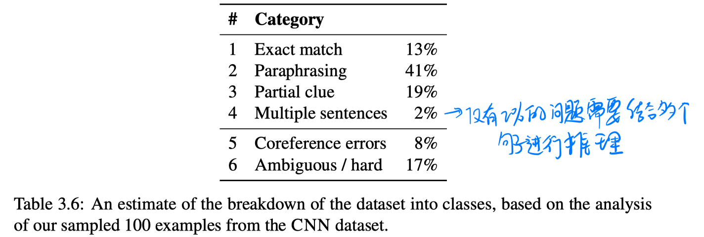

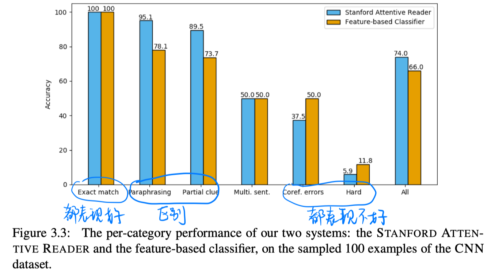

#### 一些可应用到RC任务的有效组件

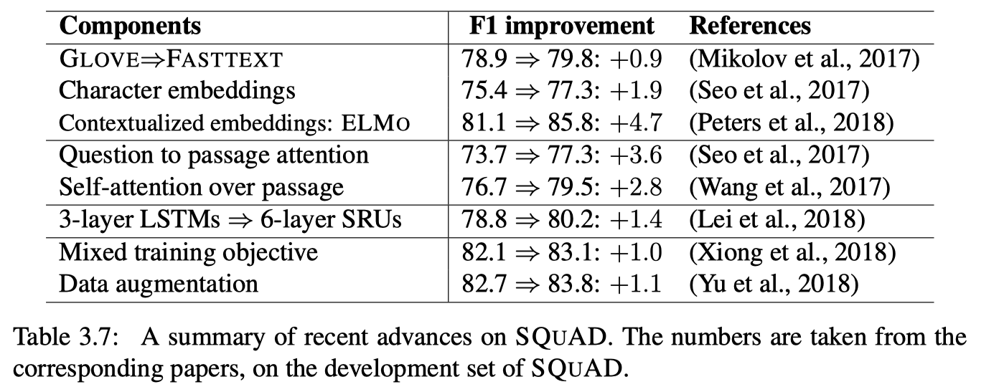

# 第四章（目前RC任务存在的问题及未来方向）

#### 目前的模型存在的问题

- 模型可以很好地判断答案类型，但无法真正理解文本的微妙内容，无法从几个候选答案中识别正确答案。
- 即使是最好的模型（BERT的集成），case study也发现了一些人不会犯的简单错误。猜测模型只是学到了复杂的文本匹配，并不能真正理解实体之间的内在结构和文本中表示的事件。
- 一些研究工作表明，通过增加人为扰动（在passage结尾加一个和question高度重合的句子，但不和正确答案冲突或误导人的理解），会使模型在SQuAD上的性能下降很严重。说明目前的模型只是强烈依赖于question和passage之间的词汇线索。对于对抗样本的鲁棒性很差。
- 只有当训练集和测试集同分布时，才能保证正确率。鲁棒性不够。

#### 目前的数据集存在的问题（以SQuAD为例）

- 问题是基于passage提出的，问题和passage存在大量重合的词。
- 大部分样本都是过于简单的，只需要很少的理解能力。单个支持句子就可以问题，不需要跨多个句子的推理。
- 问题要求是passage中的一个span可回答的，大部分问题都是事实型问题，而且answer一般都比较短。

#### 未来的方向

- 数据集：
- 模型
  - 速度和可扩展性：更快的训练和推断速度；扩展到长文本（目前的方法有，使用更快的网络结构，例如transformer；跳过部分文档；先检索一些相关的piece）
  - 鲁棒性：构造一些对抗训练样本；迁移学习和多任务学习
  - 可解释性：不仅提供答案，还提供evidence sentence，甚至背后的推理路径
- 其他
  - 可融合一些现有的NLP工具，显式融合文字的内部结构
  - 模块化的思想，而不是用一个巨大的模型解决所有推理类型的问题。
  - 预训练+复杂的模型结构
  - 无监督学习、迁移学习，更好地利用无标注文本

# 第五章（开放域QA）

#### 数据集

- TREC：Contains a total of 2,180 questions extracted from the datasets from TREC 1999, 2000, 2001 and 2002. All the answers are written in regular expressions.  只含问答对，不含passage。
- WebQuestions：This dataset is built to answer questions from the Freebase KB. It was created by crawling questions through the GOOGLE SUGGEST API, and then obtaining answers using Amazon Mechanical Turk。 含3K左右个train question，和2K左右个test question。只含问答对，不含passage。
- WikiMovies：Contains 96k questionanswer pairs in the domain of movies。只含问答对，不含passage。
- SearchQA（2017）：使用google搜索得到相关段落。
- Quasar-T（2017）：使用Lucene从ClueWeb搜索得到相关段落。
- TriviaQA（2017）：有开放域的设置，使用Bing检索相关段落。

#### 未来的方向

- 整合多个段落的证据：可以对各个段落抽取答案后再进行复杂的整合处理；或者先对相关段落进行rerank。
- 使用更多更好的训练数据：远程监督得到的样本中含有噪声（含有答案，但无法从段落中推断出答案），需要去噪处理；增加适当的负例（相关但不含答案）也可以提高系统性能。
- 使用可训练的retrieval模块：使用机器学习方法；联合训练retrieval和reader。
- 更好的reader模块
- 更多的分析：分析哪些问题表现的好，哪些仍然做不好。

 

# 第六章（对话式QA）

#### 数据集

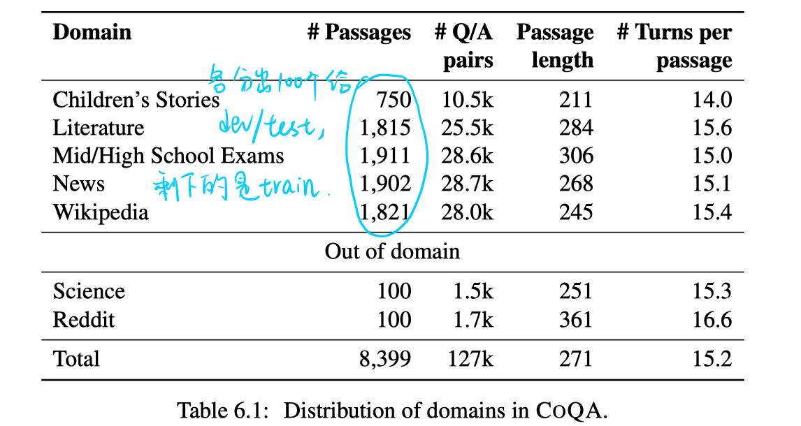

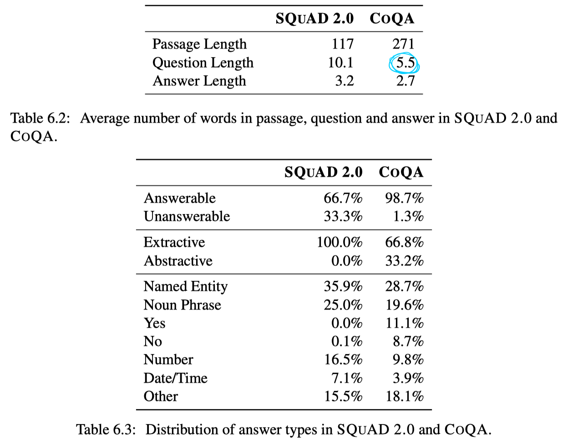

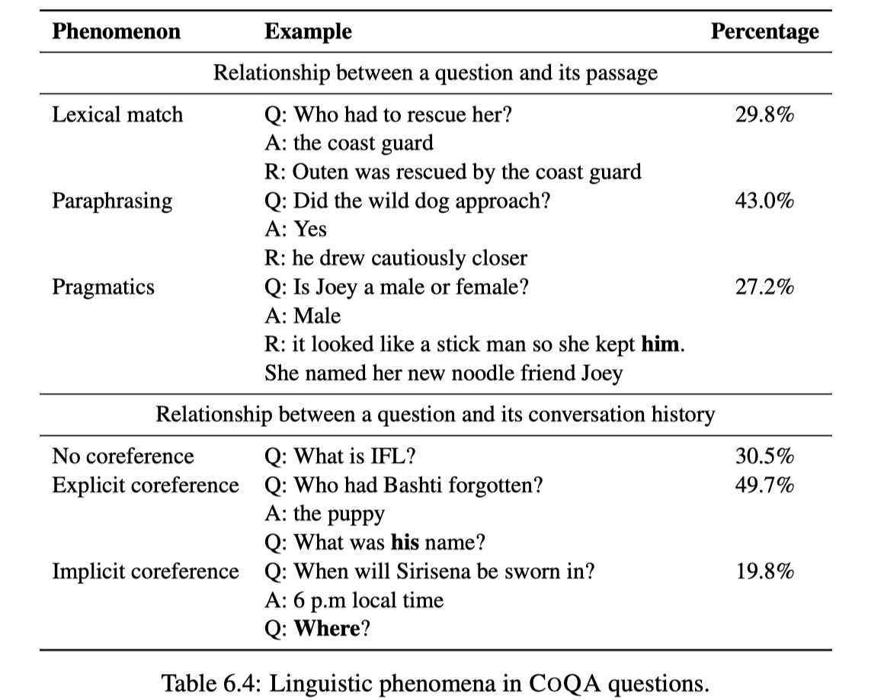

- CoQA：在train set中，除了提供answer外还提供了推理依据（passage中的span）。设计7个域，其中有2个仅用于test。question的类型更丰富。
- QuAC：平均answer长度为15.1，且限制为text span。
- Interpretation of natural language rules in conversational machine reading.（2018，EMNLP）：一个法律条文方面的数据集。answer被限制到yes/no。

#### 未来的方向

- 更复杂精巧的方式利用对话历史，而不是仅concat最近的几轮。
- 联合学习推理依据抽取和答案生成。如果先用基于RC的模型抽取span，再用seq2seq生成答案，可能会造成错误传递。
- 更充分地利用训练数据中的推理依据span。
- 其他新的数据集。

