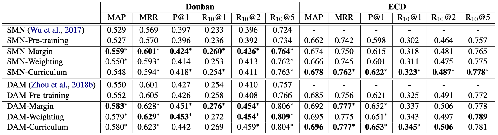

# [Dialog ACL2019]Learning a Matching Model with Co-teaching for Multi-turn Response Selection in Retrieval-based Dialogue Systems

```
论文作者：Jiazhan Feng, Chongyang Tao, Wei Wu, Yansong Feng, Dongyan Zhao, Rui Yan
论文单位：北京大学
论文地址：https://arxiv.org/pdf/1906.04413.pdf
代码地址：暂无
论文类别：方法
```

### Motivation-论文解决了什么问题

本文研究的问题是学习一个匹配模型，用于检索式多轮对话的回复选择任务。在该类任务中，通常负样本是自动构造的，因此会含有大量噪声，本文关键解决了如何从含有噪声的训练数据中学习一个鲁棒的匹配模型。

（核心在于提出新的模型学习方法，而不是提出一个新模型）


### Motivation-本文的方法思路

作者提出了一个通用的**co-teaching框架**，其中包含三个具体的teaching策略（teaching with loss functions 和 teaching with data curriculum）。在该框架下，同时学习两个具有独立训练集的匹配模型。在每次迭代中，一个模型将从其训练集中学到的知识传递给另一个模型，同时从另一个模型接收关于如何克服训练中的噪声的指导。通过这种student和teacher的模式，这两个模型可以互相学习，共同进步。


### Method-模型概述

**Co-teaching 框架**：


该框架中含有两个预训练的模型A和B，在每次的迭代过程中：

- 每一个batch的数据首先被随机平分为两个sub-batch  $\overline{\boldsymbol{D}}_{\boldsymbol{A}}$  和  $\overline{\boldsymbol{D}}_{\boldsymbol{B}}$ ；

- 然后模型A和B分别以 $\overline{\boldsymbol{D}}_{\boldsymbol{B}}$ 和 $\overline{\boldsymbol{D}}_{\boldsymbol{A}}$ 为输入，并分别输出 $\left(\widetilde{\boldsymbol{D}}_{\boldsymbol{B}}, \boldsymbol{J}_{\boldsymbol{B}}\right)$ 和 $\left(\widetilde{\boldsymbol{D}}_{\boldsymbol{A}}, \boldsymbol{J}_{\boldsymbol{A}}\right)$ ，其中 $\widetilde{\boldsymbol{D}}_{\boldsymbol{i}}$ 为训练数据， $\widetilde{\boldsymbol{J}}_{\boldsymbol{i}}$ 为loss；
- 最后模型A和B分别根据  $\left(\widetilde{\boldsymbol{D}}_{\boldsymbol{A}}, \boldsymbol{J}_{\boldsymbol{A}}\right)$ 和 $\left(\widetilde{\boldsymbol{D}}_{\boldsymbol{B}}, \boldsymbol{J}_{\boldsymbol{B}}\right)$ 来更新各自的参数。

> 以上只是一个通用框架，若想实例化，则需指定两个模型的初始化方式以及teaching策略。本文中假设模型A和B是在整个训练数据上经过了预训练的匹配模型，而且提出了以下三种teaching策略。


**Teaching 策略**：

$符号说明：c_*代表对话上下文，r_*代表候选回答，y_*代表候选回答对应的相关性标签。$

1. **Teaching with Dynamic Margins**

   输入数据为：
   $$
   \overline{\mathcal{D}}_{A}=\left\{\left(c_{A, i}, r_{A, i}^{+}, r_{A, i}^{-}\right)\right\}_{i=1}^{N_{A}} \\   \overline{\mathcal{D}}_{B}=\left\{\left(c_{B, i}, r_{B, i}^{+}, r_{B, i}^{-}\right)\right\}_{i=1}^{N_{B}}
   $$
   模型A对 $\overline{\mathcal{D}}_{B}$ 中的每个样本计算匹配值，为模型B建立一个margin：
   $$
      \Delta_{B, i}=\max \left(0, \lambda\left(s_{A}\left(c_{B, i}, r_{B, i}^{+}\right)-s_{A}\left(c_{B, i}, r_{B, i}^{-}\right)\right)\right)
   $$
   模型B同理， 对 $\overline{\mathcal{D}}_{A}$ 中的每个样本计算匹配值，为模型A建立一个margin：
   $$
      \Delta_{A, i}=\max \left(0, \lambda\left(s_{B}\left(c_{A, i}, r_{A, i}^{+}\right)-s_{B}\left(c_{A, i}, r_{A, i}^{-}\right)\right)\right)
   $$
   该策略规定 $\tilde{\mathcal{D}}_{A}=\overline{\mathcal{D}}_{A}$ , $\tilde{\mathcal{D}}_{B}=\overline{\mathcal{D}}_{B}$ 。
   
    更新阶段的loss函数为：
   
   $$
   \begin{aligned}
      \mathcal{J}_{A}=\sum_{i=1}^{N_{A}} \max \left\{0, \Delta_{A, i}\right.&-s_{A}\left(c_{A, i}, r_{A, i}^{+}\right) \left. +s_{A}\left(c_{A, i}, r_{A, i}^{-}\right)\right\} \\
      \mathcal{J}_{B}=\sum_{i=1}^{N_{B}} \max \left\{0, \Delta_{B, i}\right.&-s_{B}\left(c_{B, i}, r_{B, i}^{+}\right) \left. +s_{B}\left(c_{B, i}, r_{B, i}^{-}\right)\right\}
      \end{aligned}
   $$
   
2. **Teaching with Dynamic Instance Weights**

   > 该策略用权重惩罚低质量的负样例，被一个模型识别为假负例的样本会获得较小的权重，因此在另一个模型的优化过程中将较少地关注这些样本。

   输入数据为：
   $$
   \overline{\mathcal{D}}_{A}=\left\{\left(y_{A, i}, c_{A, i}, r_{A,i}\right)\right.\}_{i=1}^{N_{A}^{\prime}} \\
   \overline{\mathcal{D}}_{B}=\left\{\left(y_{B, i}, c_{B, i}, r_{B,i}\right)\right.\}_{i=1}^{N_{B}^{\prime}}
   $$
   模型A为 $\forall\left(y_{B, i}, c_{B, i}, r_{B, i}\right) \in \overline{\mathcal{D}}_{B}$ 计算权重：
   $$
   w_{B, i}=\left\{\begin{array}{ll}
   {1} & {y_{B, i}=1} \\
   {1-s_{A}\left(c_{B, i}, r_{B, i}\right)} & {y_{B, i}=0}
   \end{array}\right.
   $$
   同理，模型B为 $\forall\left(y_{A, i}, c_{A, i}, r_{A, i}\right) \in \overline{\mathcal{D}}_{A}$ 计算权重：
   $$
   w_{A, i}=\left\{\begin{array}{ll}
   {1} & {y_{A, i}=1} \\
   {1-s_{B}\left(c_{A, i}, r_{A, i}\right)} & {y_{A, i}=0}
   \end{array}\right.
   $$
   该策略规定 $\tilde{\mathcal{D}}_{A}=\overline{\mathcal{D}}_{A}$ , $\tilde{\mathcal{D}}_{B}=\overline{\mathcal{D}}_{B}$ 。

   更新阶段的loss函数为：
   $$
   \begin{aligned}
   \mathcal{J}_{A} &=\sum_{i=1}^{N_{A}^{\prime}} w_{A, i} L\left(y_{A, i}, s_{A}\left(c_{A, i}, r_{A, i}\right)\right) \\
   \mathcal{J}_{B} &=\sum_{i=1}^{N_{B}^{\prime}} w_{B, i} L\left(y_{B, i}, s_{B}\left(c_{B, i}, r_{B, i}\right)\right)
   \end{aligned} \\
   其中，L(\cdot, \cdot)\ 定义为\ cross\ entropy,\ 即 -y \log (s(c, r))+(1-y) \log (1-s(c, r))
   $$

3. **Teaching with Dynamic Data Curriculum**

   > 前两种策略是让两个模型分别评估对方的训练数据，并通过loss将soft label从一个模型传递给对方。该策略则是直接为每一个模型选择训练样本。

   $\mathcal{J}_{A}$ 和 $\mathcal{J}_{B}$ 定义为 cross entropy。

   该策略选择small-loss instances来构建 $\tilde{\mathcal{D}}_{A}$ 和 $\tilde{\mathcal{D}}_{B}$ ，这些样本远离两个模型的决策边界，因此更可能是真正例和真负例：
   $$
   \begin{aligned}
   &\tilde{\mathcal{D}}_{B}=\operatorname{argmin}_{\left|\tilde{\mathcal{D}}_{B}\right|=\delta\left|\overline{\mathcal{D}}_{B}\right|, \tilde{\mathcal{D}}_{B} \subset \overline{\mathcal{D}}_{B}} \mathcal{J}_{A}\left(\tilde{\mathcal{D}}_{B}\right)\\
   
   &\tilde{\mathcal{D}}_{A}=\operatorname{argmin}_{\left|\tilde{\mathcal{D}}_{A}\right|=\delta\left|\overline{\mathcal{D}}_{A}\right|, \tilde{\mathcal{D}}_{A} \subset \overline{\mathcal{D}}_{A}} \mathcal{J}_{B}\left(\tilde{\mathcal{D}}_{A}\right)\\
   \end{aligned} \\
   
   其中，|\cdot|表示数据集的大小；\mathcal{J}_{*}\left(\tilde{\mathcal{D}}_{*}\right)是在对应数据集上的loss累加；\delta是超参数，用来衡量数据集的大小。
   $$


### Experiment-实验

**数据集**：Douban Conversation Corpus（Douban）、E-commerce Dialogue Corpus（ECD）

**使用的匹配模型**：[SMN](https://arxiv.org/pdf/1612.01627.pdf)，[DAM](https://www.aclweb.org/anthology/P18-1103.pdf)

**实验一**：（模型A和B由同一个模型进行初始化）



- Douban数据集是随机选择负例，ECD数据集是通过检索选择负例，有可能包含较多的假负例，因此对于ECD，"hard data filtering"比"soft labeling"更有效。


- 上图说明，使用三种策略中，两个模型的确可以”互相学习，共同进步“。

**实验二**：（模型A和B分别用DAM和SMN进行初始化）


- 实验结果表明，co-teaching依然有效，但是用不同的模型进行初始化比用同一模型初始化所带来的提升较少。原因可能是更强的模型不能很好地由更弱的模型来教导，特别是使用soft label策略时，导致也无法传递更多的知识给更弱的模型。

**实验三**：（超参数的影响）


- 实验结果表明，学习策略对超参数的选择比较敏感。较小的 $\lambda$ 导致正常的和噪声的样本在训练中margin差别不大；较大的 $\lambda$ 又会导致"soft labels"引入的错误被放大。较小的 $\delta$ 意味着较少的数据被用于训练；较大的 $\delta$ 可能会训练中引入了更多的噪声样本。


### Highlight

- 本文提出了co-teaching的架构，两个模型之间可以互相传递知识，互相指导，从而达到对噪声数据更鲁棒的效果。
- 该论文是我一个本科学弟在**大四期间**发表的工作。