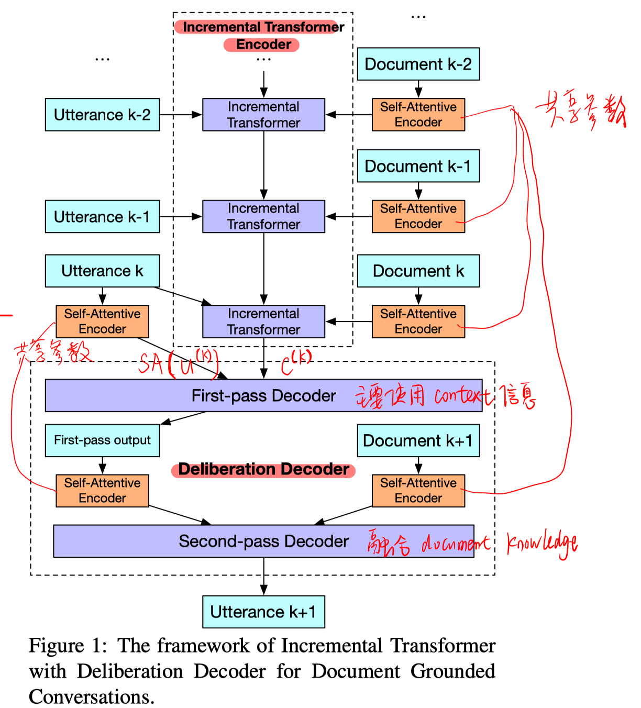
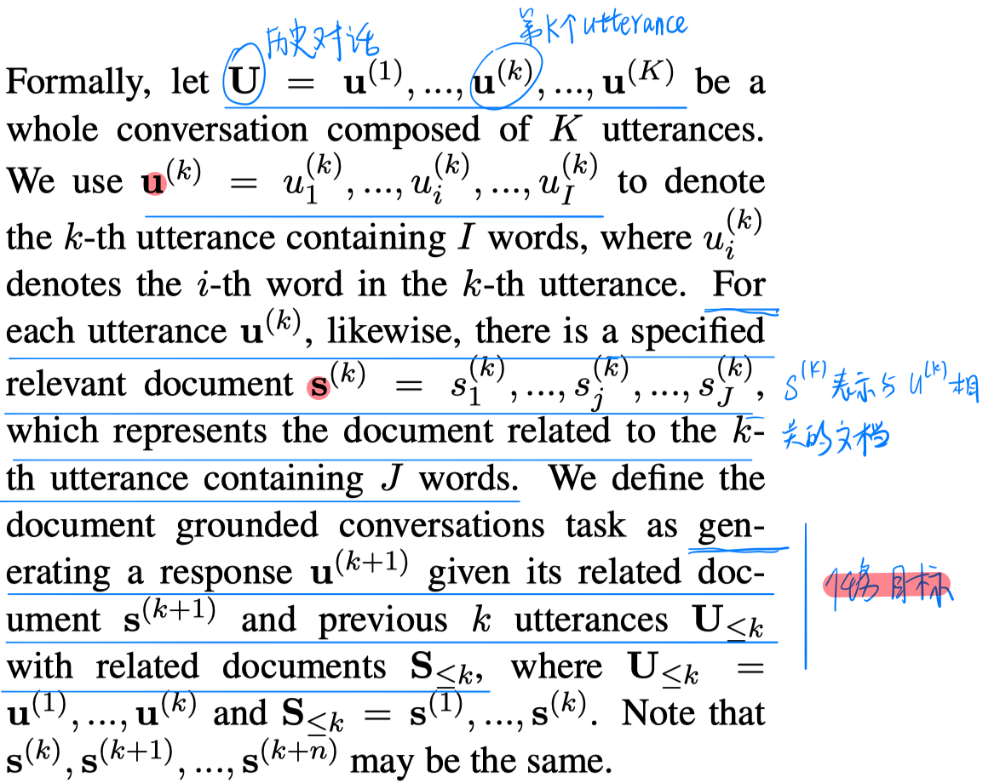
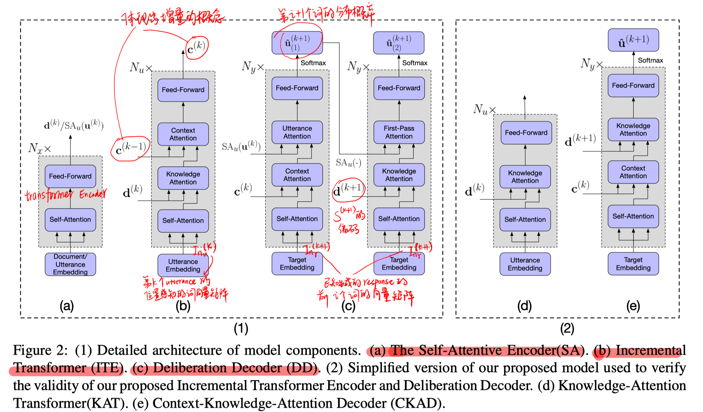
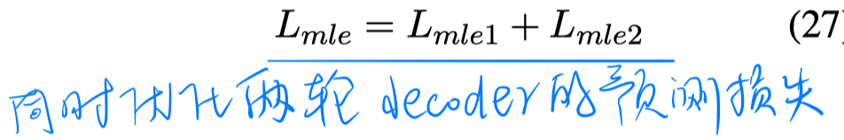
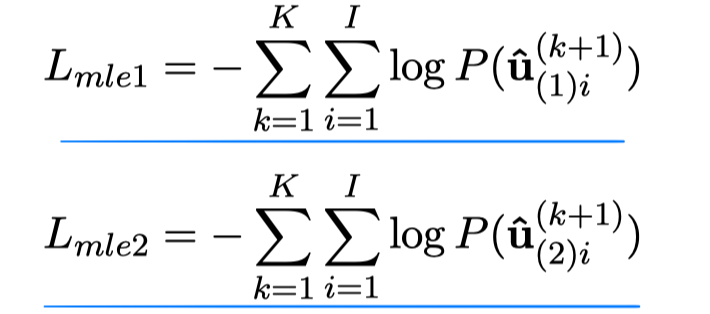
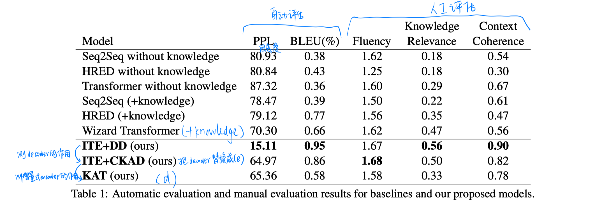
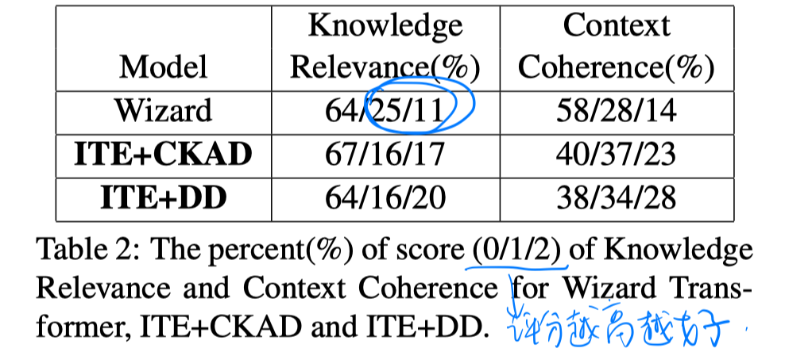

> > ACL2019

源码：https://github.com/lizekang/ITDD

## 背景

本文针对的任务是Document Grounded Conversation，该任务是要求对话的内容是给定的文档集合情况下，生成response。该任务要求生成response时需要融合Document中的知识以及历史对话。

本文提出了Incremental Transformer with Deliberation Decoder模型：

- Encoder：用Transformer增量式地编码多轮历史对话，并把Document Knowledge融合进编码中。
- Decoder：两段式地解码过程。第一轮解码主要考虑上下文的连贯性，第二轮解码主要是通过考虑相关的Document Knowledge来进一步改善第一轮的解码结果。

## 方法

##### 整体模型框架

##### 问题定义

##### 三个主要模块

##### 损失函数

## 实验

##### 数据集

一个Document Grounded Conversations Dataset数据集

##### 结果

- 第一轮的编码结果类似ITE+CKAD，说明第二轮编码可以很好地利用Document Knowledge，大量地降低了困惑度。
- 两段式的解码过程可以提高Knowledge correctness，更好地指导接下来的对话。
- ITE+CKAD相比KAT，除了在困惑度的其他指标上都提高了很多，说明增量式编码的有效性。
- Wizard Transformer的Knowledge relevance指标上，score为1的是score为2的两倍，说明简单地把Document和utterance拼接起来并不能很好地利用Document knowledge。

## 思考

增量式编码和两段式解码的思路都值得借鉴。