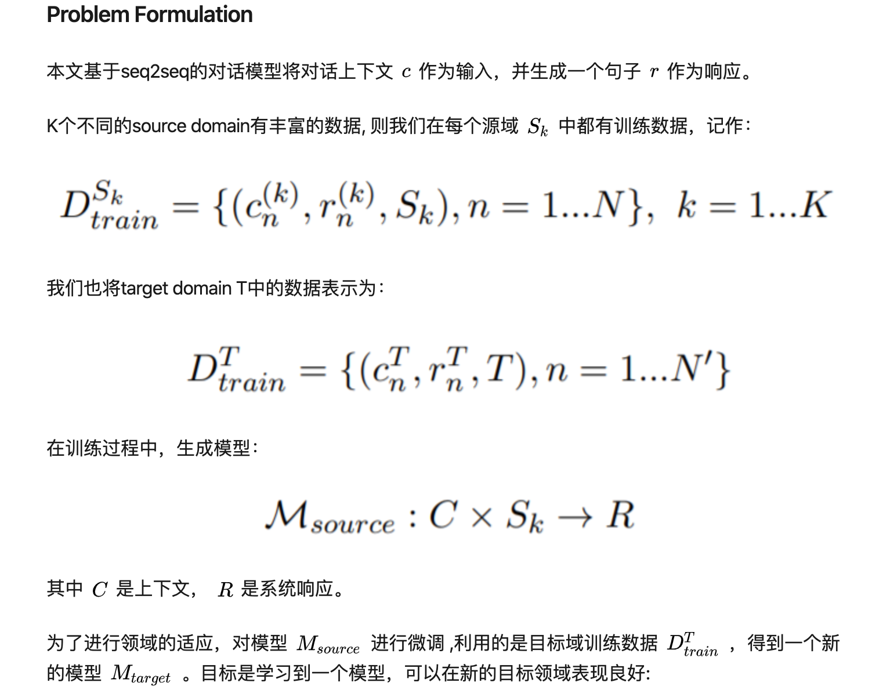
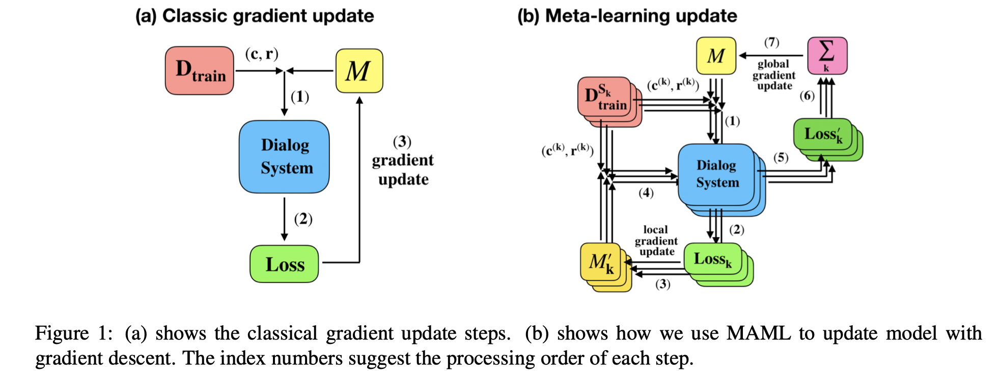
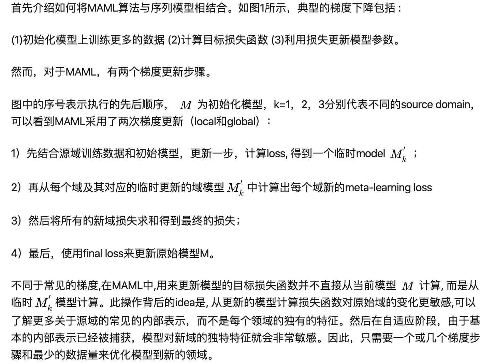
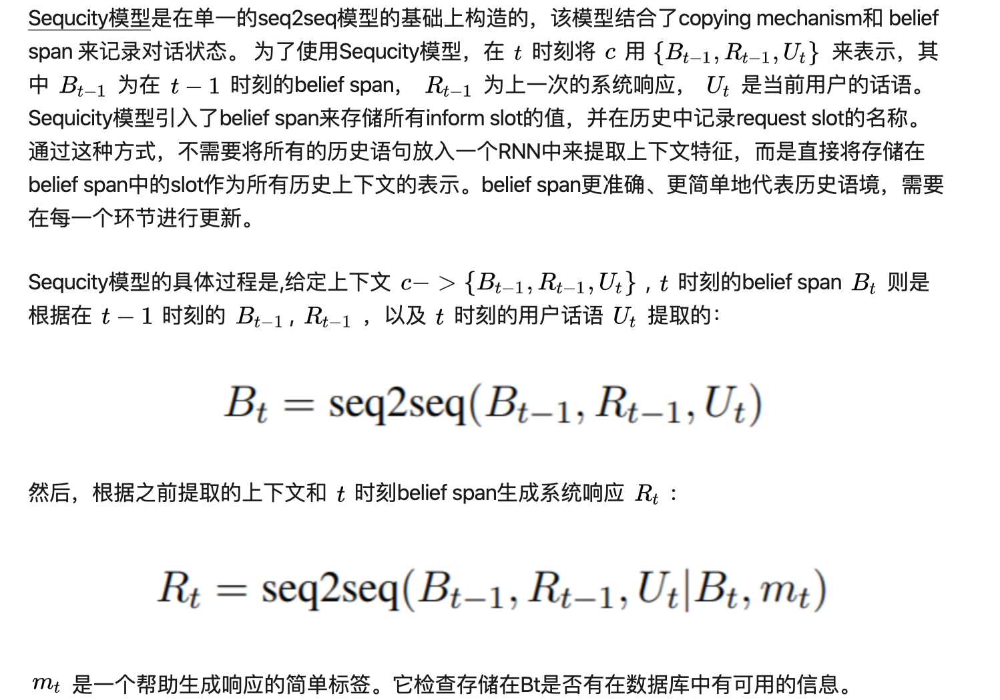
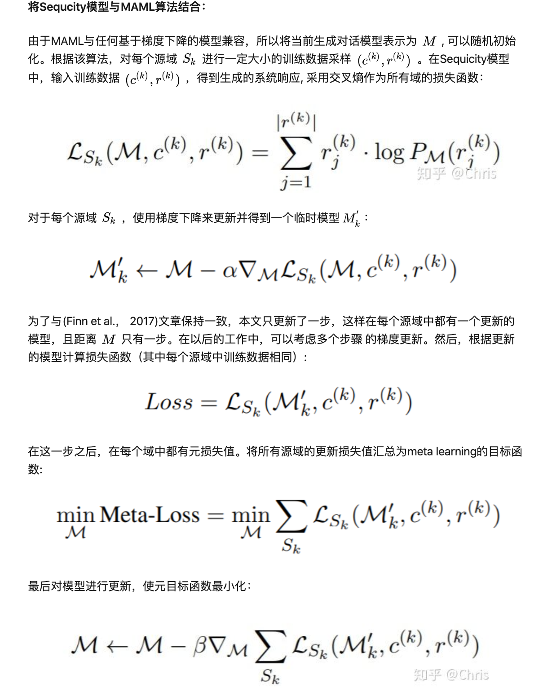
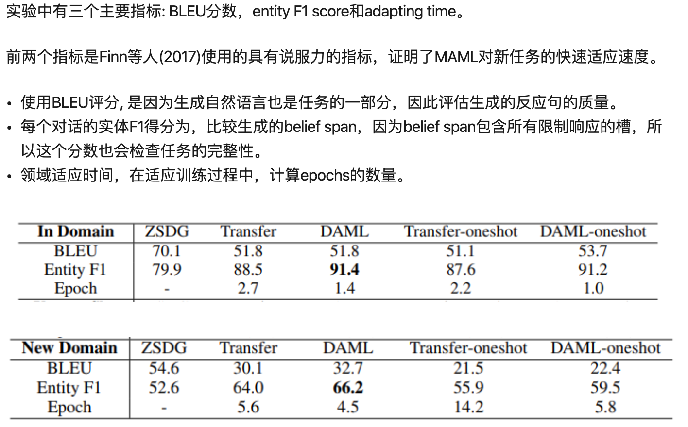

> > ACL2019，元学习，response生成

## 背景

领域适配是对话系统中的一项重要任务，现有解决方法包括Transfer learning、few-shot learning、meta-learning等。

> **meta-learning** 即元学习，也可以称为“**learning to learn**”。常见的深度学习模型，目的是学习一个用于预测的数学模型。而元学习面向的不是学习的结果，而是学习的过程。其学习的不是一个直接用于预测的数学模型，而是学习“如何更快更好地学习一个数学模型”。
> **MAML** （[model-agnostic meta-learning](https://link.zhihu.com/?target=https%3A//arxiv.org/pdf/1703.03400.pdf)）的思想在于学习一个好的初始化权重，从而在新任务上实现fast adaptation，即训练好的模型能够在小规模的训练样本上迅速收敛并完成fine-tune。MAML算法试图建立多任务的通用内部表示，并在应用于新任务时最大限度地提高损失函数的灵敏度，从而当参数有微小的更新能够极大地提高新任务的损失值。这也使得对话系统不仅是只需要较少的目标域数据，而且能够以更有效的方式成功地适应新的领域。

本文提出了**基于元学习的领域自适应对话生成方法**（DAML）。它是一个端到端的对话系统，先在几个数据资源丰富的源域上进行训练，然后再迁移到只有少数训练样本的目标域中。

## 方法

##### **基本思路**

通过更改seq2seq编解码器网络模型 [Sequicity](https://link.zhihu.com/?target=https%3A//www.comp.nus.edu.sg/~kanmy/papers/acl18-sequicity.pdf)，对其两阶段的CopyNet进行改进，通过实现MAML算法，使用源域的对话数据来实现最优初始化。然后使用常规梯度下降，用最少的对话框数据对目标域的初始化进行微调。最后，利用目标域的测试数据对自适应模型进行了评价。本文超越了最先进的zero shot的基线，[ZSDG](https://link.zhihu.com/?target=https%3A//arxiv.org/pdf/1805.04803)(Zhao and Eskenazi, 2018)，以及其他迁移学习方法。

##### 问题形式化

##### 模型

接下来具体描述MAML算法和Sequicity模型结合的实现细节。如算法1所示，Sequicity模型以seq2seq的方式将自然语言理解、对话管理和响应生成结合起来，而元学习是一种调整损失函数值以实现更好优化的方法。

## 实验

##### 数据集

SimDial：总共有6个对话域:restaurant、weather、bus、movie、restaurant-slot和restaurant- style，本文选择restaurant、weather、bus作为源域，对于每个源域，有900、100、500个对话分别对应训练、验证和测试，每个会话有9个回合。其余三个域用于评估，它们被视为目标域。生成9个对话(占源域的1%)对每个域进行适应训练(fine tune)，平均每个域包含约8.4轮。对于测试，为每个目标模型使用500个对话, 其中选择Movie作为新的评价目标域。

##### 结果

## 思考

- 本文提出了一种基于元学习的领域自适应对话生成方法。构建了一个端到端可训练的对话系统，该系统利用两步梯度更新来获得对新领域更敏感的模型。

- 本文的方法相当于对 Sequicity 模型实行模型不可知的元学习训练方法。

