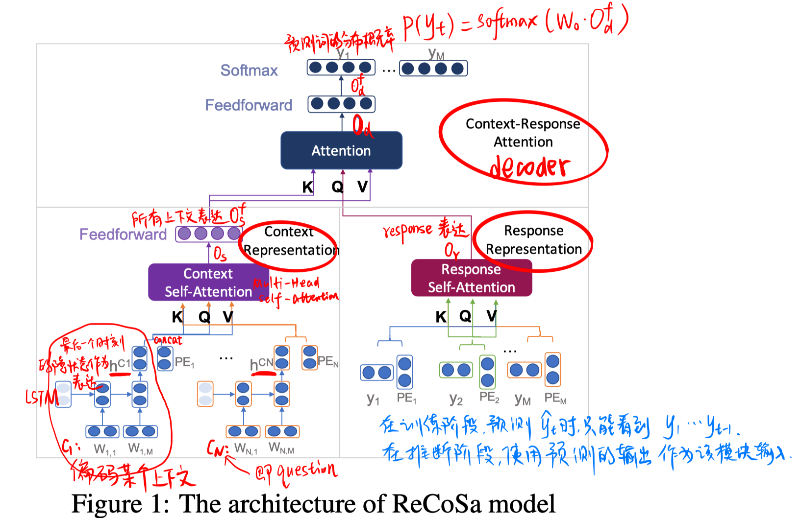
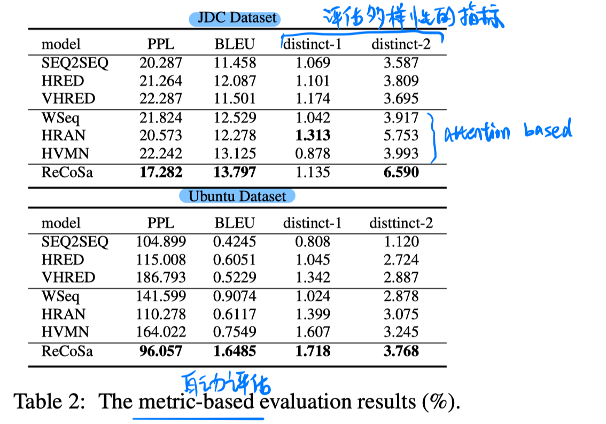
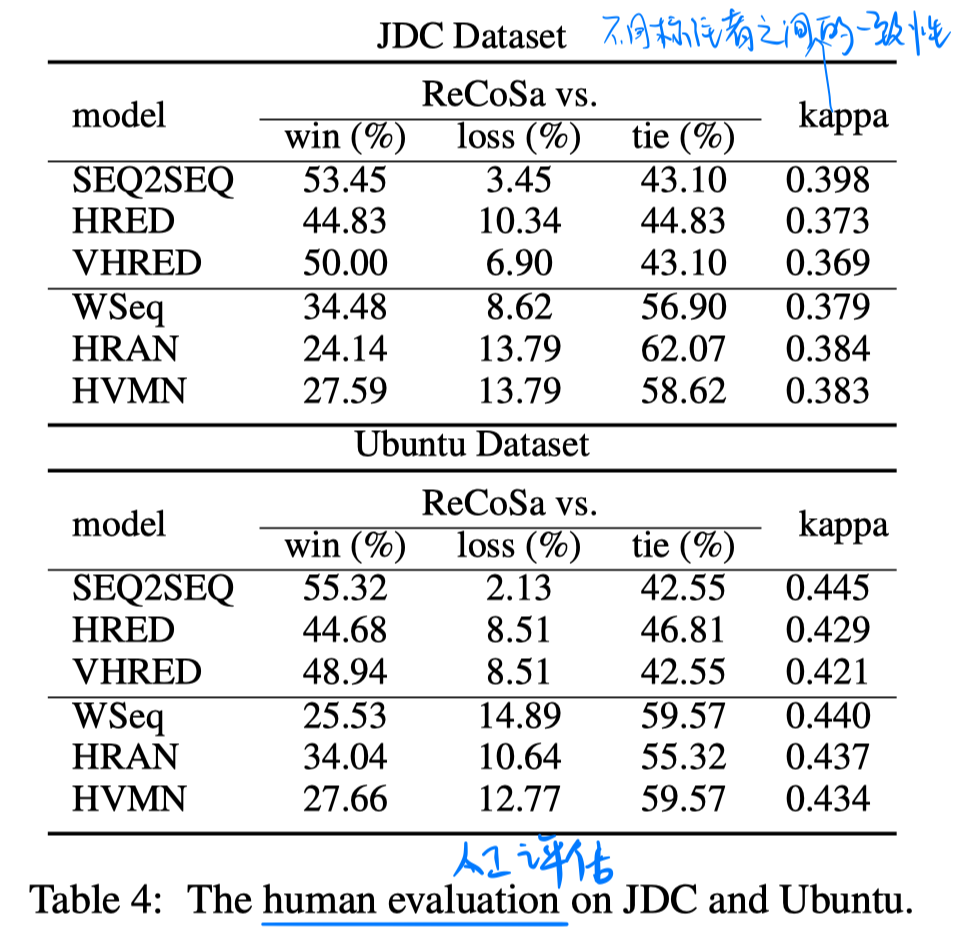
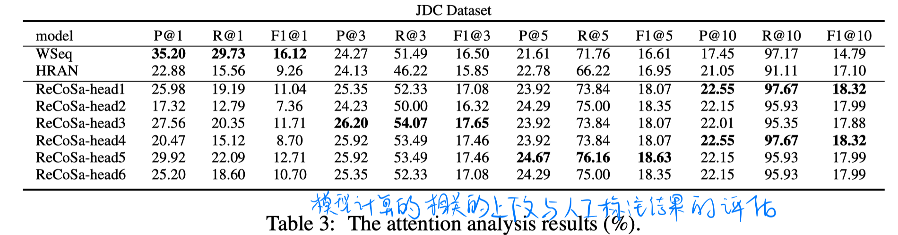

> > ACL2019，response generation，ReCoSa模型

源码：https://github.com/zhanghainan/ReCoSa

## 背景

在多轮对话的response generation任务中，response通常只跟少部分上下文相关。一个好的模型应该能够识别出相关的上下文，并生成合适的回答，否则不相关的上下文反而会引入噪声。比如层级的基于RNN的Encoder-Decoder模型（HRED模型）把每个上下文视为相同的重要度，这会影响后续的response生成过程。

为了解决以上问题，目前的一些尝试包括：

- 计算question和每个上下文的相关性，但是他们两者的相关性并不等价于response和每个上下文的相关性，所以这个假设是不合适的。
- 在RNN的Encoder-Decoder架构中引入attention机制，但是RNN模型本身存在position bias。

本文提出了**ReCoSa模型**来解决该问题。该模型的核心思想是，使用self-attention机制计算response和每个上下文的相关度，而且可以捕捉长期依赖关系（即response和较久远之前的context相关）。

## 方法

##### 整体模型

- context representation encoder
  - 基于LSTM的 word-level encoder，把每个上下文编码成一个固定长度向量
  - 一个multi-head self-attention模块，把各个上下文的表达及其位置编码作为输入，输出context representation
- response representation encoder
  - 一个multi-head self-attention模块，把masked response的词编码和位置编码作为输入，输出response representation
- context-response attention decoder
  - 一个multi-head self-attention模块，把context representation和response representation作为输入，输出解码结果。

## 实验

##### 数据集：

京东比赛的对话数据集、Ubuntu

##### 结果：

## 思考

