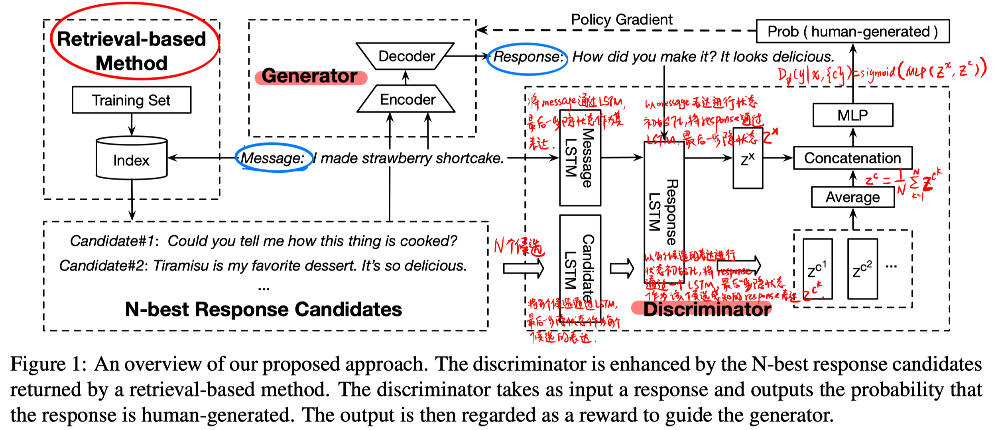
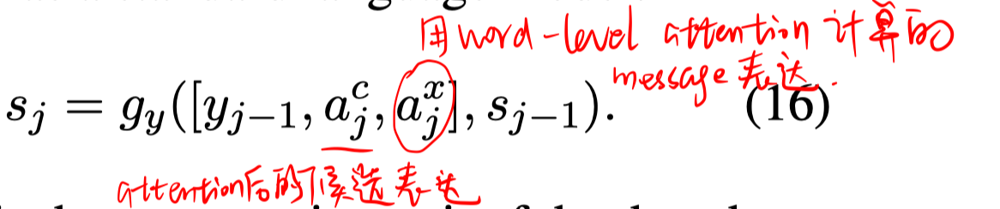
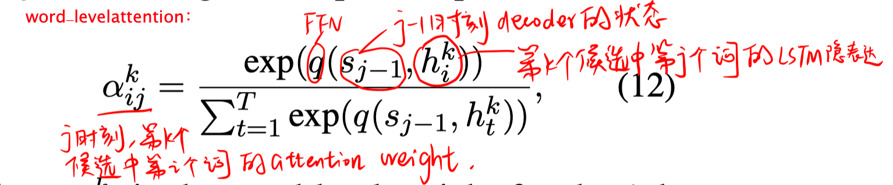
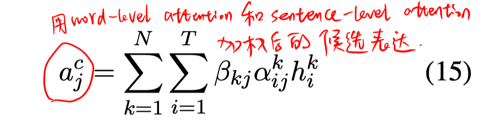
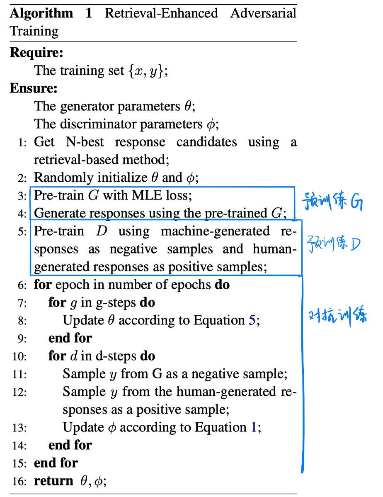
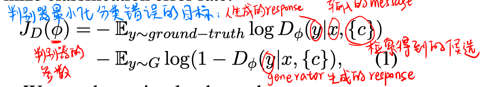
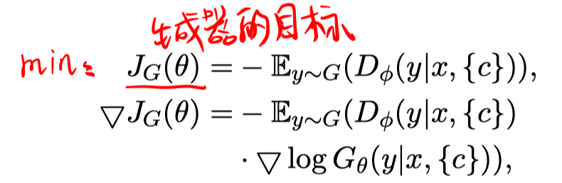
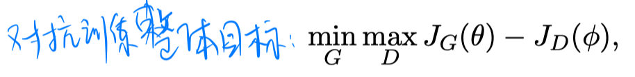
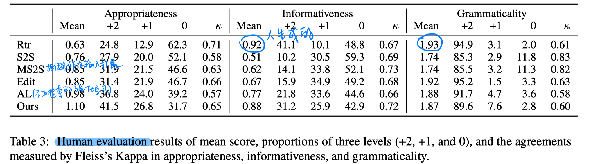
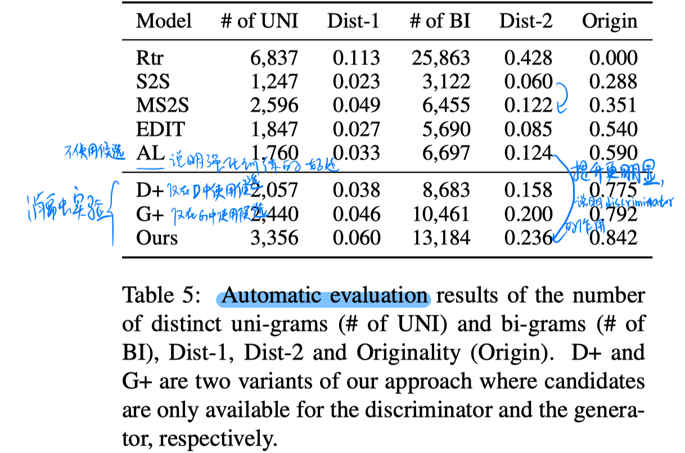

> > ACL2019

## 背景

对话系统一般分为生成式的和检索式的，很少有人考虑结合两者的优势。

- 检索式方法的response是人事先写好的，比较有多样性和信息性。但是由于response需要事先准备好，所以可能无法与新输入的question非常相关。
- 生成式方法的诟病在于生成的response可能比较通用，不够多样性和信息性

在检索得到的response候选中，除了不相关的部分，其他的部分是非常具有多样性的。因此，它可以成为一个很好的信息源，来帮助生成合适的有信息性的response。

过去的方法中，有人提出用检索得到的N-best response candidate来扩展seq2seq的输入，但是目前的方法都没有充分利用其中富含的信息。

本文提出 **Retrieval-enhanced Adversarial Training 模型**来进行response生成。它利用一个seq2seq的架构和对抗训练方法，同时也利用<u>检索系统</u>得到的N-best response候选来构建discriminator，来更充分地利用N-best response候选信息。 

## 方法

##### 整体模型

- retrieval -based mothod：对一个message，前检索得到topK候选，然后rerank得到top2作为最终候选。

- generator：

  - Encoder：对每个候选和message分别通过一个BiLSTM

  - Decoder：

    

    

    

    

- discriminator：具体步骤如图。目标是判别 $y$ 是人生成的还是generator生成的。

##### 训练过程

- 预训练：generator 和 Discrimination 都先进行预训练。

- 对抗训练：

  

  

  

​     

## 实验

##### 数据集

NTCIR corpus，来自新浪微博的数据

##### 结果

## 思考

- 采用 retrieval enhanced 的方式，可以利用一些外在资源
- 设计的对抗训练的方式可以更充分利用外在资源

