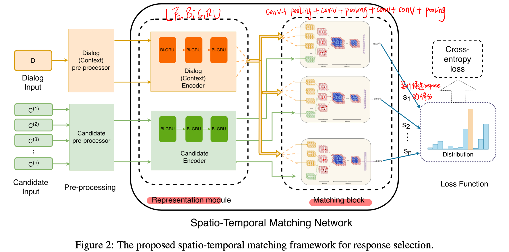
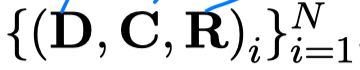
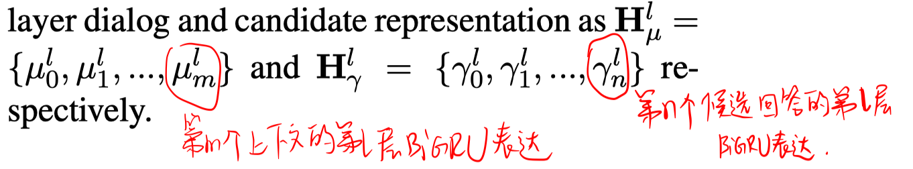
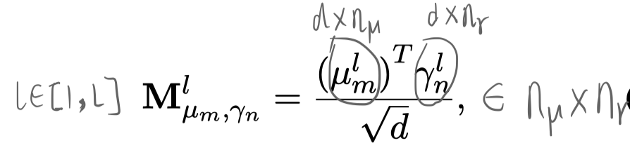
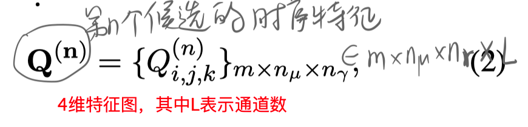
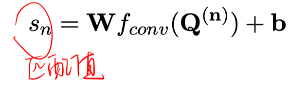
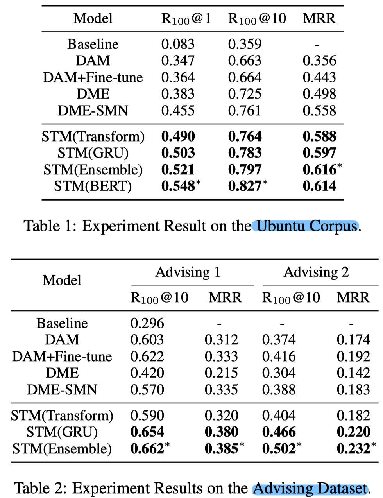

> > ACL2019，response selection

源码：https://github.com/CSLujunyu/Spatio-Temporal-Matching-Network

## 背景

对话任务的一个特点是谈论内容的话题是动态变化的，因此response selection时，匹配可能仅出现在最近一段上下文中。

本文提出了Spatio-Temporal Matching Network（STM），并把response selection问题形式化为多类别的分类问题。

## 方法

- 数据的形式：  其中，$\mathbf{D}=\left\{d_{0}, d_{1}, \dots, d_{m}\right\}$表示对话历史，$\mathbf{C}=\left\{c_{0}, c_{1}, \dots, c_{n}\right\}$表示候选回答集合，$R$表示标签。

- representation 模块

  使用L层BiGRU，得到

  

- 时空匹配模块

  

  

  对特征图使用堆叠的conv+pooling层，然后用一个全连接得到匹配值得分。

  

## 实验

