> >ACL2019，IoI模型，response selection

## Motivation-论文解决了什么问题

基于检索的对话系统需要学习一个好的匹配算法，在以往的工作中，匹配模型可以被抽象为【表示-交互-输出】三层结构。但是作者认为，仅仅一次交互是不够的，需要进行更深入的交互才能取得较好的效果。

## Motivation-本文的方法思路

作者将【表示-交互】抽象为一个 interaction block，从而使用多层堆叠的交互块获得更丰富的匹配信息。

## Method-模型/方法概述

#### 整体模型

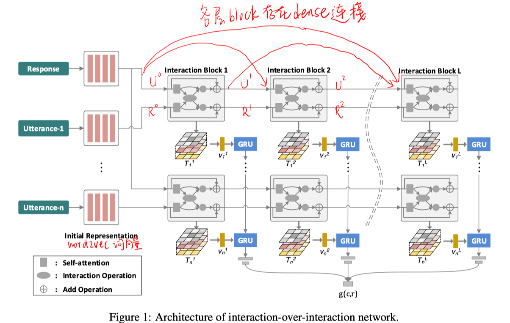

#### Interaction Block

整个block分三个模块：self-attention module、interaction module、compression module

- self-attention

  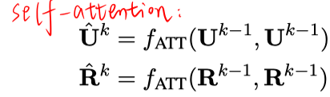

- interaction module

  

  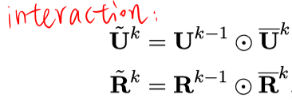

- compression module

  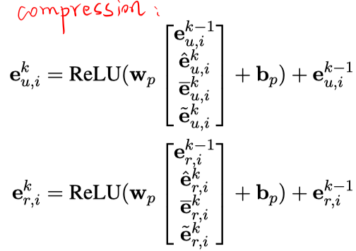

>其中，$f_{ATT}$的计算过程为：
>
>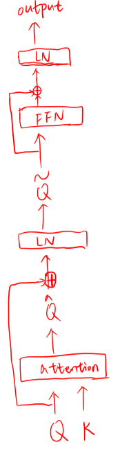
>
>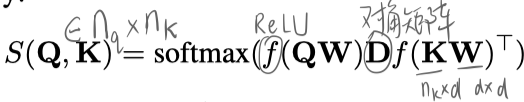
>
>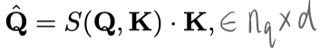

#### Matching

对每个block：

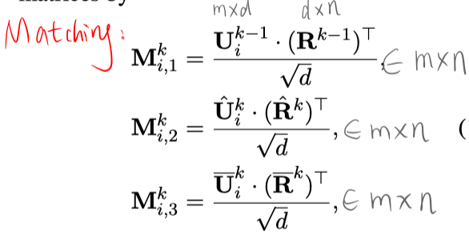

对每层交互：

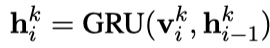

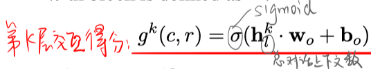

总匹配得分：

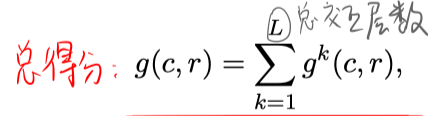

#### 训练

本文提出两种训练策略：

- 最小化一个全局的损失函数

  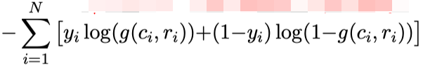

- 每层交互有一个局部的损失函数

  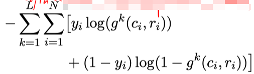

## Experiment-实验

数据集：Ubuntu Corpus、Douban Corpus、E-commerce Corpus

1. 在三个数据集上的实验结果

   - 使用local loss训练相比global loss更好。

   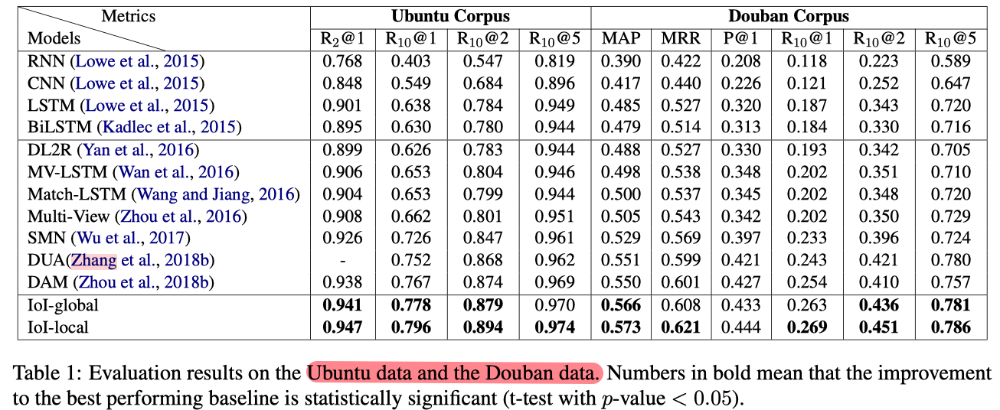

   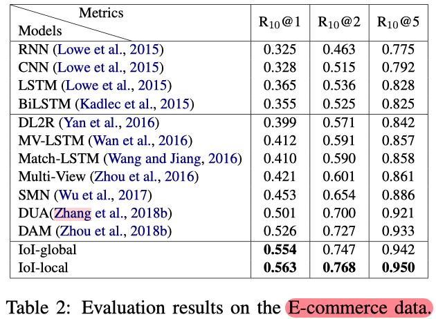

2. 交互层数对模型效果的影响

   - 随着层数增加，性能先上升，后稳定。

   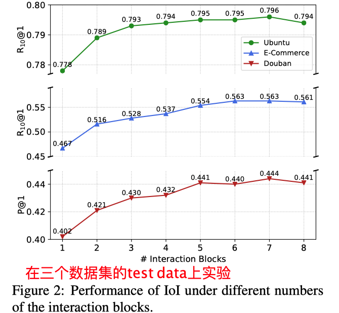

3. 对话上下文的轮数  和 平均表达长度 的影响

   - 使用多层交互，对于短上下文的性能提升更明显。

   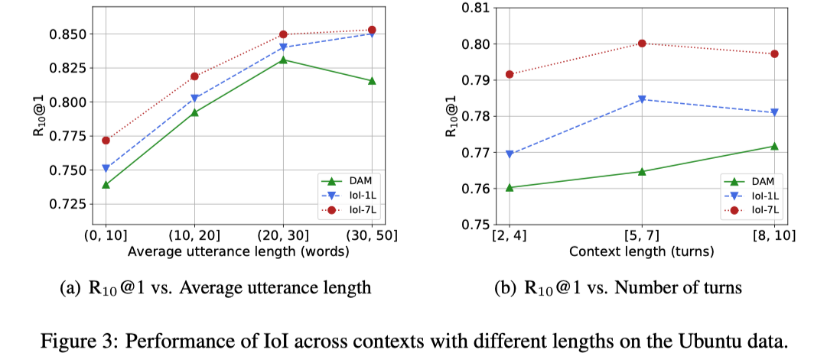

4. 消融实验

   - $$
     \hat{E}>\bar{E}>E>E>\tilde{E} \text { and } M_{2}>M_{1} \approx M_{3}
     $$

   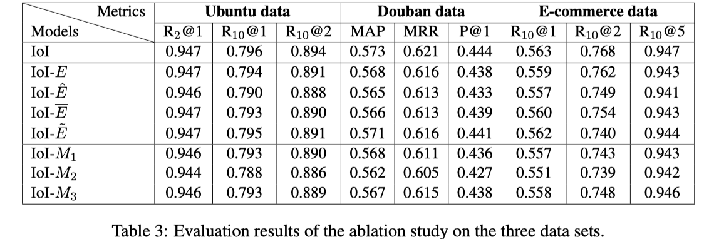

## Highlight

- 提出了interaction over interaction (IoI)模型，进行多层迭代交互。