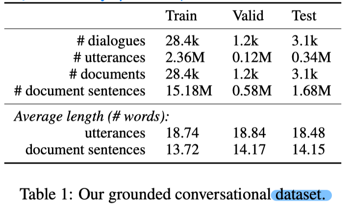
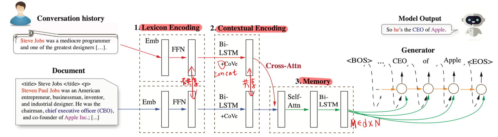
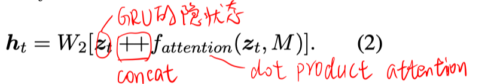
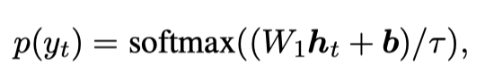
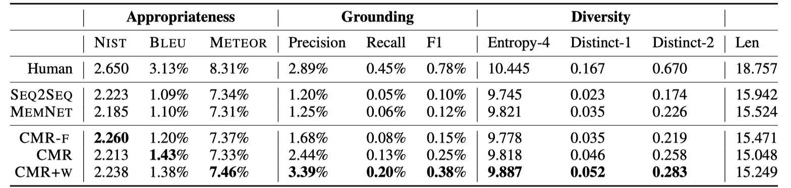

> >ACL2019，对话，加入外部知识

代码：https://github.com/qkaren/converse_reading_cmr

## Motivation-论文解决什么问题

Neural conversation models已经能够有效学习到如何产生流畅的回答，他们的主要问题在于要知道what to say，才能使得对话contentful、不空洞、有意义。

近期方法尝试，在decoder端加入外部知识进行进行条件生成，来解决此问题。这样尽管有些效果，但是却不足以提供足够的引导作用来达到外部知识和回答生成之间深层次的、精确的整合。

## Motivation-本文的方法思路

- 借鉴MRC的方法。将 response generation 和 on-demand(按需) machine reading 联合建模，作者称该方法为CMR (Conversation with on-demand Machine Reading)。其关键在于，为对话模型提供即时的（on the fly）、相关的长篇文本作为一种外部知识源。

- 提供了一个新的、大规模的document-grounded conversation的数据集。该数据集是从Reddit平台采集的。Reddit上发布的讨论话题有很多都会附带一个URL，该URL会指向所讨论话题的背景文档。

  

## Method-模型/方法概述

**输入**：长度为M的历史对话 $X=\left(\boldsymbol{x}_{1}, \ldots, \boldsymbol{x}_{M}\right)$，长度为N的外部知识文档 $D=\left(\boldsymbol{s}_{1}, \dots, \boldsymbol{s}_{N}\right)$

**输出**：生成的free-form的response $y$

**方法**：可以使用任何现有的MRC模型，本文采用SAN。

> response generation 部分：用历史对话的contextual Encoding的输出进行self-attention，作为GRU decoder的初始状态 $h_0$。
>
> 
>
> 

**Data Weighting 机制**：计算loss时，response与document越相关的样本具有越大的权重。对于每个训练batch内的样本，计算每个样本的相似度值，再进行归一化。（这样的做法可以让模型更好地编码和利用文档信息）

## Experiment-实验

- CMR-F 是指不使用外部知识文档D，仅用历史对话来生成response。
- CMR是指不使用data weight机制。

## Highlight

- 发布了新数据集。

- 有了外部知识文档后，以MRC的思路来做 对话的response generation。
- 自己的一点看法：有很多对话的场景是没有现成的外部知识文档的。。。所以一个关键的问题可能如何获取相关的外部知识文档。