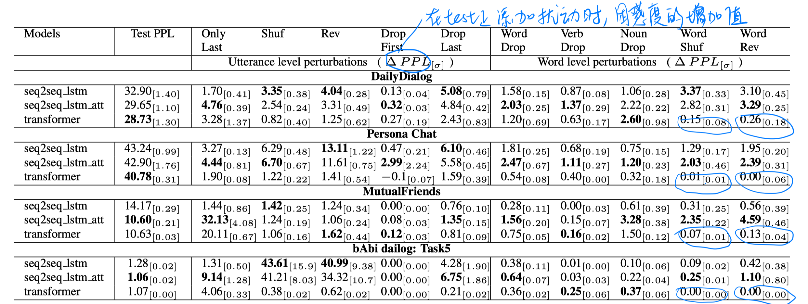
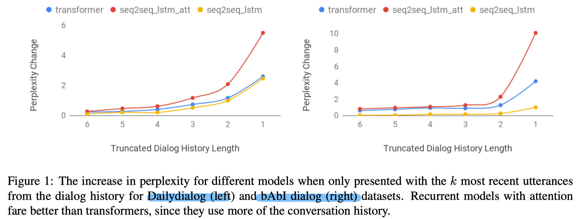

> > ACL2019，实验性论文

源码：https://github.com/chinnadhurai/ParlAI/

## 背景

目前，neural generative model是比较流行的解决多轮对话任务的方法，但是这些系统的一个通病是很少能够有效地理解和使用可得的历史对话信息。

本文提出一个经验性的方法来探究这些模型是如何利用对话历史的，即在测试阶段对上下文进行人工干扰，来观察模型的敏感性。（本文的核心前提是，如果模型对于某些干扰不敏感，则说明模型没有充分利用某种特定类型的信息）

## 实验

##### 数据集

bAbI、Persona Chat、Dailydialog、MutualFriends

##### 实验设置

1. 干扰的类型

   - Utterance-level
     - shuffle：打乱会话历史中的各个表达的顺序
     - reverse：翻转会话历史中的各个表达的顺序
     - drop：去掉部分表达
     - truncate：只保留最近的k个表达
   - word-level
     - word shuffle：随机打乱每个表达中词的顺序
     - reverse：翻转每个表达中的词
     - word drop：随机去掉30%的词
     - noun drop：去掉所有名词
     - verb drop：去掉所有动词

2. 实验设置

   正常地训练好模型，然后再测试时对会话历史添加人为扰动。

3. 评估指标

   添加人工扰动后，模型预测结果的困惑度的增加。增加的越多，说明模型对扰动越敏感。

##### 实验结果

1. 基于Recurrent 和 Transformer的模型，对本文考虑的大部分类型的干扰都不敏感，说明他们没能充分利用可得的历史信息。
2. 基于Transformer的模型对词序不敏感，说明他可能学习的是类似CBOW的表达。
3. 相比seq2seq_lstm和transformer，seq2seq_lstm_attr似乎利用了更多信息。
4. 基于Recurrent的模型比基于Transformer的更可以捕捉会话动态。

