> > ACL2019

源码：https://github.com/chin-gyou/dialogue-utterance-rewriter

## 背景

目前的多轮对话任务还做的不够好，其中一个主要的原因是多轮对话中富含的共指和信息缺失问题使机器很难理解真正的意图。

本文提出，<u>在进行正常的每轮对话之前，先rewrite 本轮表达，恢复共指和缺失的信息</u>，然后就可以不管历史对话，把多轮对话问题转化成单轮对话。为此，

- 本文通过人工标注收集了一个新的数据集（中文、2万个多轮对话）
- 提出了基于Transformer和pointer network机制的**utterance rewrite架构**，该架构是把utterance rewrite问题形式化为 **extraction generation问题**。
- 该utterance rewrite架构是对话模型不可知的，可以融合进任何现有的对话系统。

## 方法

#### 数据集构建

从中文社交媒体平台抓取了部分对话数据，由人工标注者重写。最终得到40K个样本，其中一半是包含共指或信息缺失，需要重写的（positive），一半是不需要重写的（negative）。

#### 模型

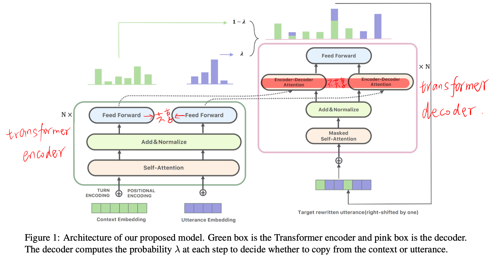

数据样本的形式为 $(H,U_n,R $)，其中H表示会话历史 {$U_1,……, U_{n-1}$}，U_n表示当前对话，R表示对U_n的重写。

输入：

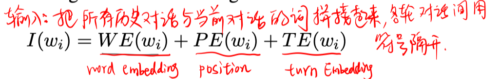

Encoder：L层Transformer-encoder的堆叠，输出是 $E^{(L)}$

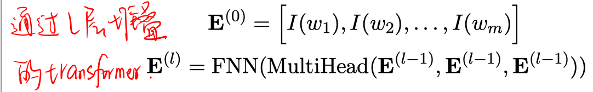

Decoder：L层Transformer-decoder的堆叠，但不同点在于，每层包含两部分Encoder-decoder Attention，分别处理历史会话和当前会话。

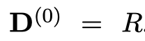

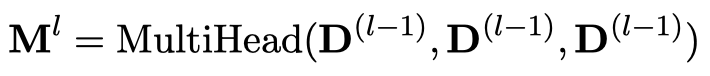

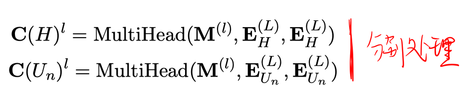

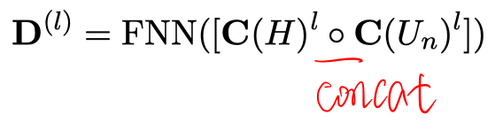

基于pointer network的输入概率分布计算：

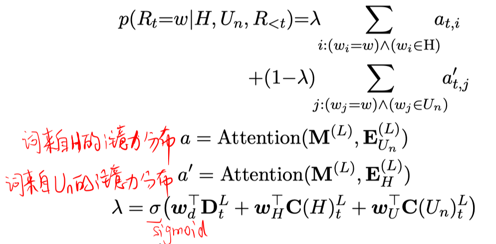

## 实验

1. 和其他utterance rewrite模型的比较

   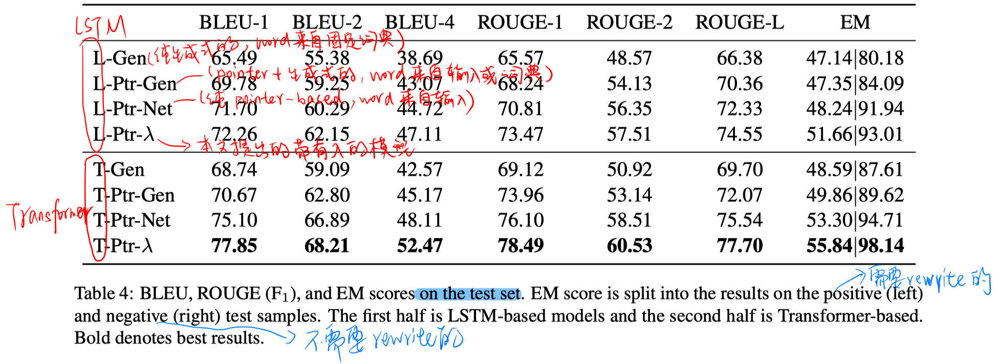

   - 基于Transformer的比基于LSTM的好。
   - pointer-based 比 基于生成式的或混合的好。
   - 相比不用$\lambda$（不区分历史对话和当前对话），加上$\lambda$会更好。
   - 从EM的指标看，模型可以很好地识别出不需要重写的表达，，未来的方向可能在于如何提高重写能力。

   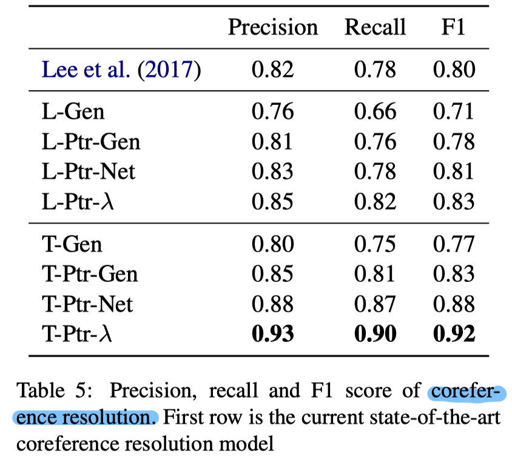 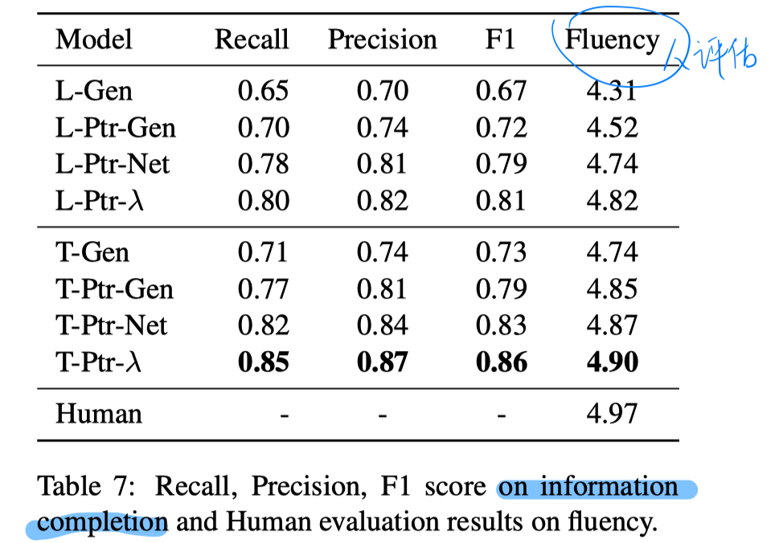    

2. 将本文提出的utterance rewrite架构融入到现有的对话系统中

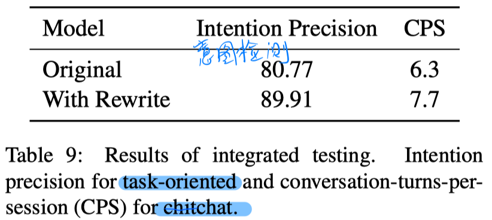

## 思考

- 像这样，提出一种新的解决问题的思路，但普通人根本没有办法获取标注数据，，只有公司才有这样聘请标注人员的能力。。。。。

