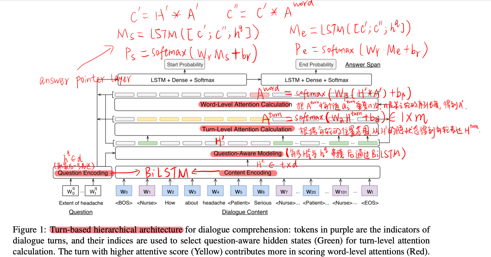
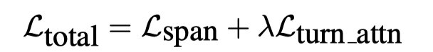
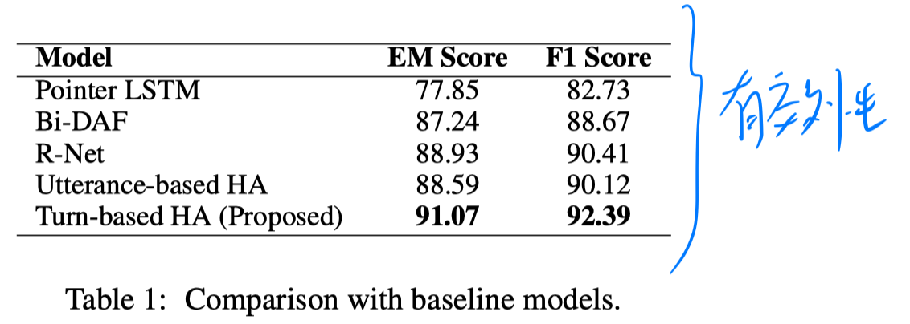
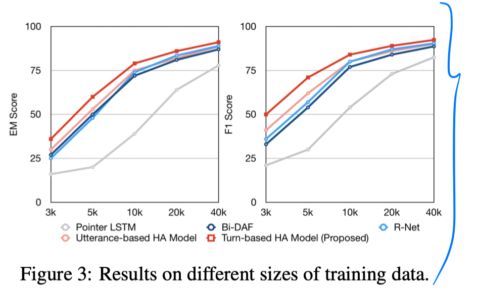
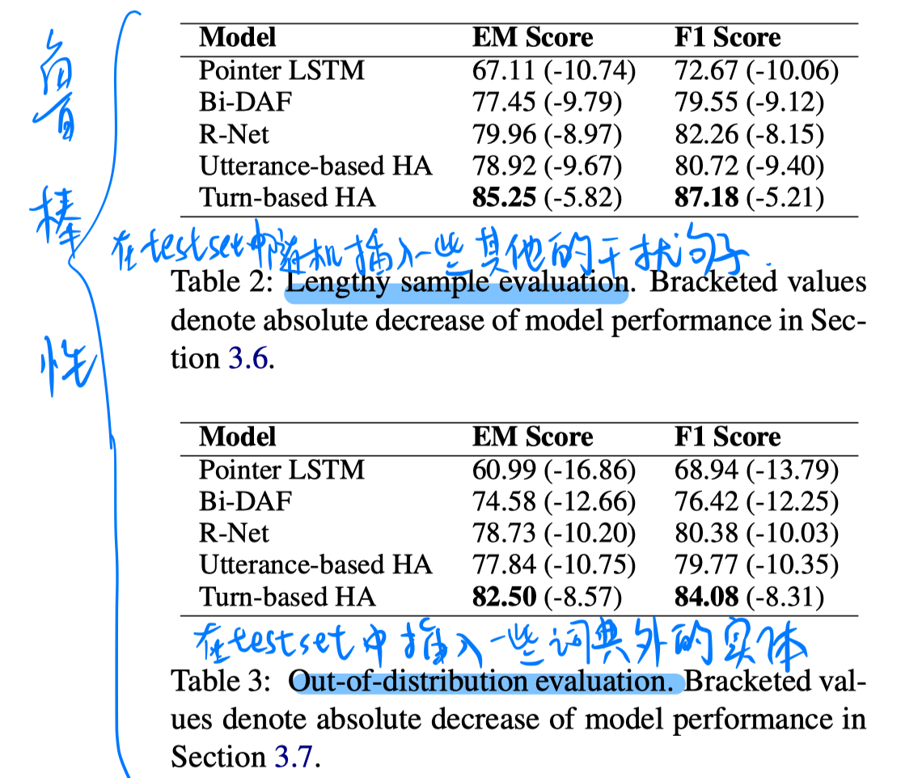

> > ACL2019

## 背景

对轮对话和机器阅读理解的区别在于：

- 阅读理解时是给定一个段落，然后回答一系列问题。
- 对话是具有交互的本质，动态的、非正式的、冗长的、重复的。
- 文本段落的机器阅读理解中，句子是默认的语义建模单元；但在多轮对话中，每一轮是建模单元。

本文提出了**Hierarchical Attention Architecture**，结合 turn-level 和 word-level 的注意力机制，来提高多轮对话的性能。层级模型可以捕捉不同粒度的上下文信息，利用粗粒度的注意力来降低在细粒度中可能的分心，同时也利用细粒度的注意力为下游任务蒸馏出关键信息。

## 方法

loss：

其中$L_{turn_attn}$

## 实验

数据集：一个护士和病人对话的真实世界的数据集。标注有answer span，和answe所在的turn。

实验结果：

## 思考

- 方法过于粗糙
- 把对话问题形式化为抽取式的QA，感觉很奇怪，response不可能总是在重复已有内容吧。。。。