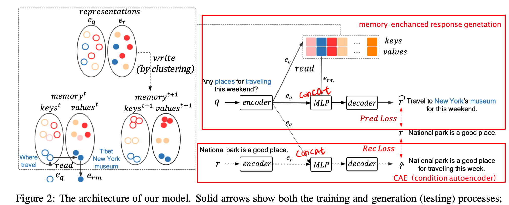
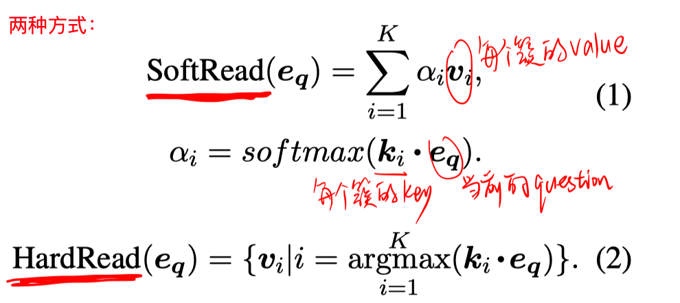
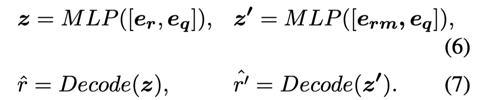
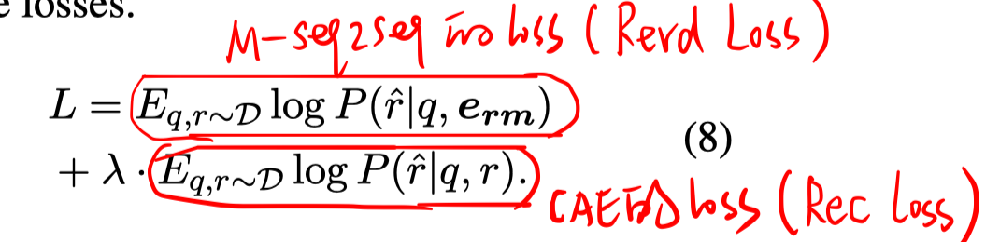

> >ACL2019

## 背景

开放域对话系统目前的挑战在于，生成的回复不够有信息量，不够多样性。

有些工作尝试用检索模型的结果来提高生成模型得到的response，但是这样往往会受制于检索结果的质量。

本文提出**记忆增强的生成模型**（memory-augmented generative model），学习从训练语料中进行抽象，并把有用的信息保存到memory中，帮助进行response生成。

## 方法

##### 基本思路

- memory module：把训练语料中的query-response pair 划分成几组，提取并存储每组中的query和response之间隐含的对应信息。

  - 写操作：memory中一共有K个槽，每个槽对应一对key cell和value cell，分别用key embedding 和 value embedding表示一个query-response pair分组。（把训练集中的query-response pair按query embedding进行K-means聚类，得到中心向量作为其key embedding，该簇的response embedding平均作为value embedding。）

  - 读操作：给定一个query的embedding表示 $e_q$，从memory中查找有用信息 $e_{rm}$.

    

- generative module：考虑memory module存储的信息，根据输入query生成response。

  - memory-enchanted response generation 模块
  - conditional autoencoder 模块

​        Loss函数：

## 实验