> > ACL2019，开放域对话，response生成

## 背景

一个聊天机器人通常是通过encoder-decoder框架的response生成模型实现的，但其通常存在的一个问题就是容易产生<u>平凡回复</u>（safe response）。一般来讲，平凡回复的产生来源于开放域对话中存在的输入和回复间的 “一对多”关系，而传统的Seq2seq结构倾向于记住数据中出现频率高的词汇。

本文提出的模型可以对开放域对话中的一对多关系进行可解释性和可控制的建模。与隐变量方法不同的是，本文使**用元词（meta-word）来明确地表示message与response之间的关系**。给定一条消息，<u>我们可以通过控制元词来控制生成的响应。</u> 该方法的优点在于：

- 使生成模型具有可解释性，用户可以在生成响应前就知道生成的响应类型；
- 生成的过程是可以控制的，元词的接口允许用户定制响应；
- 生成的方法是可泛用的，可以将行为、人物角色、情感等特征作为元词的属性与一些已有的工作进行结合；
- 基于生成的开放域对话系统现在变得可扩展，因为该模型支持元词的特征工程。

本文还提出了一个从message中预测meta-word的方法，从而使得整个架构可以在实际中使用。

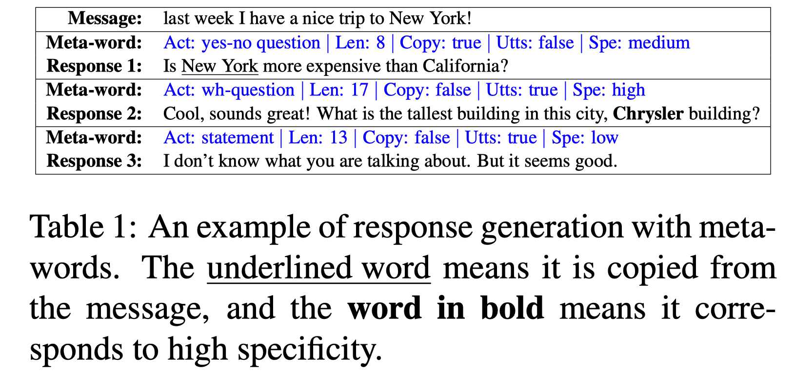

## 方法

利用meta-word进行响应生成需要解决两个问题：

- 如何确保回复和输入相关；
- 如何确保回复能够如实地表达预先定义的元词。

##### 整体模型

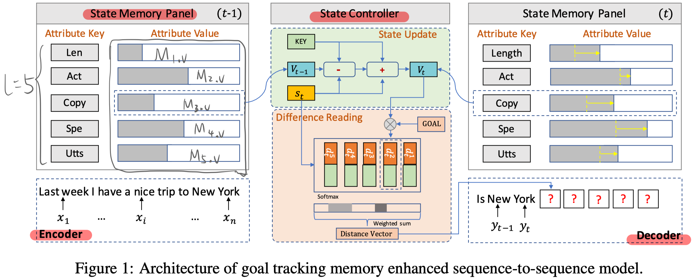

- 问题描述：输入是massage $X$ 和 原词 $M$，输出是response $Y$.

  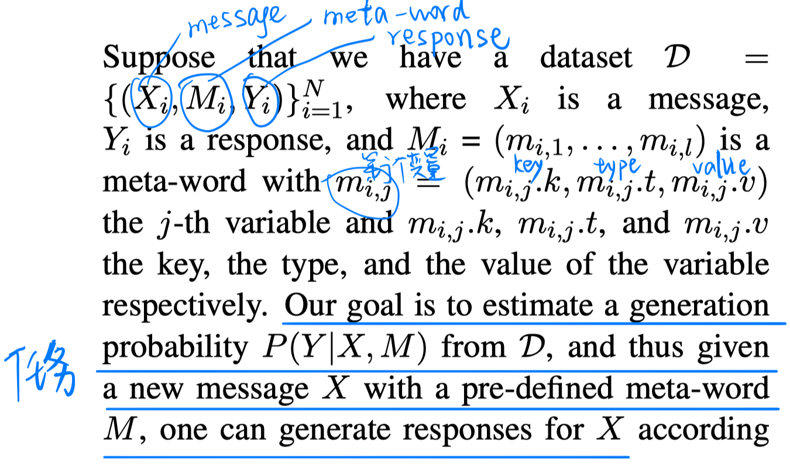

- Encoder：用BiGRU得到输入message的隐表达

- Decoder：利用goal tracking memory network帮助进行decoder。goal tracking memory network利用meta-word进行初始化。

  - state memory panel 跟踪 meta-word 的表达，在每步解码时根据decoder的状态 ，由 state controller 进行更新。
  - state controller 从 state memory panel 中读取 meta-word 的当前表达状态，并通知 decoder 原词表达目标与当前状态的差异，进而控制每一步解码过程。
  - 基于message表达、state controller提供的信息 和 以及已经生成的 word sequence，decoder来生成下一个词。

  > 初始化过程：
  >
  > 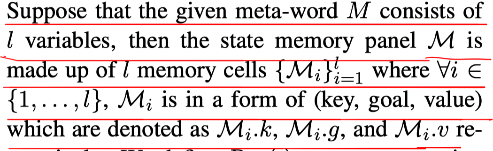
  >
  > 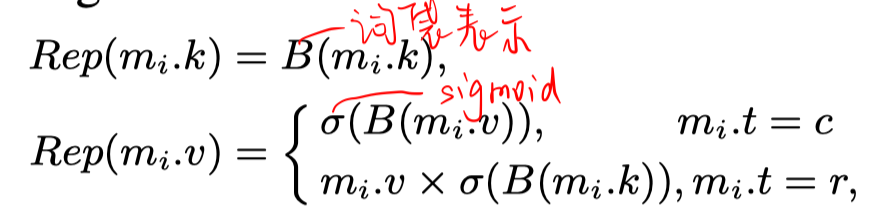
  >
  > 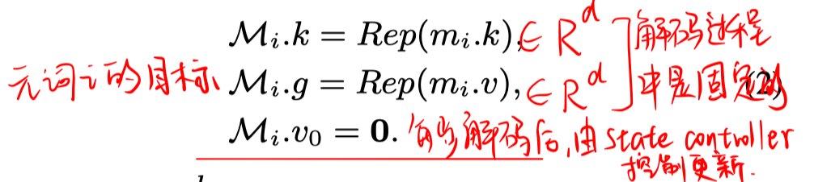

  > 更新过程：
  >
  > 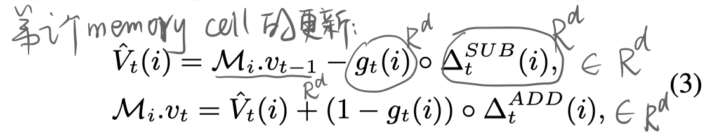
  >
  > 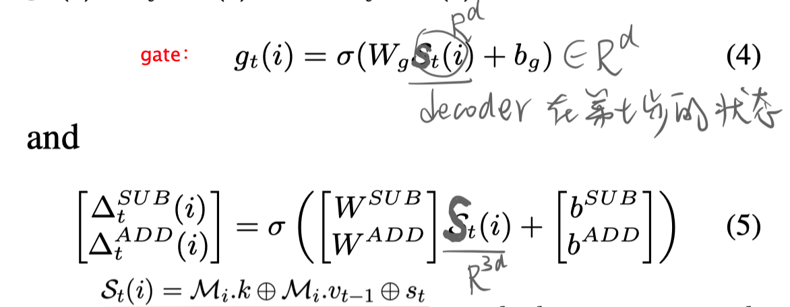

  > 计算差异过程：
  >
  > 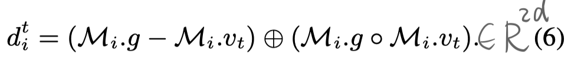
  >
  > 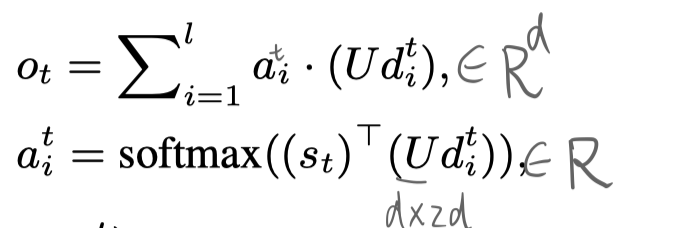

  > 解码过程：
  >
  > 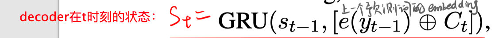
  >
  > 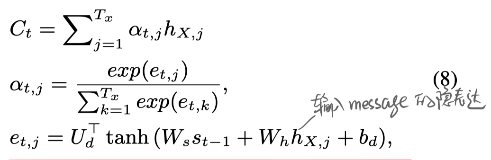
  >
  > 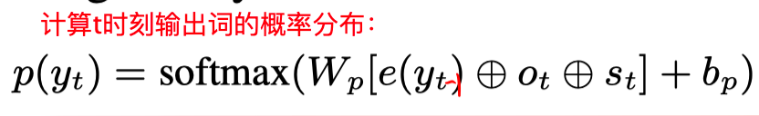

##### Loss 函数

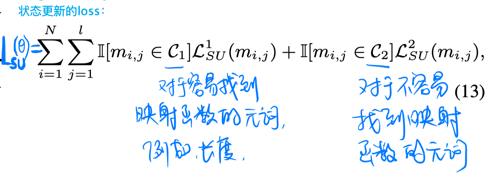

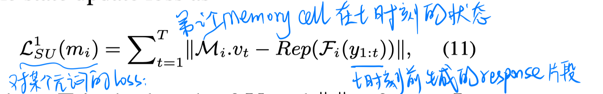

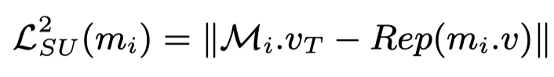

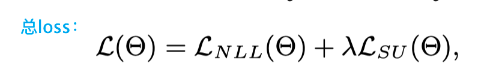

##### 原词预测

根据概率分布，从message中采样出meta-word。

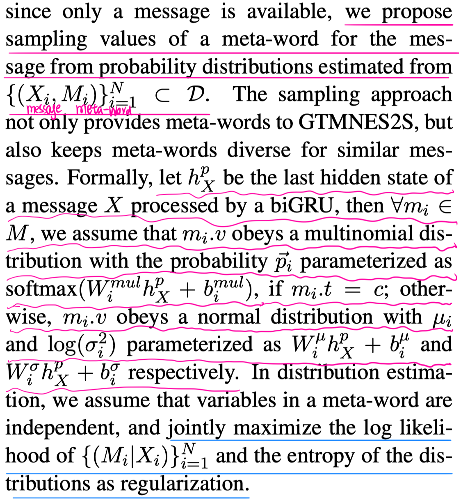

## 实验

##### 数据集：

Twitter、Reddit

##### 结果

## 思考

本文提出了一个目标跟踪记忆增强的seq2seq模型，用于使用元词明确定义响应特征地进行开放域response生成。