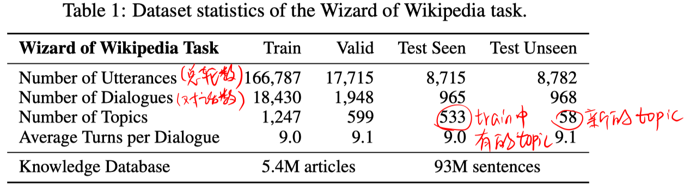
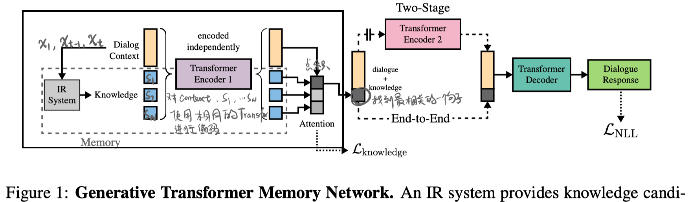
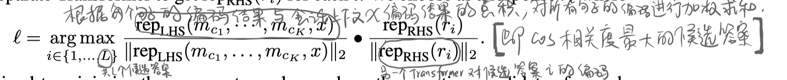
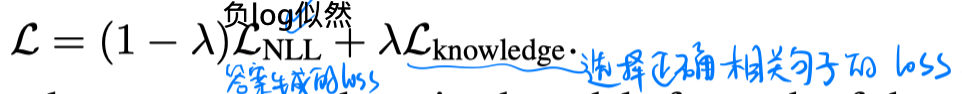

> > ICLR 2019，开放域对话系统，外部知识

benchmark：http://parl.ai/projects/wizard_of_wikipedia/

## 背景

开放域对话系统应该显式利用外部知识，但已有的工作中没有很好的方法。其中一个原因是，缺少相应的数据集。

本文发布了一个带有知识作为ground truth的对话数据集。并设计了一个架构，能够检索相关知识，并在其基础上生成response。

## 数据集

本文考虑的开放域对话场景是：有两个参与者，一个是知识专家（Wizard），一个是学习者（apprentice）。apprentice想要对某个话题进行深入的探究；Wizard拥有一个信息检索系统，可以检索到可能与对话相关的Wikipedia，但这对apprentice不可见。

对话流程是：Wizard或者apprentice其中一方先选择一个话题；然后apprentice提问，Wizard检索出相关的知识，并选择一个相关的句子，根据该句子生成一个回复；重复该过程。

最开始是用两个人来模拟该过程，收集到一个数据集。然后在其数据集的基础上，训练得到一个自动的Wizard。

一共有1365个topic，每个对应一个Wikipedia页面。使用和SQuAD相同的retriever，对每个topic，We retrieve the top 7 articles (first paragraph only) for the last two turns of dialogue (by wizard and apprentice) and the article (first 10 sentences only) for the original topic, and present these articles to the wizard as knowledge context, along with their titles. （把这些结果展示给标注者）

最终得到的数据集为：

## 模型

本文提出一个基于transformer和memory network的模型：1）基于对话历史检索相关知识；2）利用知识；3）生成回答。。。包括【基于检索的答案生成】和【生成式回答】两个模型。 

#### 整体框架

> 
>
> 前一部分（画黑框的）是两个模型相同的部分。
>
> 输入：对话上下文 $x_{1}, \ldots, x_{t}$
>
> 输出：$x_{t+1}$
>
> IR System：使用和SQuAD相同的retriever。以 $x_{1}, x_{t-1}, x_{t}$ 分别作为query进行检索，We retrieve the top 7 articles (first paragraph only) for each lookup and then flatten all the results into separate sentences , but prepend every sentence with its article title.
>
> Transformer Encoder1：对上下文和每个相关句子使用相同的Transformer进行编码

#### 基于检索式的

> 
>
> 使用 cross entropy loss。

#### 基于生成式的

> - 端到端的方式
>
>   对句子编码器Transformer的各词输出求平均，作为每个句子的表达。
>
>   与会话上下文的表达计算点击，选择相似度最大的一个句子。
>
>   然后将该句子的编码和上下文的编码concat起来输入到Transformer解码器。
>
>   
>
> - 两段式
>
>   使用两个分开的网络进行 句子选择 和 答案生成 两个任务。（具体的做法，论文没说）

## 实验

## HighLight

- 本文发布了 Wizard of Wikipedia dataset
- 本文提出了 Transformer Memory Network model

