> > 2017

# 背景
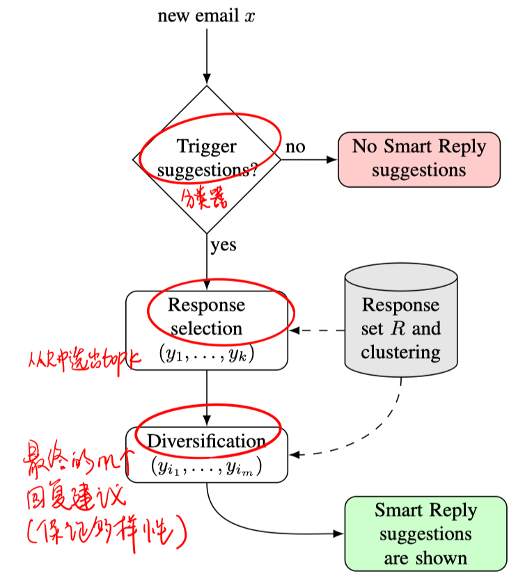

总体系统架构如上图，本文主要关注实现高效的 response selection。

本文的方法使用基于n-gram的前向神经网络来建模文本的序列信息（虽然RNN和CNN也可以实现，但效率不够高）。

# 模型

- 基础模型

  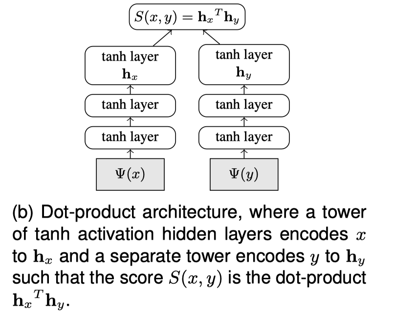

  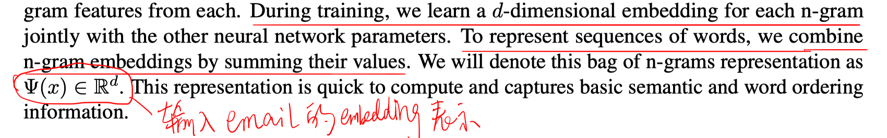

- 考虑email x的多个特征：使用一个两层次的模型架构

  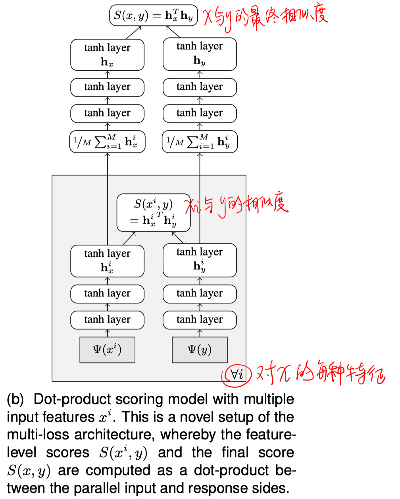

  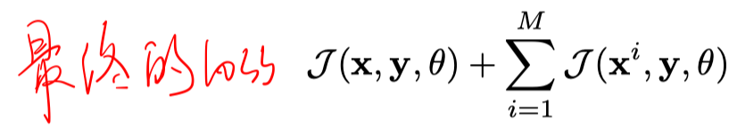

- 快速搜索算法（使用quantization技术提高效率）

  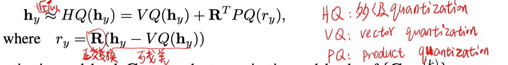

  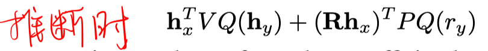

  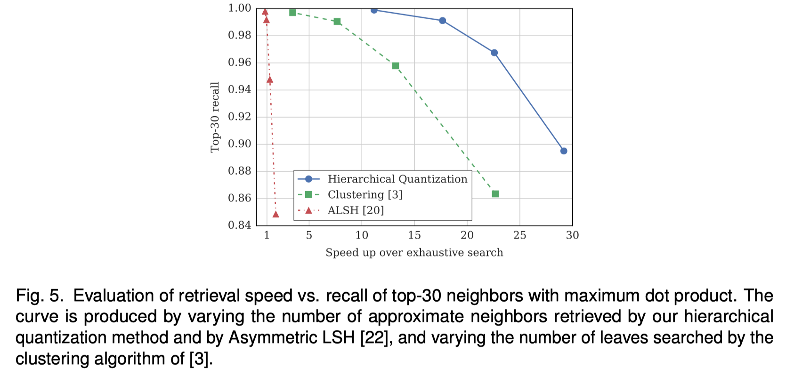

- 训练

  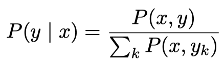

  使用K个样本（包括一个正例和K-1个负例）进行近似计算：

  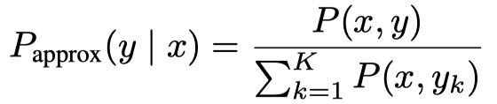

  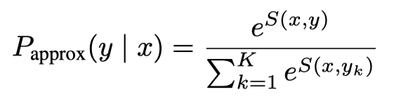

  负例采样策略：使用同batch内其他样本对的reply作为负例。

  解决负例采样带来的偏差：（因为负例中会有较多短的一般性的回复，导致这类回复会受到抑制）

  

# 实验

##### 数据集

300M个样本对

##### 对比模型（Joint model）

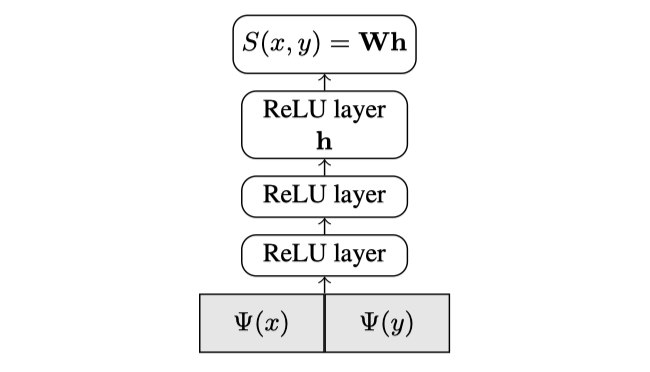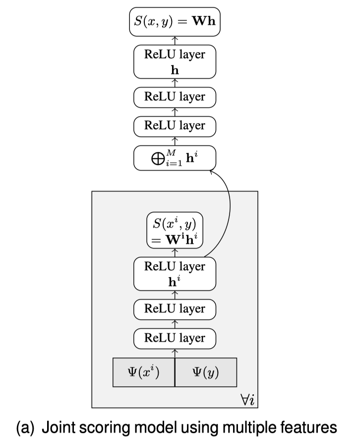

##### 实验结果

- 离线评估

  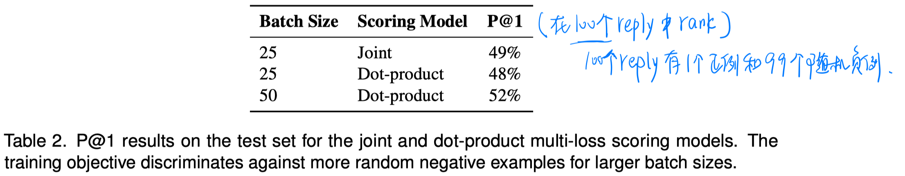

- 在线评估

  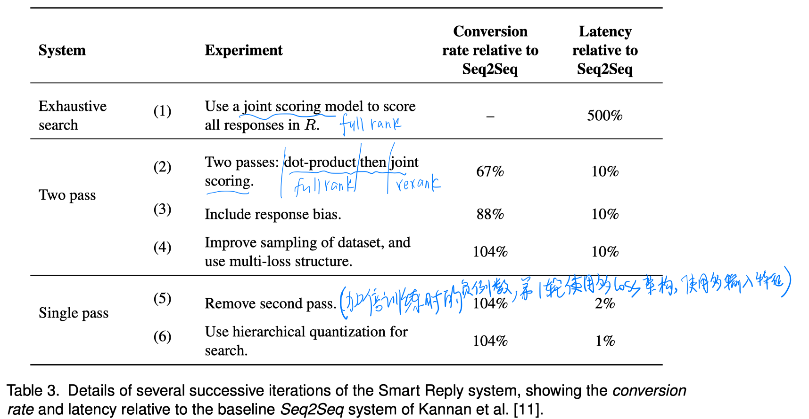

# 结论