> > EMNLP2019

## 背景

对于多轮检索式的对话，以往的做法都是把候选回答和每一个上下文做匹配。上下文表达提供了丰富的信息来提取更多匹配信号，但它也包含噪声信号和不必要的信息（随着对话进行，可能已经发生话题转移）。

本文分析了使用过多上下文表达的边际效应，提出了**multi-hop selector network（MSN）**。先利用一个多跳选择器选择相关的表达作为上下文，然后再用过滤出来的上下文与候选答案进行匹配。

## 方法

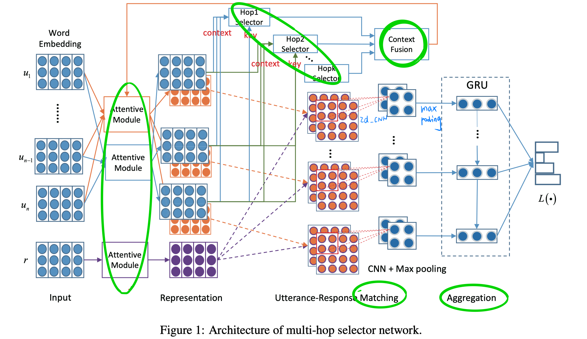

##### 问题描述

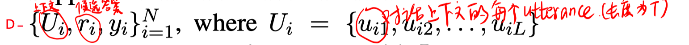

##### 整体模型

- attentive module

  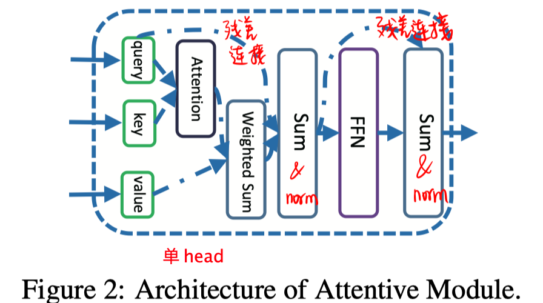

- context selector

  每个上下文表达通过 attentive module，得到自己的上下文表示：

  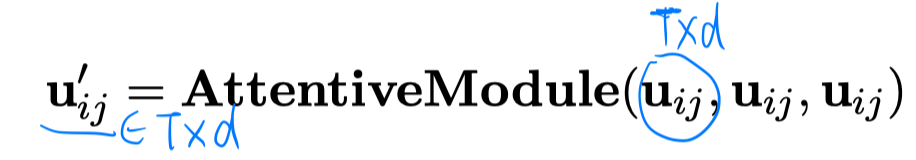

  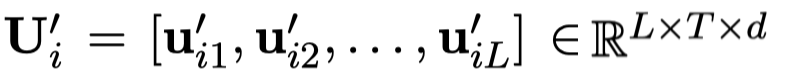

  - word 级别的selector

    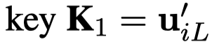

    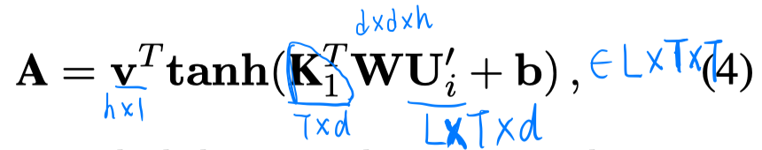

    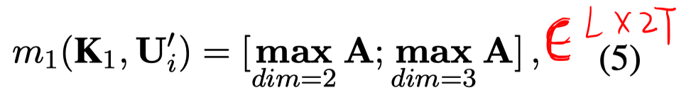

    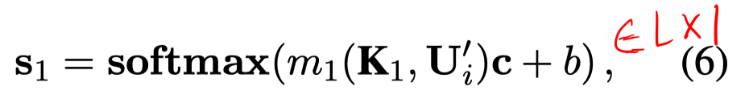

  - utterance 级别的selector

    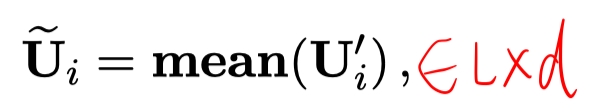

    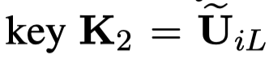

    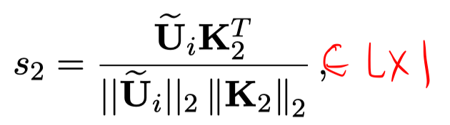

  - 结合 word 和 utterance 级别

  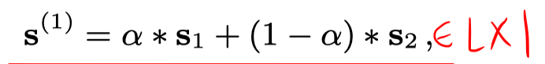

  - hopk selector

    上述只是但是了hop1 selector。由于对某些数据，最后一个utterance可能很简短，没有足够的信息，因此提出了hopk selector，更改 K2。

    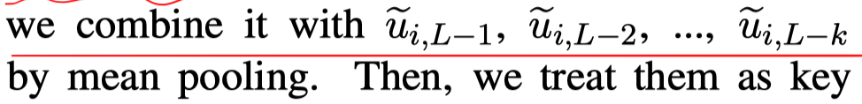

    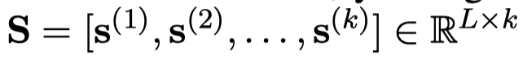

- context fusion

  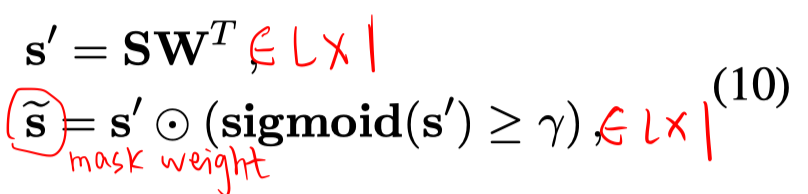

  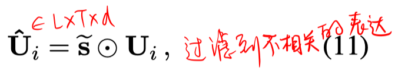

- matching

  - origin matching

    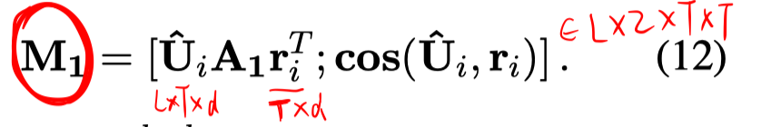

  - self matching

    

    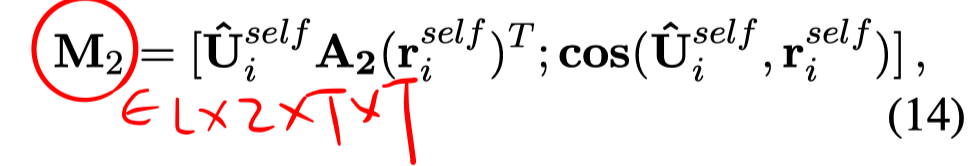

  - cross matching

    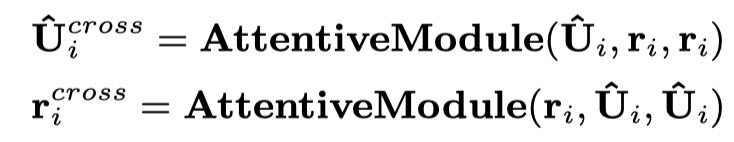

    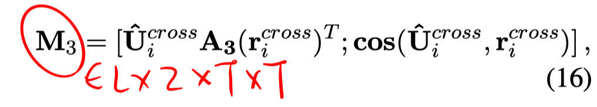

- aggregation

  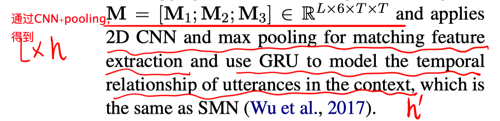

  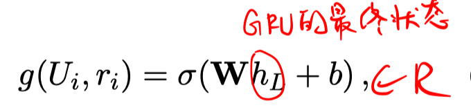

## 实验

##### 对抗性实验

实验设置：在Ubuntu数据集上，保持训练集不变，在测试集上，从上下文中随机采样1-3个词，分别加到每个候选答案中，检测匹配模型的性能影响。

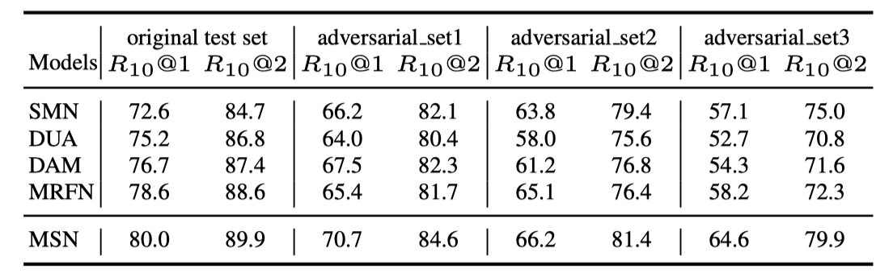

##### 实验

1. 主试验

   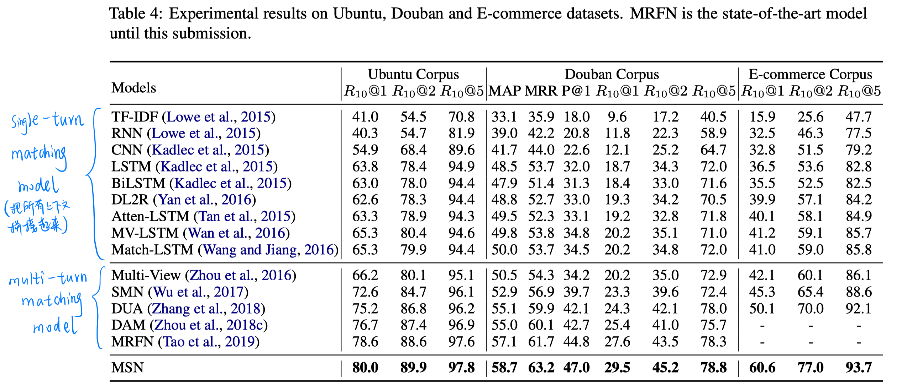

2. 消融实验

   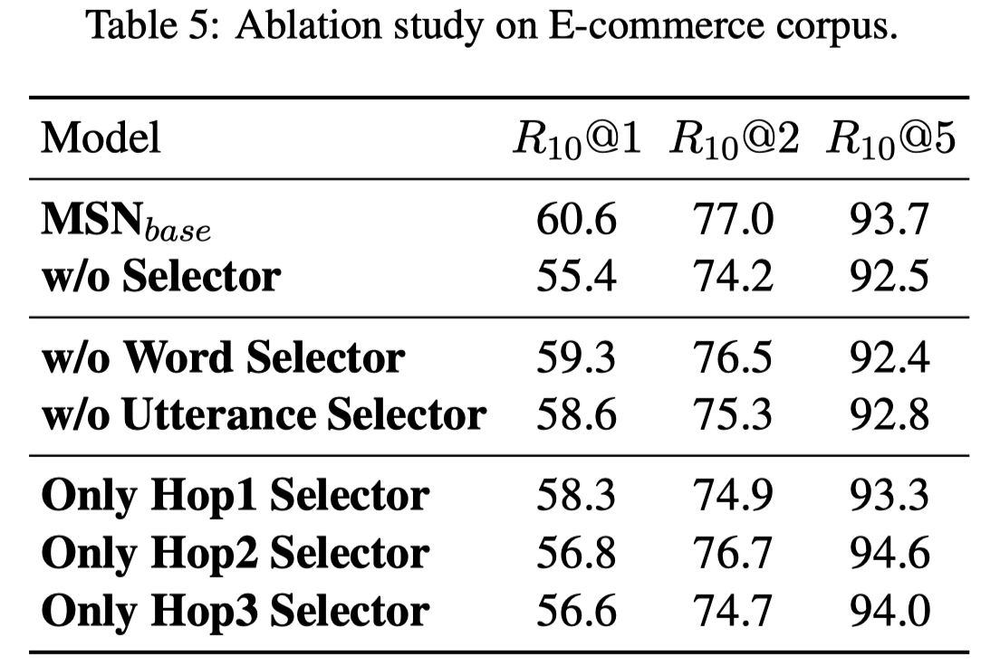

3. 关键超参数的实验

   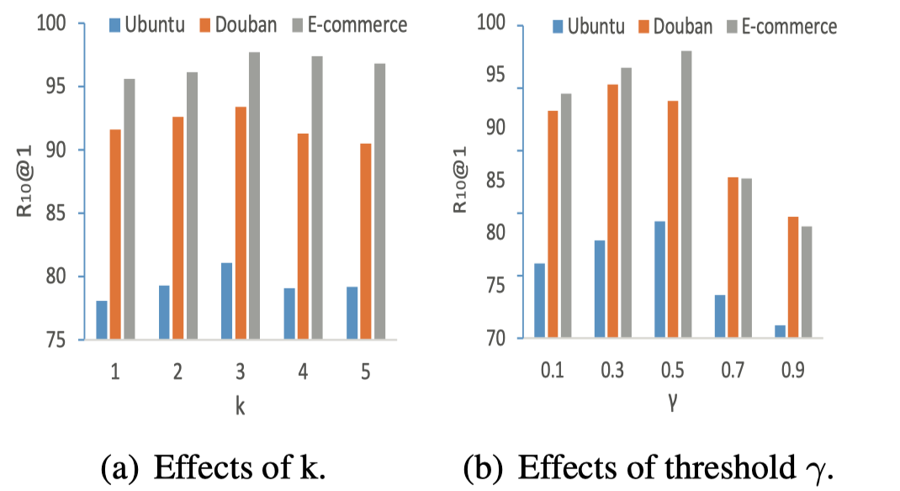

# 思考

motivation清晰，方法简洁，而且的确有效果。

