> > ICLR2020

## 背景

有研究提出通过将基于知识的dialogue分解为两个子问题来解决：先从候选池中选择知识（knowledge），再基于对话上下文和选择的知识来生成回复。

本文关注该任务的知识选择（knowledge selection）部分，如何更好的建模。

在对话任务中，dialogue context 和 knowledge 之间存在的关系是一对多的，也就是说对话任务中的knowledge selection是具有多样性的本质的。

本文提出了一个 sequential latent variable model——**sequential knowledge transformer（SKT）** 来进行知识选择：

- 它可以正确地解决对话中知识选择的多样性。
- 通过建模后验概率，可以更好地利用response信息来使知识选择更正确。
- 跟踪在历史对话中知识选择的话题流，帮助选择当前对话轮的知识。

## 方法

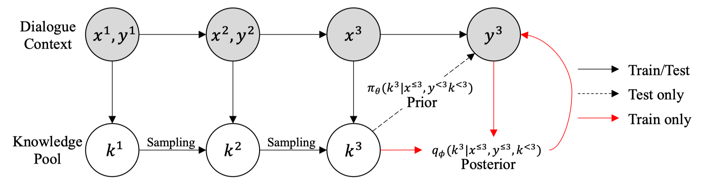

##### 问题形式化

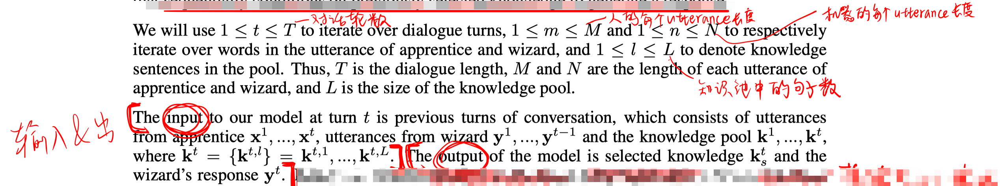

注意，对于每一轮对话，都有对应的一个knowledge pooling。

##### 整体模型

- sentence embedding

  采用BERT+avg-pooling，得到每个表达x,y的向量表示，以及知识池中每个知识的向量表示。

  对每一轮对话的x,y的向量表示，将其拼接起来，通过GRU，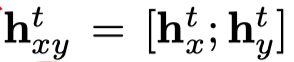

  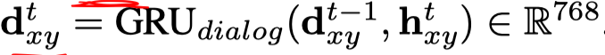

- knowledge selection

  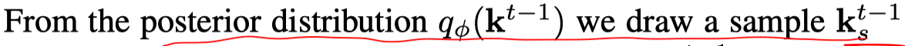

  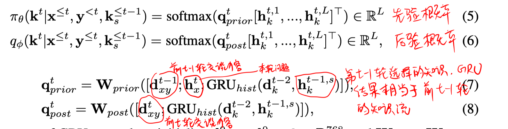

- utterance decoding

  根据公式(6)选择第t轮后验概率下应该选择的知识，并结合第t轮的问题，进行解码（Transformer+copy机制）。

  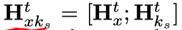

  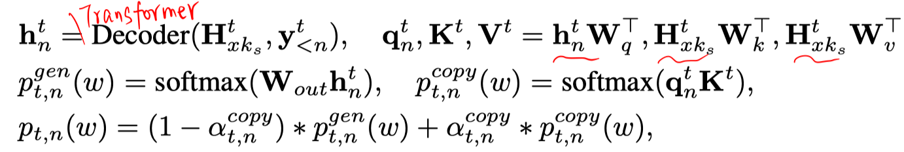

  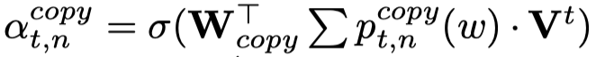

##### 损失函数

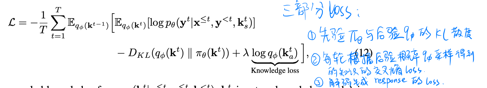

## 实验

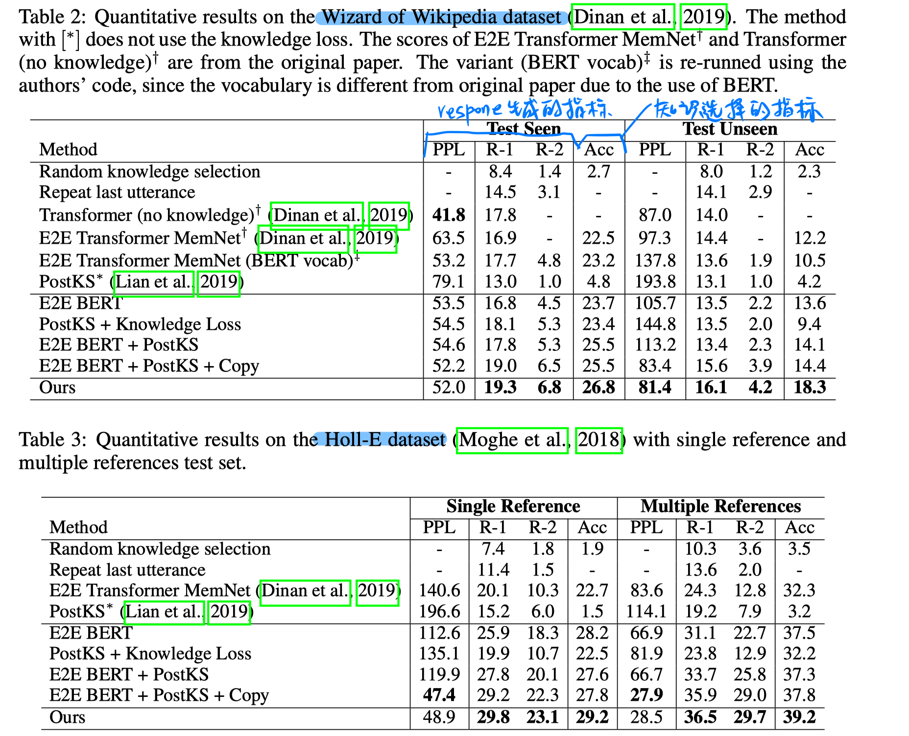

