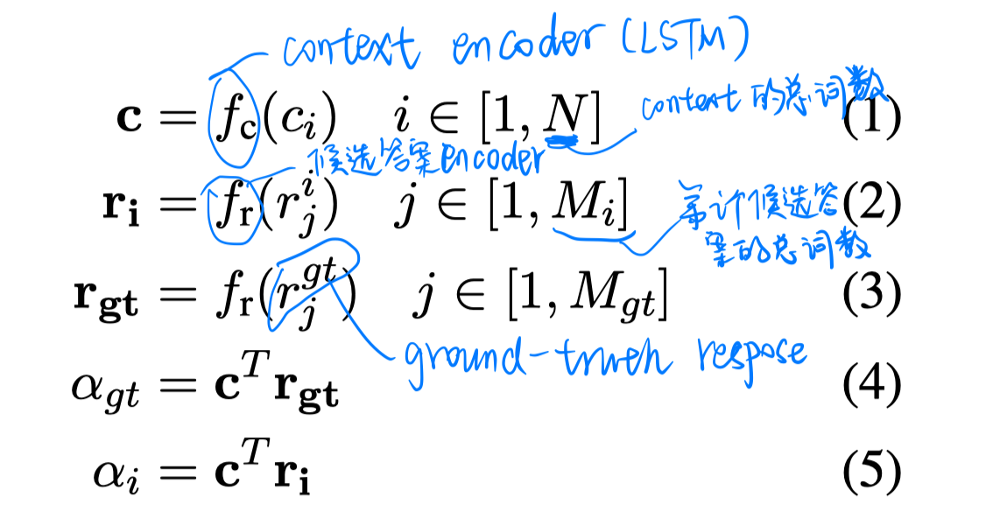
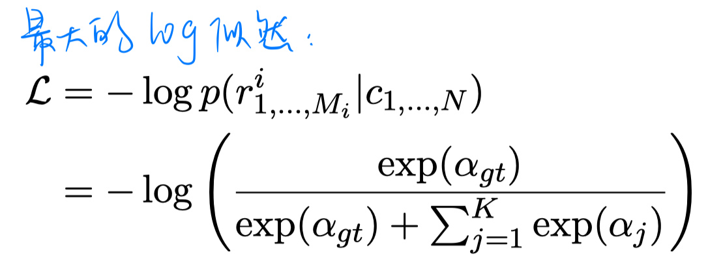
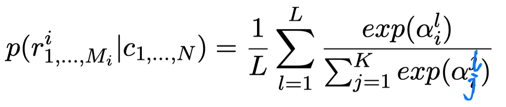
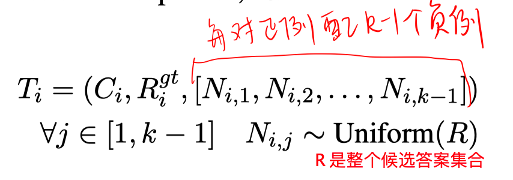
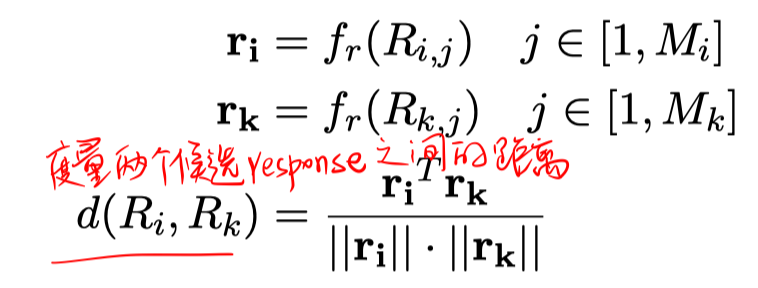
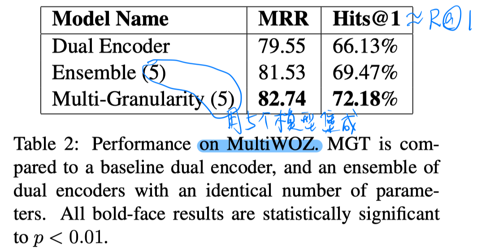
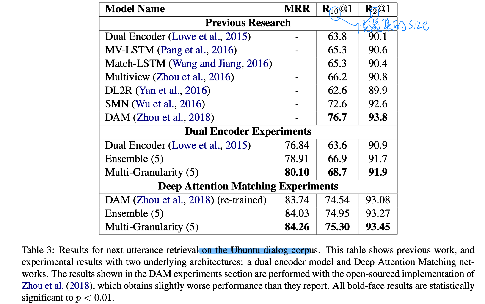
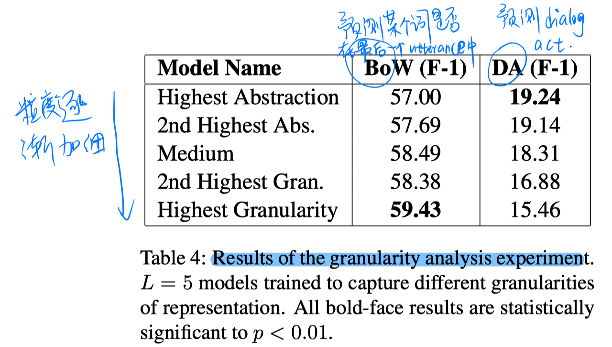

> > EMLP2019

## 背景

本文针对的是检索式的dialog。

本文提出一个新的训练方法，在模型集成的框架下，通过与ground-truth response的距离远近采样负例，创建多组训练集，进而学习多个模型。。不同的训练集可以显式地在不同的粒度上学习表达。（与ground-truth response 距离很近的负例，则模型会学到细粒度的信息；与ground-truth response距离较远的负例，则模型学习粗粒度的信息）

本文只是提出这样一种负例采样的训练思想，具体地可以使用任意现有的模型。（本文以一种Dual Encoder为例。）

## 方法

##### Dual Encoder

以LSTM作为上下文编码器和候选答案编码器，分别得到上下文和候选答案的表达，再用点积计算候选答案的概率。

训练loss：

##### Dual Encoders 的集成

共训练L个模型，通过每个模型预测的概率的平均进行集成：

训练每个模型的训练集（负例）都是在整个候选答案集合中平均采样得到的。

##### 多粒度训练

计算R中所有候选答案与ground-truth response的距离，按距离远近把所有候选答案分成L段，每个模型的训练集（负例）是从对应的第L段中进行采样得到的。

## 实验

数据集：MultiWOZ、Ubuntu

实验结果：

1. 主实验

   

   

2. 验证是否显式地学到了不同粒度的表达

   

   - 实验设置：固定每个模型的参数，额外加一个线性层用于下游任务。通过设置两个下游任务来判断是否每个模型学到的表达的粒度不同。

3. 验证学到的表达的健壮性和泛化性

   

   - 结果表明，在不微调的情况下结果更好，说明泛化性更好，但还是有进步空间的。

 

## 思考

通过这样的方式可以更有效地利用负例，学到更好的表达，更好地进行集成。