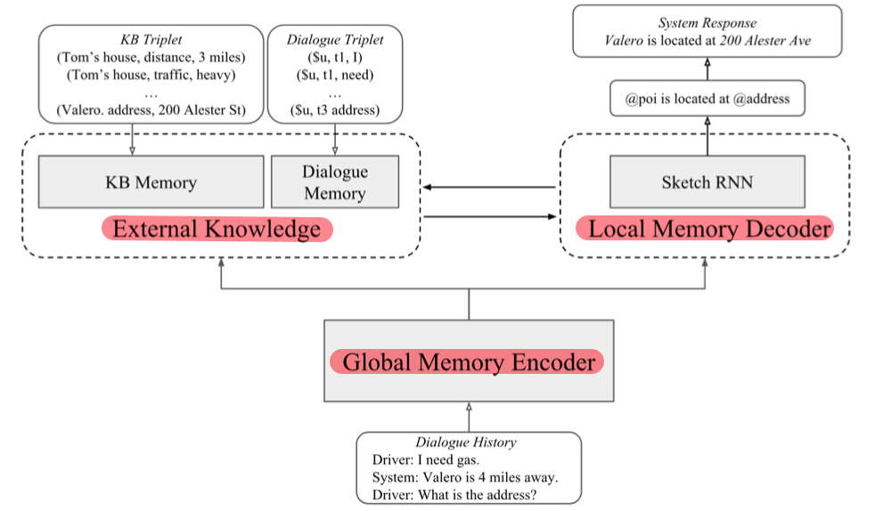
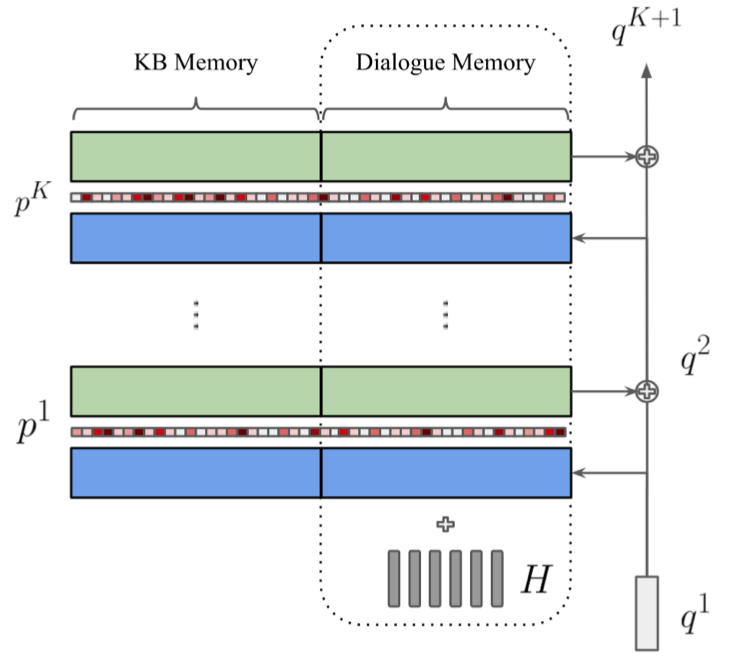
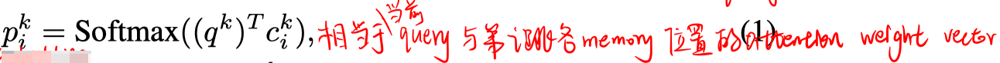
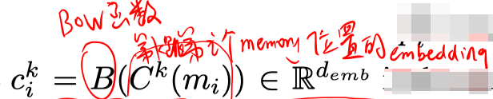
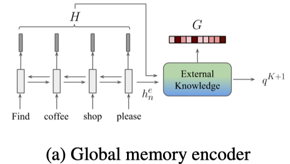
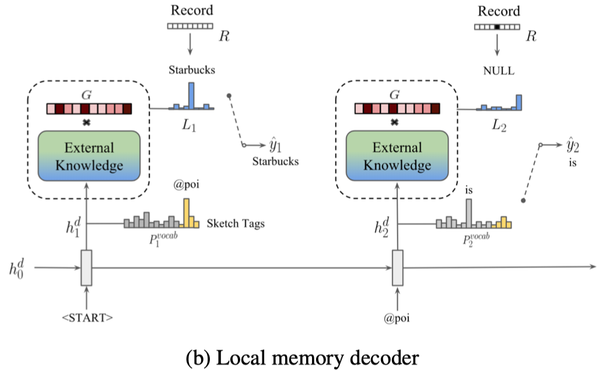
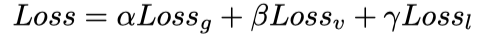
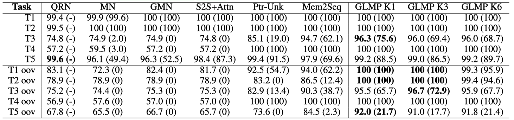
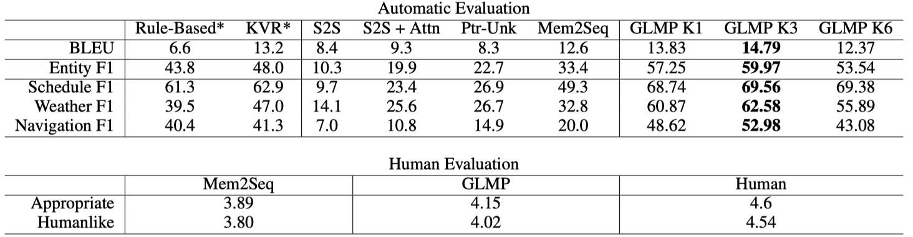
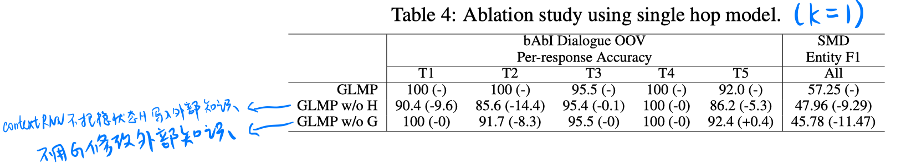

> > ICLR 2019， 面向任务的对话系统，知识库

代码：https://github.com/jasonwu0731/GLMP

## 背景

端到端的对话系统很难有效地把【外部知识库】与【response生成】结合起来。因为KB是很大的而且动态的，它就相当于是一个有噪声的输入，很难被编码和解码，就会造成response生成的不稳定。（这对于面向任务型对话系统很有害，因为这类任务生成的response中的实体一般来自于KB）。

本文提出了**global-to-local memory pointer (GLMP) networks**，它包含一个 global memory encoder、一个 local memory decoder 和 一个共享的外部知识库。

- 利用 encoder 和 外部知识库，学习一个 global memory pointer 和 global contextual representation。其中 global memory pointer 通过过滤掉一些不需要copy的词来改变外部知识。
- local memory decoder 首先使用一个 sketch RNN 来得到 sketch responses（只有模板框架，没有槽值），然后，decoder 生成 local memory pointers，从外部知识中copy一些词来填充槽。

## 方法

##### 整体框架

>
>
>输入：会话历史 $X=\left(x_{1}, \dots, x_{n}\right)$，KB 信息 $B=\left(b_{1}, \dots, b_{l}\right)$
>
>输出：response $Y=\left(y_{1}, \dots, y_{m}\right)$
>
>基本流程：
>
>- Encoder：
>  - global memory encoder 使用 RNN 编码历史对话，并把隐状态写入外部知识
>  - 最后一个隐状态用于读取外部知识，并生成 global memory pointer
>
>- Decoder：
>  - local memory decoder 用 sketch RNN 生成 sketch responses
>  - global memory pointer 和 sketch RNN的隐状态 作为query 被输入到外部知识
>  - 外部知识返回 local memory pointer，来从外部知识中copy一些词填充槽。

##### 外部知识：主要用来存储知识库和会话历史信息。

> 
>
> - 知识库中的每个元素被表示成三元组的形式。会话历史也被表示成三元组的形式<用户, turn_i, word>。
>
> - 在推断阶段，指向那个memory位置，相应的词就会被copy。
>
> - 知识的读取和写入：
>
>   - 外部知识最多存储K跳记忆。由一组可训练的embedding参数组成
>
>   ​                           $C=\left(C^{1}, \ldots, C^{K+1}\right), \text { where } C^{k} \in \mathbb{R}^{|V| \times d_{e m b}}$
>
>   - 外部知识中存储的记忆包括 $M=[B ; X]=\left(m_{1}, \dots, m_{n+l}\right)$
>
>   - 读取记忆时，需要有一个初始的query向量 $q^{1}$，
>
>     然后对每一跳计算权重
>
>     ​    
>
>     
>
>     然后更新query向量：
>
>     ​                                     $o^{k}=\sum_{i} p_{i}^{k} c_{i}^{k+1}, \quad q^{k+1}=q^{k}+o^{k}$

##### global memory encoder

>
>
>- Context RNN
>
>  - 使用BiGRU编码会话历史，得到 $H=\left(h_{1}^{e}, \ldots, h_{n}^{e}\right)$。
>
>  - 把H写入外部知识，即更新memory单元：
>
>    ​       $c_{i}^{k}=c_{i}^{k}+h_{m_{i}}^{e} \quad \text { if } \quad m_{i} \in X \text { and } \forall k \in[1, K+1]$
>
>  - 把最后一个隐状态作为外部知识的query，得到 $q^{K+1}$ 作为编码的KB信息。
>
>- Global memory pointer
>
>  Global memory pointer $G=\left(g_{1}, \dots, g_{n+l}\right) $ 是包含0/1元素的向量，计算方式是：
>
>  ​                                            $g_{i}=\operatorname{Sigmoid}\left(\left(q^{K}\right)^{T} c_{i}^{K}\right)$
>
>  为了帮助模型训练，在这一步增加一个辅助任务，$G^{label}=\left(g_{1}^{l}, \ldots, g_{n+l}^{l}\right)$表示对应的词是否在 Y 中出现，即 $g_{i}^{l}=\left\{\begin{array}{ll}{1} & {\text { if } \text {Object}\left(m_{i}\right) \in Y} \\ {0} & {\text { otherwise }}\end{array}\right.$
>
>  cross entropy loss 为：$\text {Loss}_{g}=-\sum_{i=1}^{n+l}\left[g_{i}^{l} \times \log g_{i}+\left(1-g_{i}^{l}\right) \times \log \left(1-g_{i}\right)\right]$

##### local memory decoder

>
>
>- Sketch RNN：生成不包含槽值的 sketch response $Y^{s}=\left(y_{1}^{s}, \dots, y_{m}^{s}\right)$
>
>  GRU解码器的初始状态是 $h_n^e$ 和 $q^{K+1}$ 的concat。
>
>  每一步解码：
>
>  ​                       $h_{t}^{d}=\operatorname{GRU}\left(C^{1}\left(\hat{y}_{t-1}^{s}\right), h_{t-1}^{d}\right), \quad P_{t}^{v o c a b}=\operatorname{Softmax}\left(W h_{t}^{d}\right)$
>
>  Loss：
>
>  ​                       $\operatorname{Loss}_{v}=\sum_{t=1}^{m}-\log \left(P_{t}^{v o c a b}\left(y_{t}^{s}\right)\right)$
>
>  其中，槽值用 @实体类型（sketch tag）代替。
>
>- Local memory pointer
>
>  首先用G来改变外部知识：
>
>  ​                $c_{i}^{k}=c_{i}^{k} \times g_{i}, \quad \forall i \in[1, n+l] \text { and } \forall k \in[1, K+1]$
>
>  然后用当前时刻的Sketch RNN隐单元$h_{t}^{d}$ 作为外部知识的查询，最后一跳的attention weight vector作为Local memory pointer ​L_t 的分布，L_t 的 ground truth为：
>
>  ​                    $L_{t}^{l a b e l}=\left\{\begin{array}{ll}{\max (z)} & {\text { if } \exists z \text { s.t. } y_{t}=\operatorname{Object}\left(m_{z}\right)} \\ {n+l+1} & {\text { otherwise }}\end{array}\right.$
>
>  Loss为：$\text {Loss }_{l}=\sum_{t=1}^{m}-\log \left(L_{t}\left(L_{t}^{l a b e l}\right)\right)$
>
>  此外，为了防止多次copy同一个实体，解码过程中维护一个记录向量R，其各元素初始化为1，如果对应的实体被copy过，则R中对应元素被mask掉。在推断阶段，
>
>  ​                       $\hat{y}_{t}=\left\{\begin{array}{ll}{\arg \max \left(P_{t}^{v o c a b}\right)} & {\text { if } \arg \max \left(P_{t}^{v o c a b}\right) \notin S T} \\ {\text {Object }\left(m_{\text {arg } \max \left(L_{t} \odot R\right)}\right)} & {\text { otherwise }}\end{array}\right.$

总loss：

## 实验

**数据集**：bAbI Dialogue、Stanford Multi-domain Dialogue（SMD）

**实验结果**：

在bAbI Dialogue数据集上，评估指标是per-response accuracy 和 task-completion rate：

在SMD数据集上，评价指标是BLEU和F1：

消融实验：

## 亮点

- 本文提出了方法，帮助 面向任务型对话系统 更好地在response生成过程中融合KB中的实体，以及对会话历史实行 copy 机制。
- encoder阶段 产生的 global memory pointer 用于先过滤掉一些不可能的memory单元，这对每一步解码有很大的帮助。

