> >AAAI2016，基于character的word embedding

Character-Aware Neural Language Models

## 背景

通过neural language model得到的词向量无法捕捉字词信息（e.g.词素），稀少词的embedding学不好，尤其是对于形态丰富的语言。

**本文提出提出了一个语言模型，通过一个CNN层来利用字词信息，CNN的输出作为RNN语言模型的输入。**

## 模型

> 整体框架：
>
> 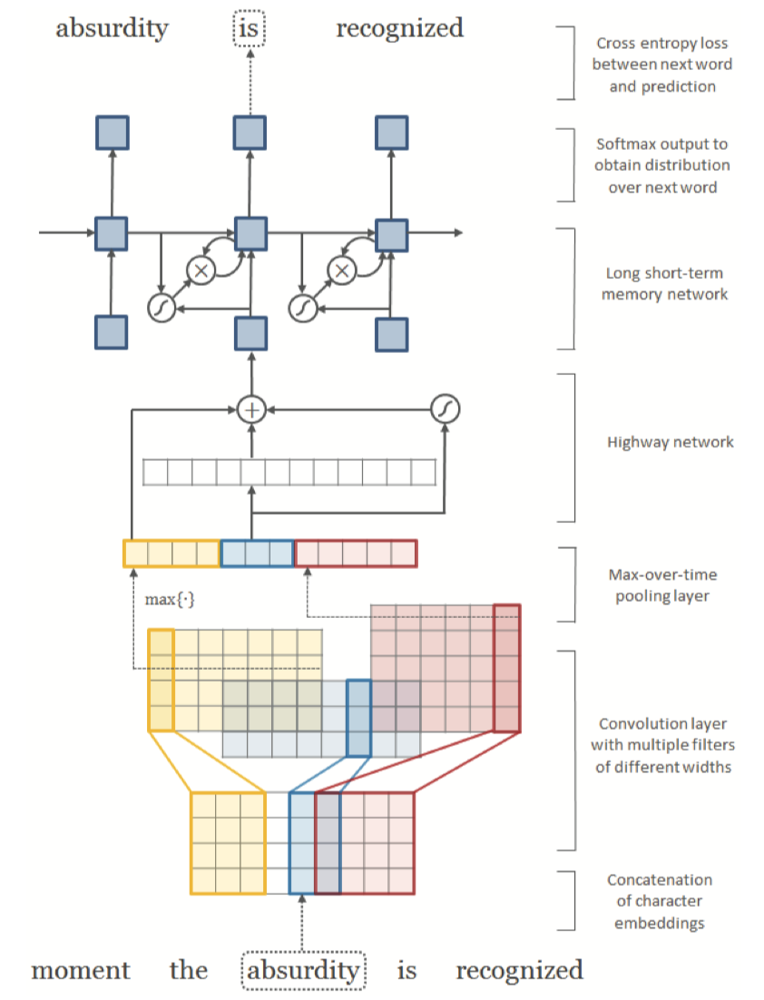
>
> - character embedding layer
>
> - CNN+maxpooling 层：不同尺寸的多个卷积核之后，使用maxpooling，得到h维的词向量表示y。
>
> - highway layer：
>
>   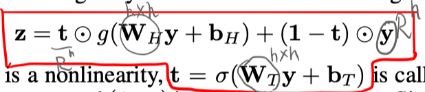
>
> - RNN
>
>   如果词典过大，可以使用分层的softmax，计算方式如下：
>
>   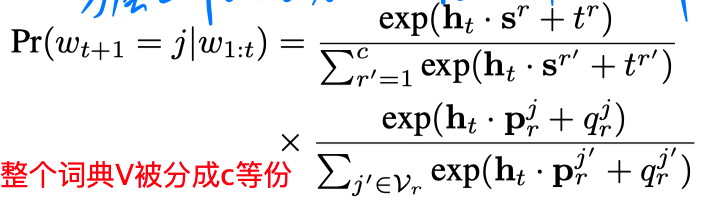
>
> loss函数：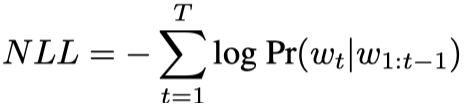

## 实验

- 数据集：先在English Penn Treebank数据集上调参，之后在形态更丰富的其他语言数据集上进行实验。

- 评估指标：困惑度 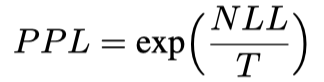

- small 和 large 两个模型版本：

  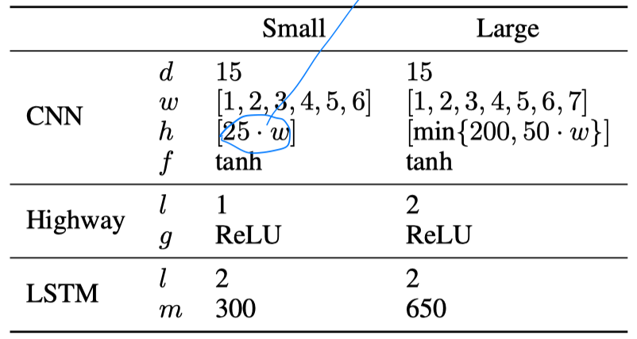

- 实验结果：

1. 在ETB 和 其他语言数据集上的结果

   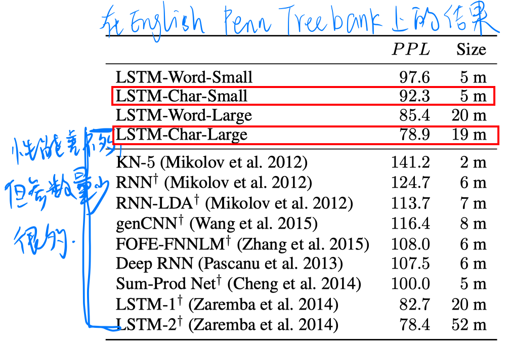

   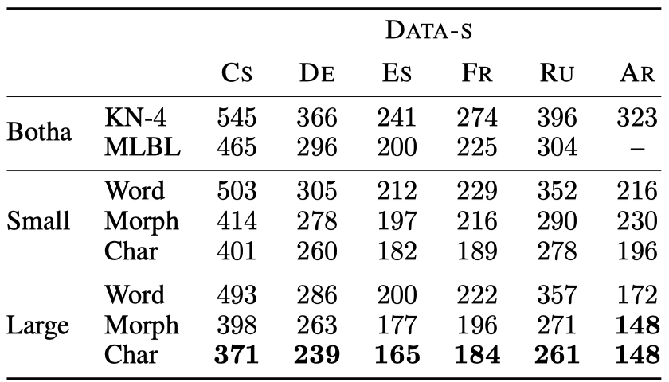                  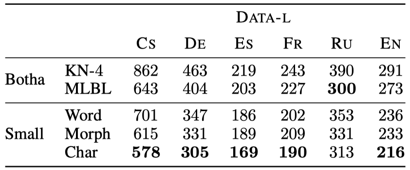

2. 利用PCA降维，得到n-gram表示的分布

   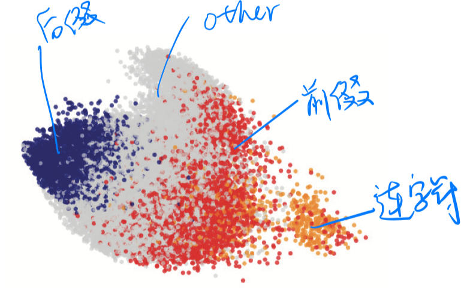

3. highway layers的必要性

   **CNNs + Highway Network over characters can extract rich semantic and structural information.**

   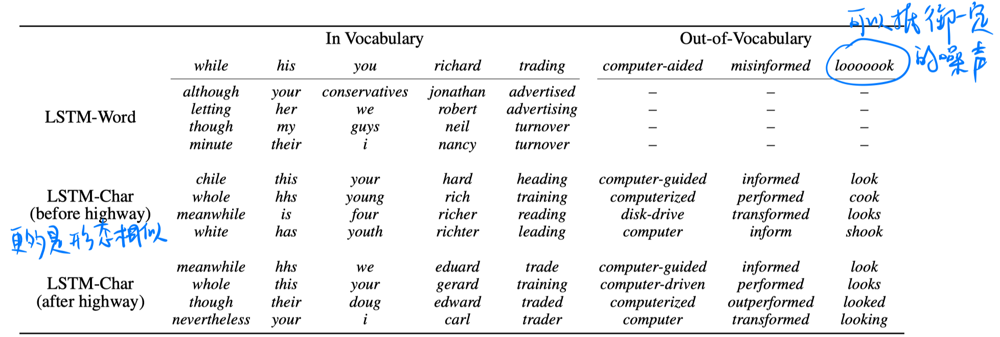

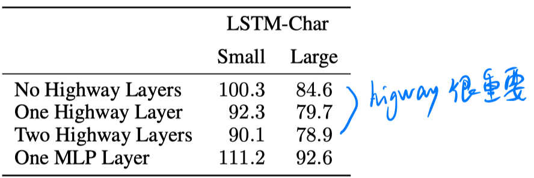

 

4. 一些其他的结果

把CNN得到的表示和word-level embedding结合起来得到词的表示，在某些任务上性能反而会下降。说明在某些任务上，基于character得到词的表示就足够了。

