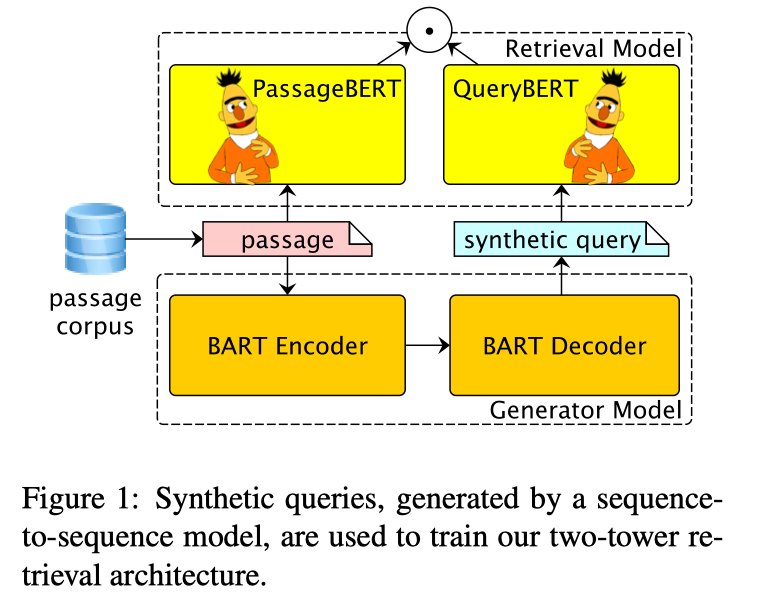
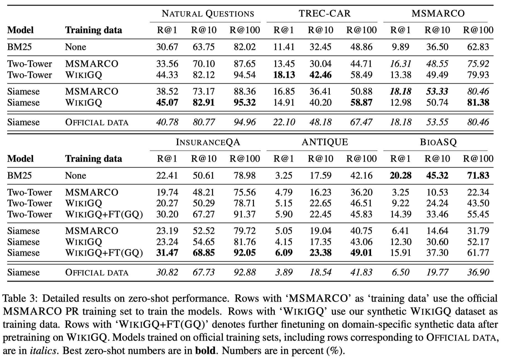

## 背景与动机

## 解决思路

we propose a novel method for generating synthetic training data for retrieval.

- we finetune BART on MSMARCO positive query-passage pairs to perform query generation (QG). 
- Then, we construct a largescale dataset by applying the BART QG model on English Wikipedia passages to generate synthetic query-passages pairs.
- we consider the embedding-based two-tower architecture as our neural retrieval model.

## 方法

## 实验

