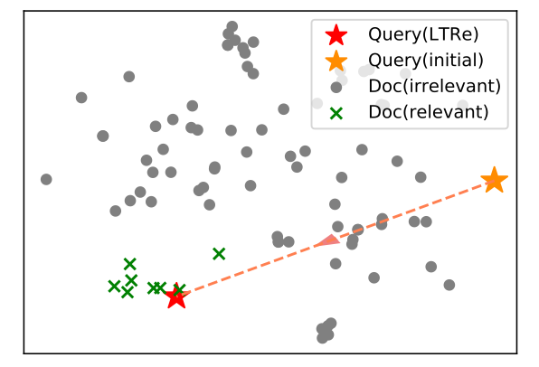
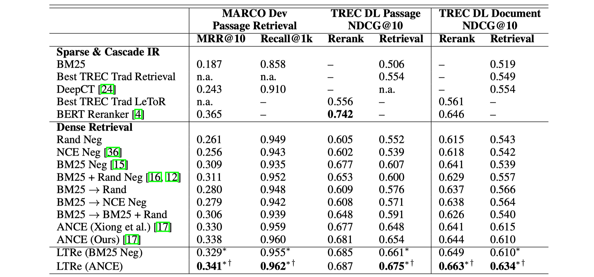
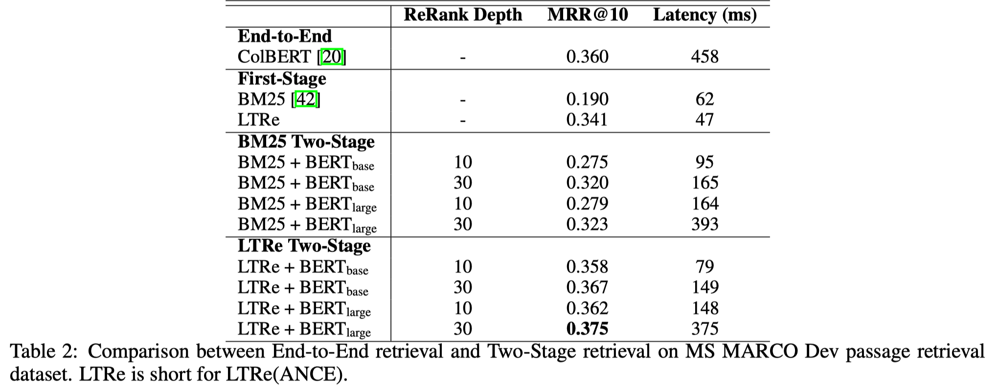
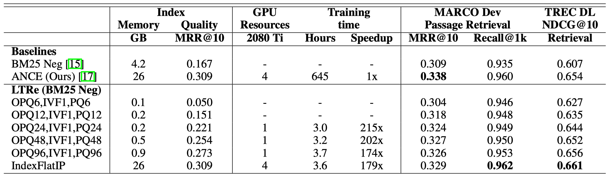

### 背景与动机

之前的模型采用负采样的方法训练 dense retrieval模型（How to effectively and efficiently train a DR model is still an open question. Previous works utilize the negative sampling method. Given a query, they sample several irrelevant documents from the corpus and mix them with relevant ones. Then they train the DR model to rerank these documents.）

负采样的方法包括：1）BM25 top documents；2) in-batch negatives；3）random samples；4）asynchronous approximate nearest neighbors；5） combinations of several above techniques.

使用负采样的方法会使模型的训练和推断之间存在差异（there exists discrepancy between training and inference when using negative sampling methods. Such methods teach a model to rerank the sampled documents during training, but require the model to retrieve from the entire corpus during inference.）

### 解决思路

为了解决这种训练和推断之间的差异，本文提出LTRe（To resolve it, we present Learning To Retrieve (LTRe), an effective and efficient training mechanism for Dense Retrieval.）

LTRe first uses a pretrained document encoder to represent documents as embeddings, which are fixed throughout the training process. At each training step, the DR model outputs a batch of queries’ representations. LTRe then uses them and performs full retrieval. Based on the retrieval results, LTRe updates the model parameters. Compared with previous works, LTRe teaches the DR model to retrieve rather than to rerank. Thus it is consistent in training and inference. 

To achieve this, LTRe runs as follows. It adopts a pretrained document encoder to map the corpus before training. According to the entire corpus distribution in the representation space, LTRe optimizes the query mapping globally.

### 方法（Learning To Retrieve (LTRe)）

1. Before training, LTRe pre-computes the document embeddings with a pretrained document encoder and builds the index. They are fixed throughout the entire training process. During training, LTRe only updates the parameters of query encoder ϕ.
2. At each training iteration, it retrieves the top-n documents for a batch of queries, which is the same as inference time. 
3. Based on the retrieval results, LTRe optimizes the query representation process as follows. It fetches the documents’ pre-computed embeddings and computes the relevance scores. 
4. It then computes the pairwise loss and uses back-propagation to update the DR model parameters

**优点**：1）it is consistent in training and inference；2）it utilizes the top-ranked results as hard negatives（难负例）；3）it computes and deploys the document index once for all, which brings additional efficiency benefits compared with the iterative index refreshes；4）it can use a compressed document index to further reduce the computational costs.

### 实验

数据集：MSMARCO passage dev、TREC DL2019 passage test、TREC DL2019 document test

结果：

1. First-Stage Effectiveness

2. Two-Stage Effectiveness

   

3. Training Efficiency

### 结论

