> > ICLR2018，信息检索，多任务学习

Multi-Task Learning for Document Ranking and Query Suggestion

##背景

查询会话：某用户在短时间内的一连串查询和点击序列。

查询会话提供了有用的上下文信息，帮助理解用户意图、排除文本排序时的歧义、预测下一个可能的问题。

本文提出了一个多任务学习框架$\color{red}{M-NSRF}$（multi-task neural session relevance framework），联合学习**文本排序**和**下一个查询预测**。这两个任务都是<u>用户潜在的查询意图</u>驱动的。

它包括两个模块：

-  document ranker：结合当前query和会话信息得到一个表达，和文档表达进行比较，进而计算相关性排序。（即在文本匹配这个任务上用的是基于表达的方法）。并且文本排序问题被建模成了pointwise分类问题。

- query recommender：跟踪用户在该查询会话中的查询变更序列，使用seq2seq架构生成下一个可能的查询。

## 方法

#### M-NSRF

> 整体模型架构：
>
> 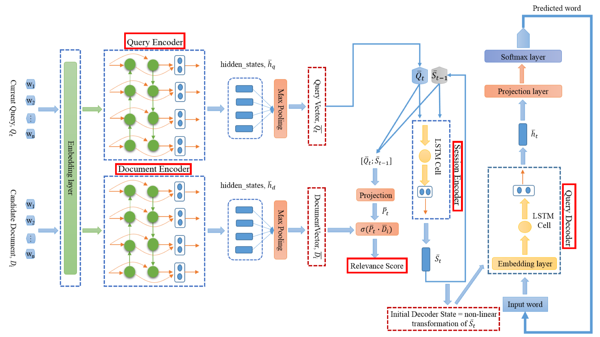
>
> - 模型的输入：
>
> 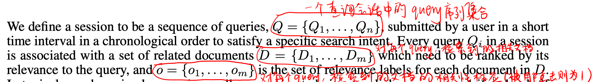
>
> - 文本排序模块：
>
>   - query encoder：BiLSTM+maxpooling
>
>   - document encoder：BiLSTM + maxpooling（本文只使用document title，因为文档比查询长，所以LSTM使用比query encoder更多的隐单元）
>
>   - session encoder：单向LSTM（隐单元个数和前两个模块不同）
>
>     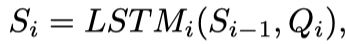
>
>     在该模块，每个query得到了它在session-level的表达（该表达编码了该query及之前所有query的信息）
>
>   - ranker
>
>     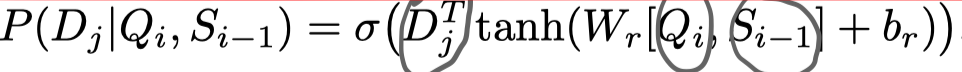
>
>     因为本文使用的数据集只有用户的点击记录，即只有正样本。所以使用BM25构造负样本。在train和dev时，每个查询有5个候选在文档，但test时每个查询有50个候选文档。
>
> - 查询预测模块：基于LSTM的seq2seq架构（解码过程使用贪心算法）
>
> 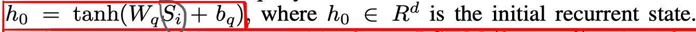
>
> 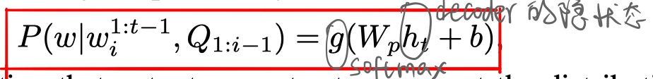
>
> - 目标函数：
>
>   总loss是两部分loss之和。
>
>   - 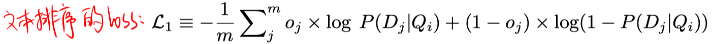
>
>   - 
>
>     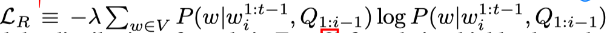
>
>     通过L_R正则项可以保证生成单词的多样性，防止偏向某些单词。        

#### M-Match-Tensor模型

> 本文还进行实验，将Match-Tensor模型融入进本文提出的多任务学习框架，形成M-Match-Tensor模型。
>
> 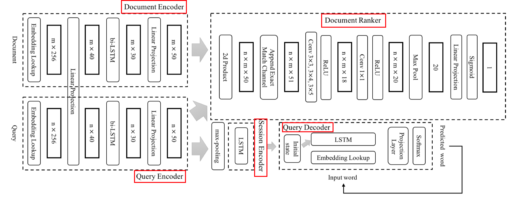
>
> 主要影响的是document encoder、query encoder、ranker模块，把文本匹配部分变成基于表达和基于交互融合的方法。
>
> 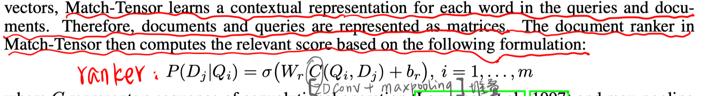

## 实验

源码：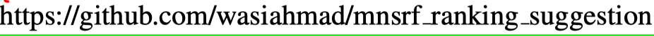

数据集：AOL search log

结果：

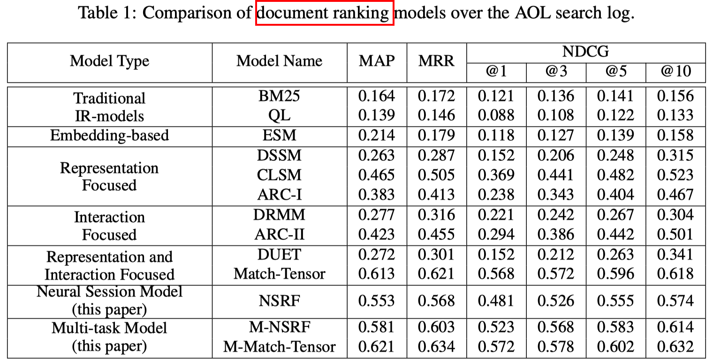

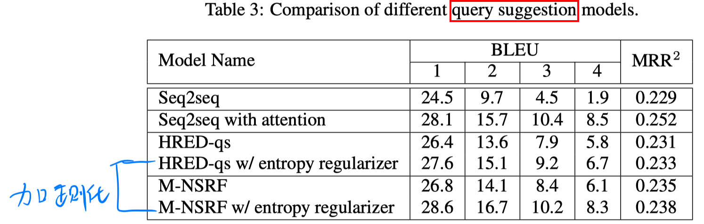