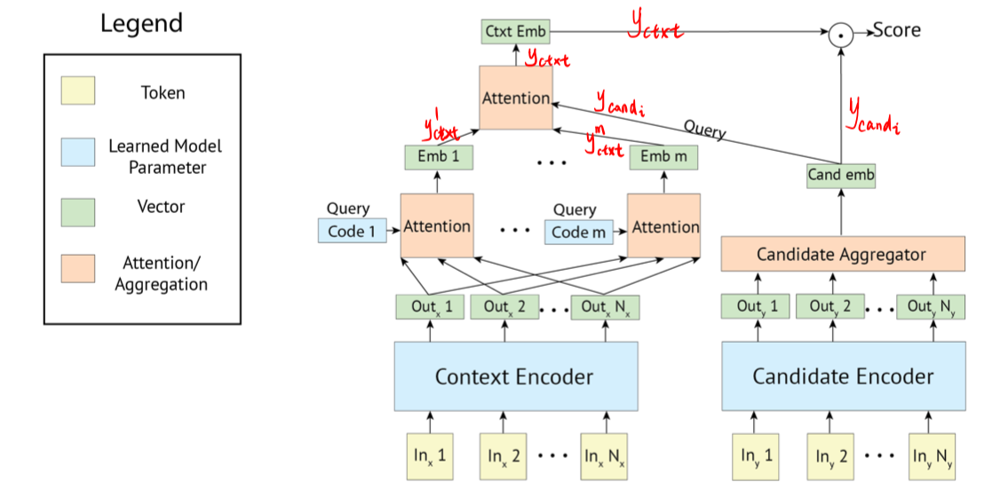
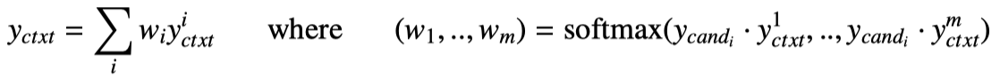
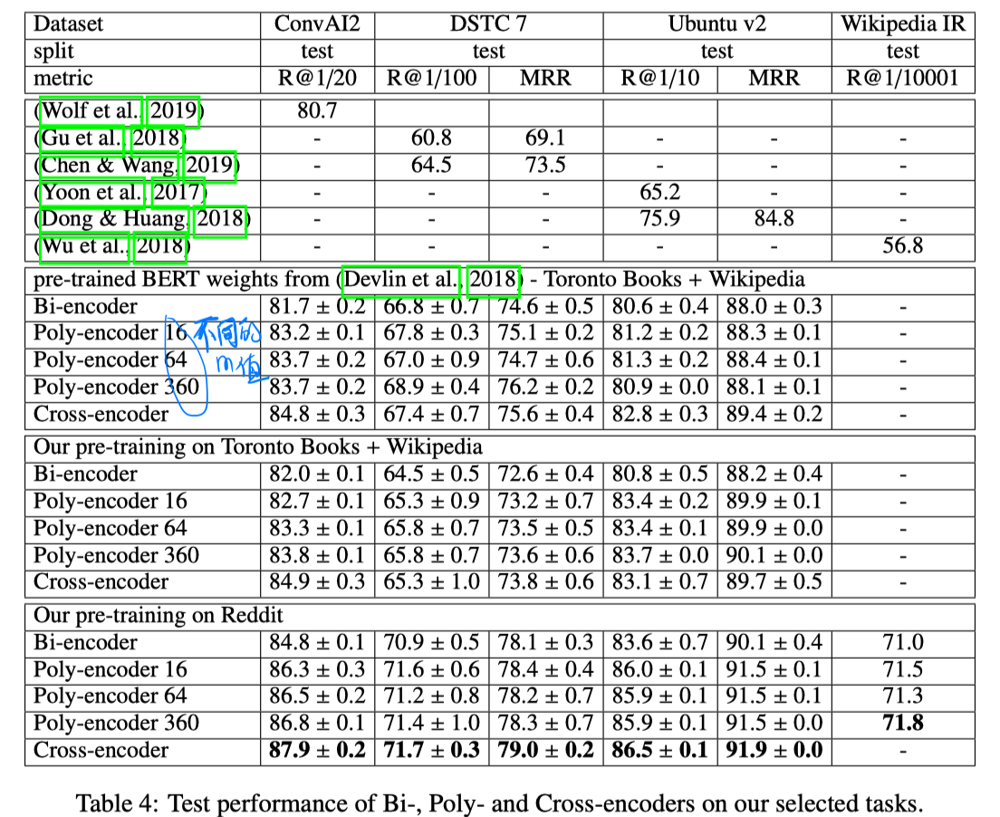
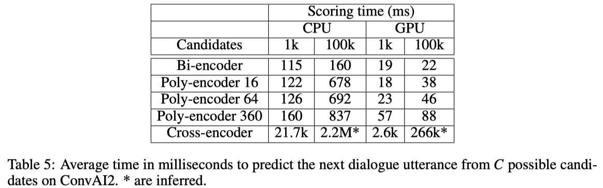

# [dialogue/IR ICLR2020] Poly-encoders：Architectures and Pre-training Strategies for Fast and Accurate Multi-sentence Scoring

```
论文作者：Samuel Humeau, Kurt Shuster, Marie-Anne Lachaux, Jason Weston
论文单位：Facebook AI
论文地址：https://openreview.net/pdf?id=SkxgnnNFvH
代码地址：暂无
论文类别：方法
```


## Motivation-论文解决了什么问题

使用预训练的模型（e.g. BERT）在很多应用上都取得了明显的进步。对于ranking任务，通常有两种微调架构：

- cross-encoder：在文本对上，进行 full self-attention。
- bi-encoder：分别编码文本对。

本文提出了一个新的架构**Poly-encoder**，以在性能和速度之间做到均衡。


## Motivation-本文的方法思路

Poly-encoder主要是学习 global self-attention特征，而不是词级别的。


## Method-模型概述



- Context Encoder模块使用和 BERT-base 相同的结构。本文进行了从头的预训练（其中一个是使用和
  BERT相同的预训练数据和预训练方法，另一个是使用Reddit数据而且NSP任务中next sentence 换成了next utterance）。对于question和candidate，分别在预训练的Encoder上进行微调

- 对于candidate，使用第一个词的输出作为它的表达 $y_{cand}$

- 对于question，encoder的输出为$h_1, ……, h_N$ ，然后计算

  

  $c_i$ 是参数，可以理解为对词的表达输出进行了m种attention-pooling，得到m个全局特征表达。

  

- 基于点积 $y_{c t x t} \cdot y_{c a n d}$ ，计算两者的相似度。
  
- 损失函数：cross-entropy loss


## Experiment-实验

**数据集：**

对dialogue任务：ConvAI2、DSTC7（Track1）、Ubuntu V2

对IR任务：Wikipedia Article Search

**实验结果：**





- cross-encoder 比之前的方法以及 bi-encoder 的性能更好。
- poly-encoder 比 bi-encoder 的性能更好，而且m值越大，表现越好。
- 在某些任务上，poly-encoder 比 cross-encoder 的性能更好。
- 使用reddit数据进行预训练，可以使结果有明显提升。说明使用和下游任务更类似的预训练任务更好。


## Highlight

本文提出的Poly-encoder模型可以在ranking任务的性能和速度之间做到更好的trade-off。


