> >2020，分析类文章

### 摘要

- 本文探究了dual encoder（Dense vector）与传统的sparse bag-of-words vector，还有Attention网络的能力上的区别。 （主要是探究了编码维度和文本长度之间的联系）
- 本文提出了一个模型multi-vector encoding，结合了它与BM25之后，探究了一种sparse-dense混合的模式。

### 引言

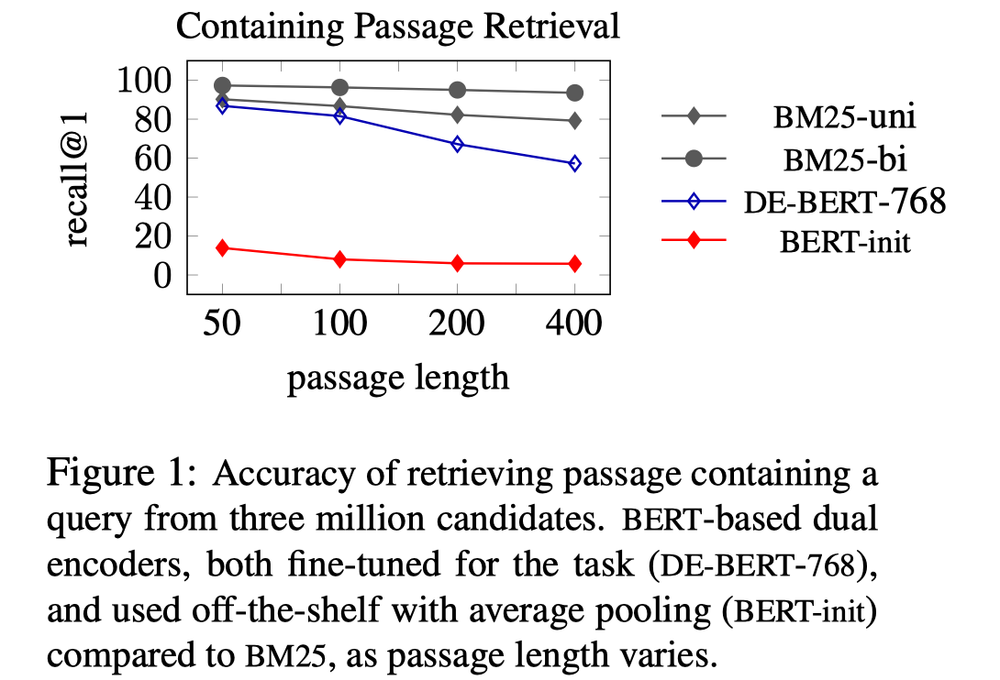

- Dual encoder因为他的高效性，可以被用于full ranking，但是目前来看他的性能很难超过BM25。

- 本文主要探究了dual encoder的capacity问题：

  1）在什么情况下dual encoder的能力可以匹配 sparse bag-of-words model（例如BM25）

  2）dual encoder的能力随着 文档长度 和 字典大小 会有什么变化？

- 一些探索结果显示：

  1）为了维持boolean bag-of-words的检索效果，dual encoder的编码维度与最长doc中不同词的数目的平方成正比。也探究了更一般的bag-of-words模型，例如BM25

  3）基于attention的架构所需的embedding维度更低，但计算代价更高

  4）dual encoder的性能会随着文档长度下降

  5）简单的结合dual encoder、sparse retrieval、attention可以取得显著的性能提升

### 分析实验

##### 探究Dual Encoder Retrieval的性能和embedding size的关系

> Dual Encoder的性能用它是否可以和boolean bag-of-words+dot product的检索排序保持一致来衡量。

**定义：**

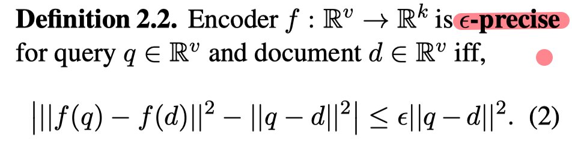

**定理1：**

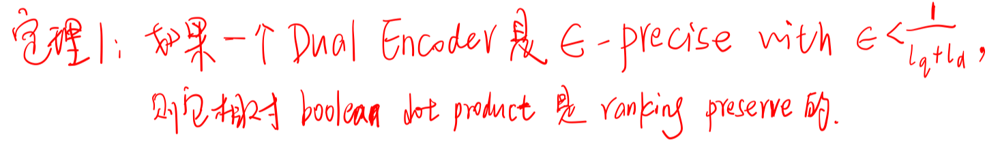

其中，l_q和l_d表示q和d中包含有多少个不同的word。

**定理2：**

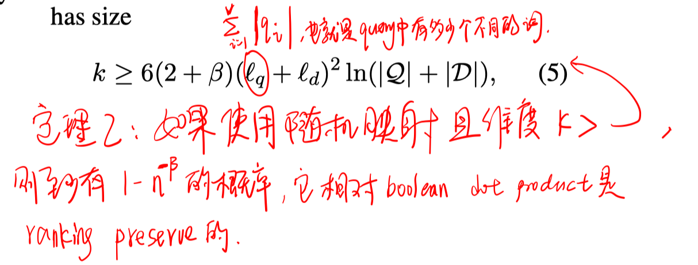

也就是说如果是随机映射，则需要的embedding size的下界与 query和document中包含的不同词的个数的平方成正比的。

> 把boolean retrieval换到更一般的形式，例如TFIDF、BM25

**定理3：**

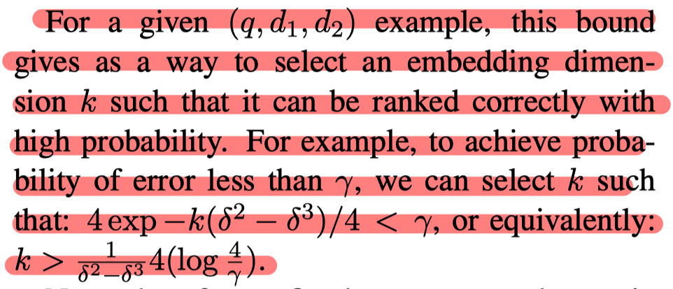

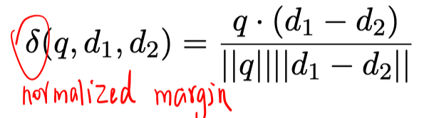

##### 2、分析Attention

**定理4：**基于attention的架构所需的embedding维度与document长度一致，但是它的缺点主要在于复杂度高。

### 提出模型：Multi-Vector Encoding

根据分析实验的结果，如果使用dual encoder，对于长文档的话需要的embedding size会过大。

因此本文提出了一个新的模型，每个document用m个向量表示，这样的方法对提高长文本的性能会更明显。

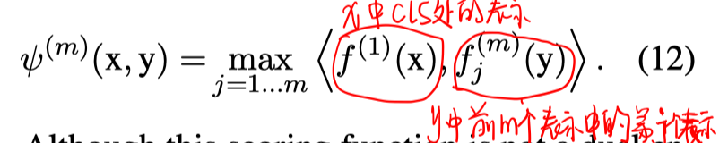

### 实验

##### 实验设置

对比实验：

BM25、Rademacher Embeddings、DE-BERT-k（两个bert，再把768维向量映射到k维）、cross-attention BERT（query+doc拼接后输入BERT）、Sum-of-Max（类似CoIBERT）、ME8-k（本文提出的模型，m=8，再把768维映射到k维）

负例构造：

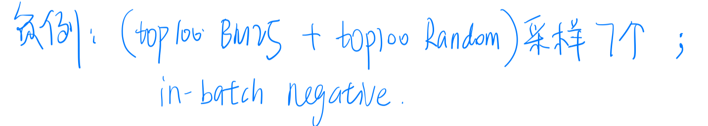

##### ICT实验

- 数据集构造：

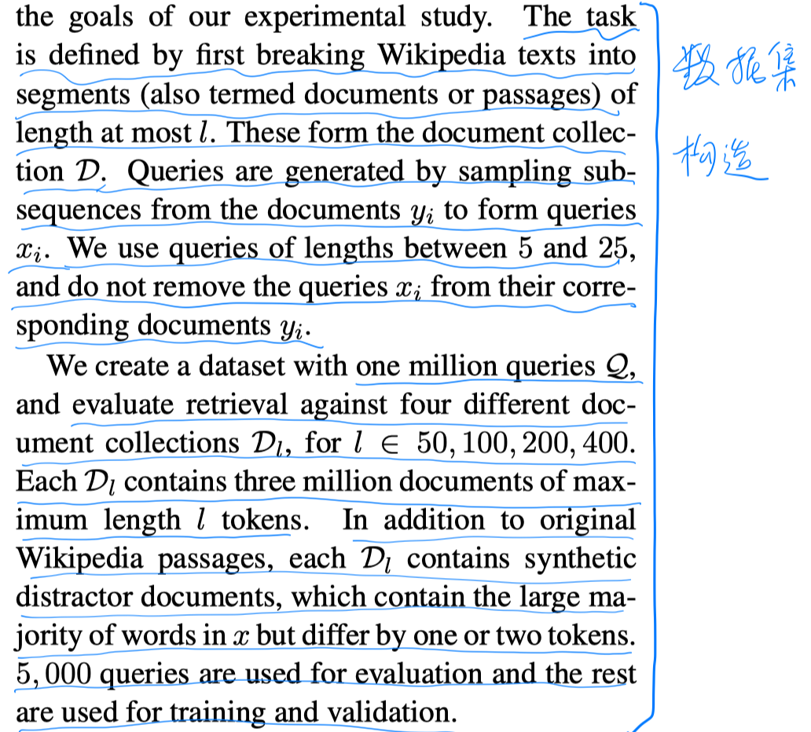

- 实验结果：

  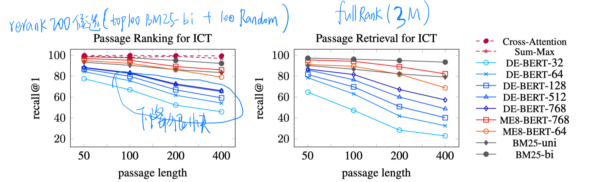

  1）DE-BERT的性能随着文本长度的增加，下降很快；

  2）Cross-Attention几乎最优，Sum-Max的性能也很不错而且效率更高。

  3）ME8-768和ME8-64相比DE-BERT，都有很大的margin。

  4）Rademacher embedding的维度在50，100，200，400长度上所需的维度分别为4K，6K，8K，32K，性能可以达到BM25的99%。

  5）对fullrank的设置，ME8基本可以和BM25持平，除了在400的长度设置上。

##### OpenQA实验

- 数据集构造

  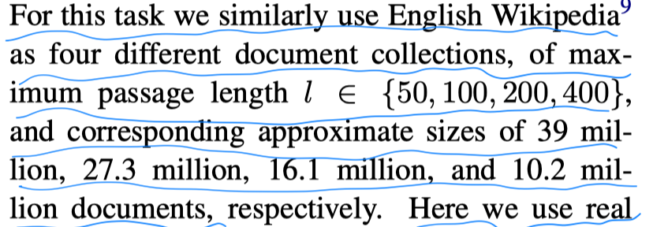

  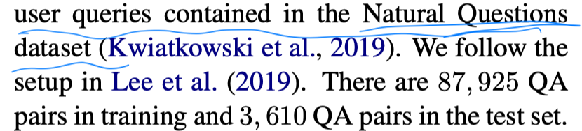

- 实验结果

  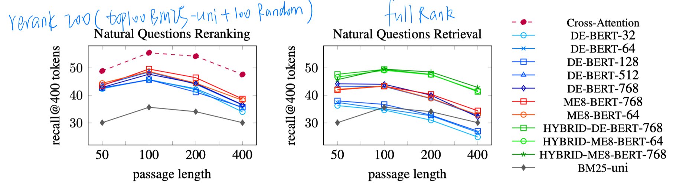

  1）BM25在该任务上并没有很强，因为该任务需要语义泛化。

  2）更高维的DE-BERT表现更好。

  3）ME8也是更高维度的表现很好，尤其在长文本上。

  4）cross-attention依然最好；Sum-Max没有比DE-BERT更好。

  5）在fullrank上，只有更高维的DE-BERT可以超过BM25.

  6）在fullrank上，混合模型有很大提升。

- answer预测的实验结果

  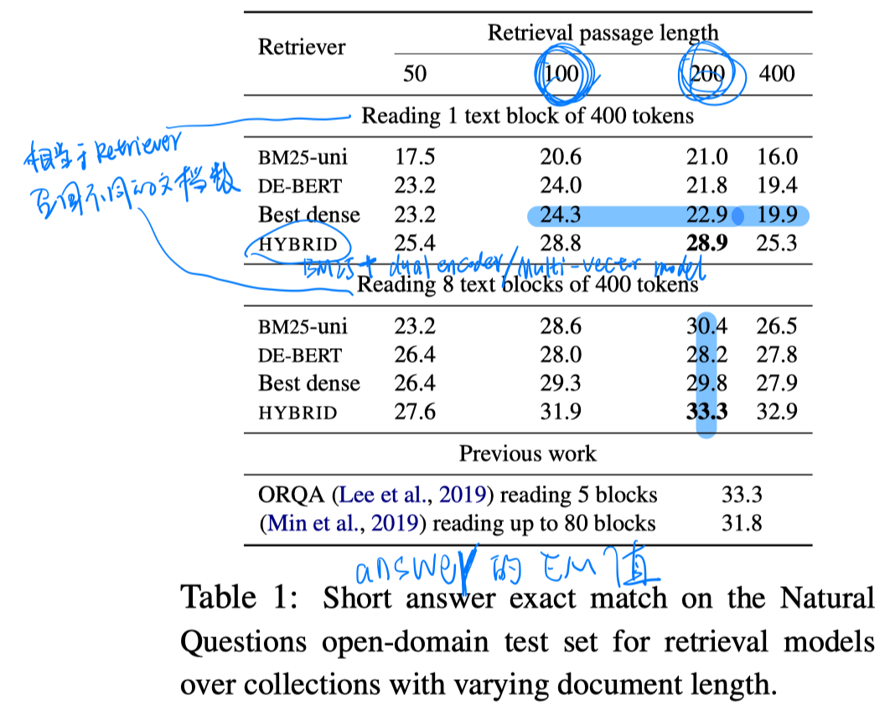

##### passage retrieval 实验

- 数据集：MSMARCO-passage、MSMARCO-document、TRECCAR

- 实验结果

  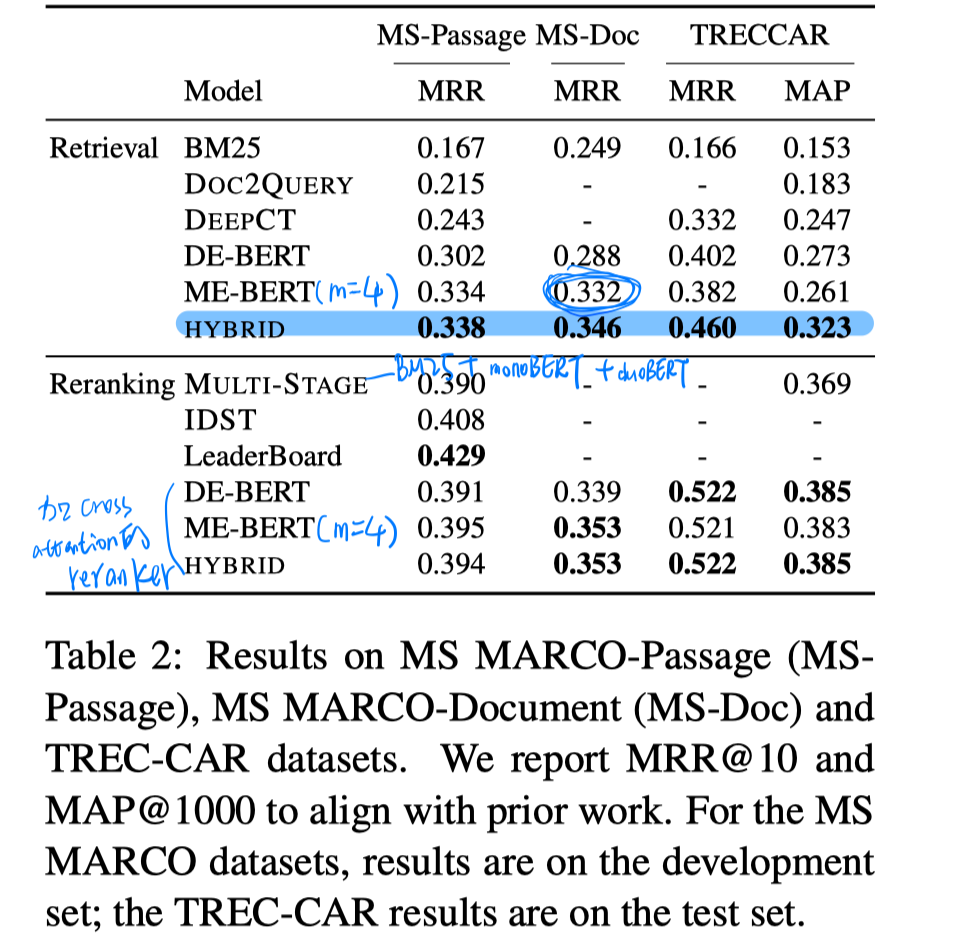

  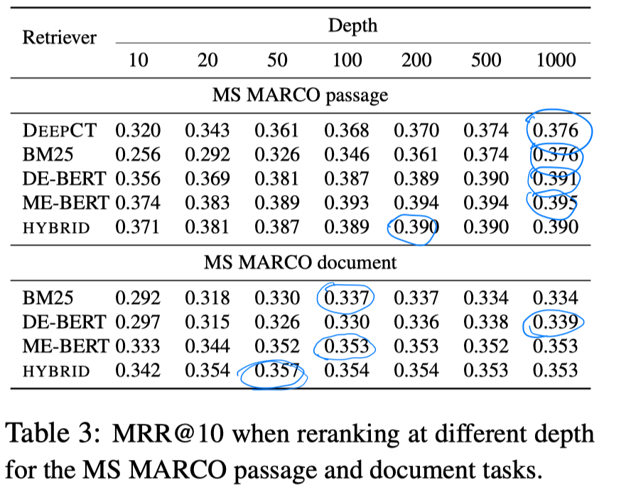

