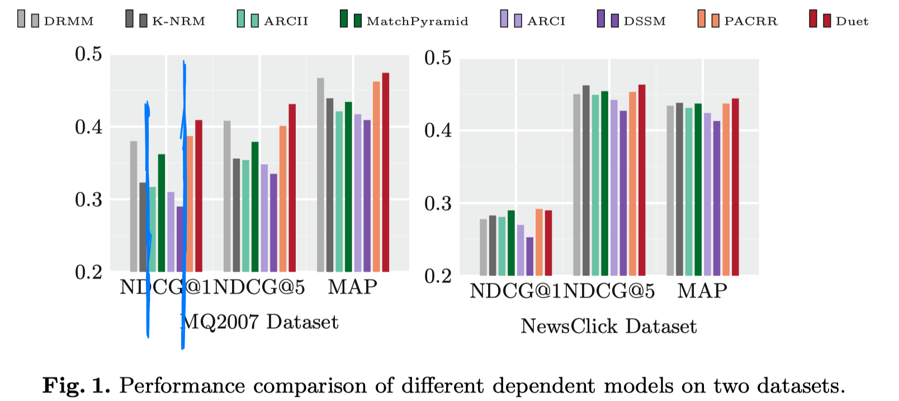
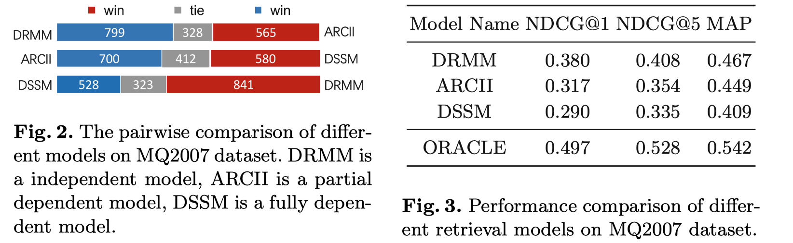
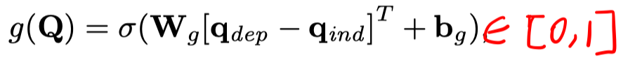
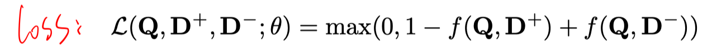
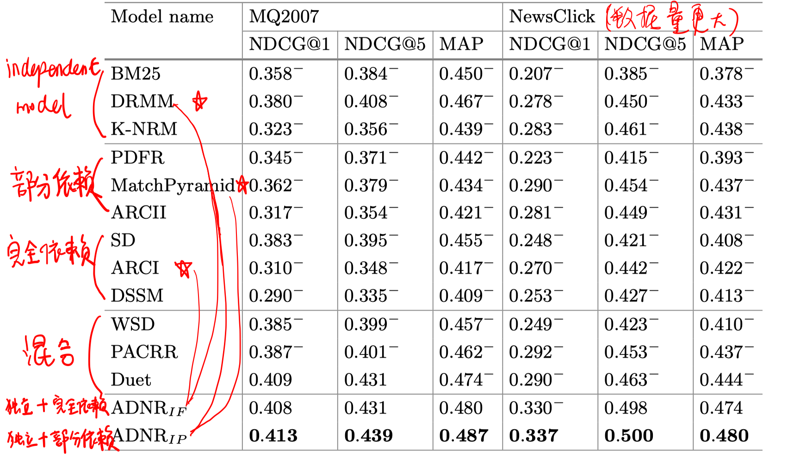

# 背景

- 本文从query term dependency的角度把现有的neural ranking model分为三类：1）independent model；2）dependent model；3）hybrid model。
- 通过实验发现，并不是哪一类模型有绝对的优势，而是对于不同的query，可能存在哪种模型更合适。
- 基于上述发现，本文提出了一个策略，根据每个query选择合适的模型。

# 先行试验

- Independent Model：DRMM、KNRM
- Dependent Model（部分依赖）：ARCII、MatchPyramid
- Dependent Model（完全依赖）：ARCI、DSSM、CDSSM、MVLSTM
- Hybrid Model：PACRR、Duet、CKNRM、MatchTensor、DeepRank

# 模型

提出一个term dependence gating network，先计算query的依赖表示$q_{dep}$和独立表示$q_{ind}$，如果两者差异不大，即g(Q)=0，则表示该query的term之间没有很强的依赖关系，即更适合独立性模型。

# 实验

ADNR_IF表示完全依赖的adaptive neural ranking，则$f_i$和$f_d$分别使用DRMM和ARCI。

ADNR_IP表示部分依赖的adaptive neural ranking，则$f_i$和$f_d$分别使用DRMM和MatchPyramid。

# 结论