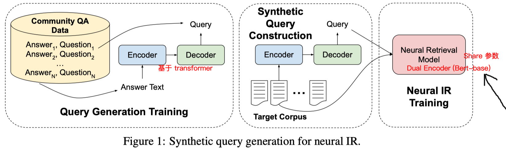
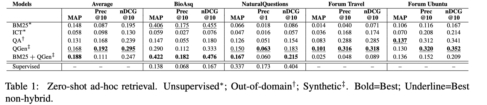

## 背景与动机

## 解决思路

In this paper, we propose an approach to zero-shot learning for ad-hoc retrieval models that relies on synthetic query generation.

we propose a data augmentation approach to leverage naturally occurring question/answering pairs to train a **generative model** that synthesis queries given a text. Once the model is trained, we can apply this model to documents in the target domain, resulting in unlimited pairs of synthetically generated queries and target-domain documents. This data then can be used to train a neural retrieval model.

## 方法

使用CQA的数据对训练问题生成模型：In this work, we mine English question-answer pairs from community question-answering resources, primarily StackExchange and Yahoo! Answers.

## 实验

