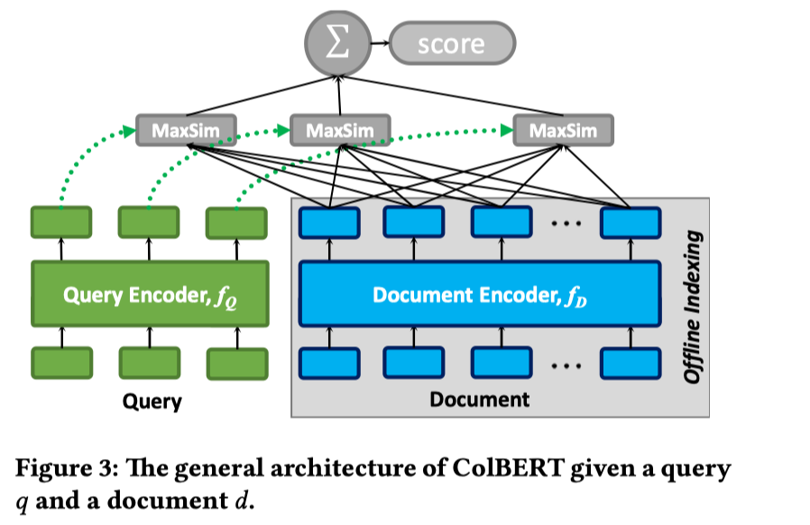
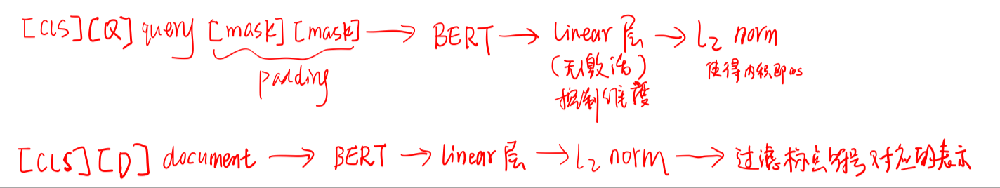
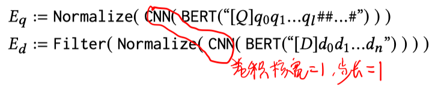
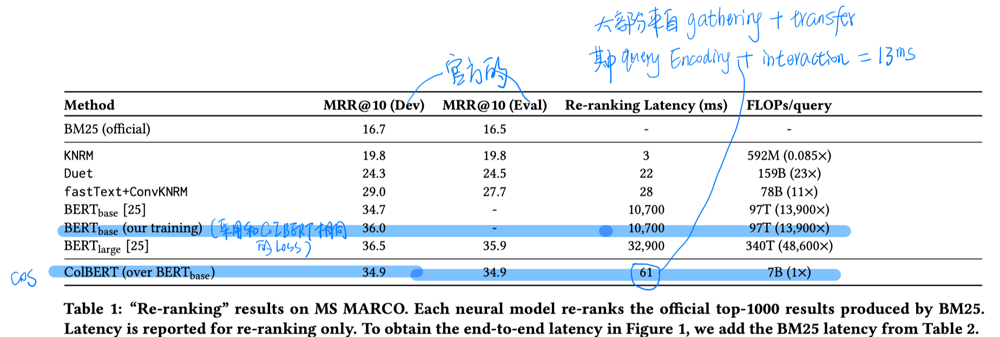
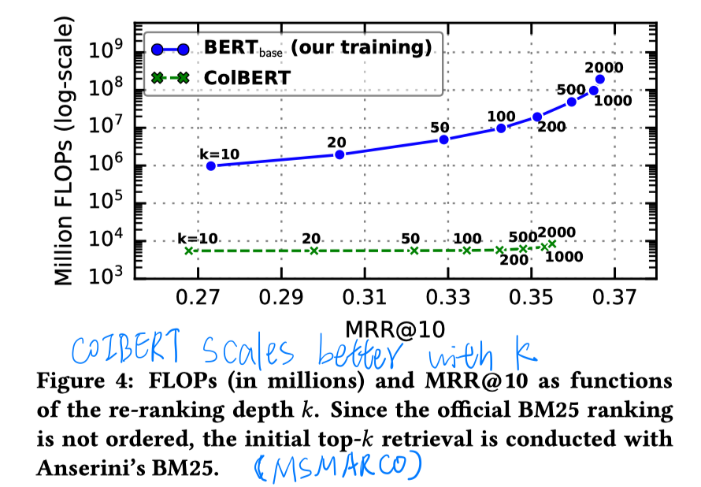
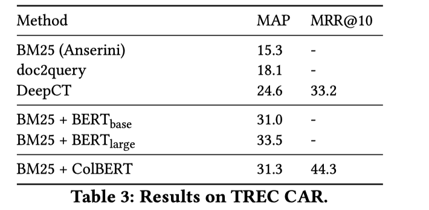
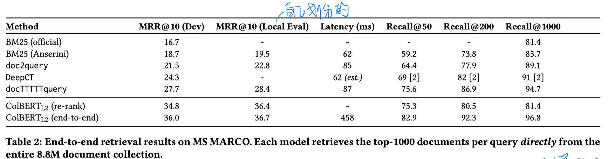
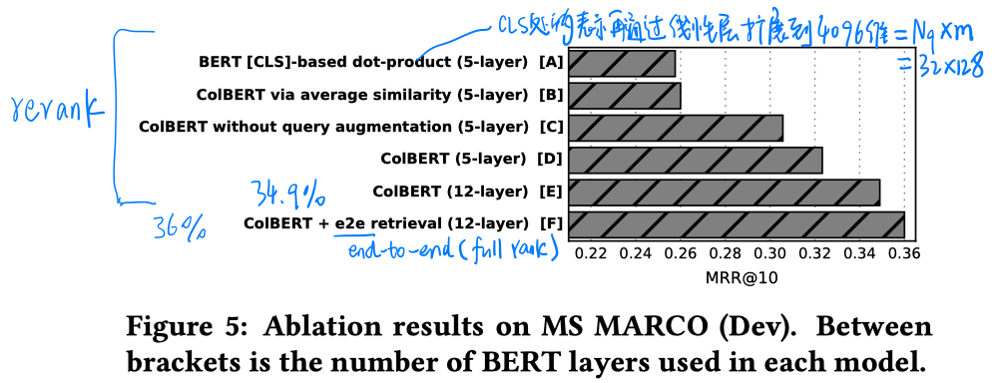
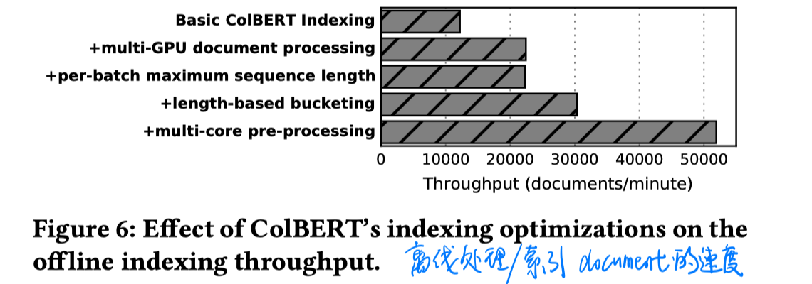
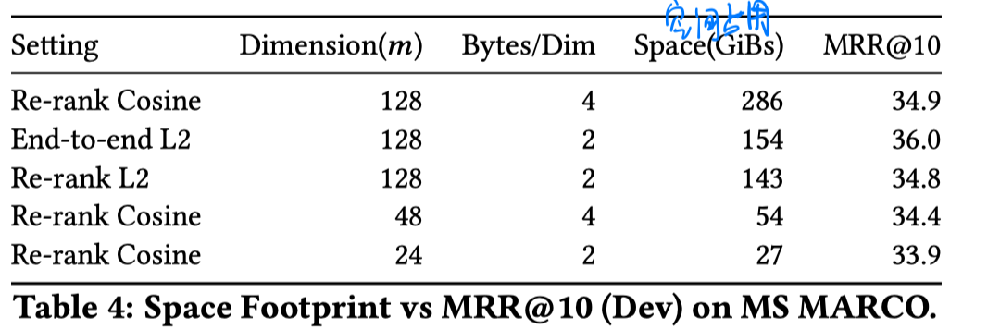

> > SIGIR2020

# 背景

CoIBERT的几个关键思路：

- 推迟交互
- query encoding时的augmentation操作很重要。
- MaxSim操作可以发挥剪枝优势，在fullrank时可以先过滤大部分文档。

# 模型

计算过程：（两个encoder共享参数）

损失函数：pairwise so￿max cross-entropy loss

# 实验

##### 数据集

MSMARCO、TREC CAR

##### 实验设置

re-rank时：用cos距离精确计算query和每个候选文档的score，然后排序。

full-rank时：分两个阶段。1）利用MaxSim操作的剪枝优势，并行地用query中每个词的向量表示查询k‘个近似文档，2）对N_q*k'个文档用L2的平方距离精确计算（同rerank的设置）。

##### 实验结果

- 在MSMARCO上的rerank结果

  

  探究可扩展性，即rerank不同数量的文档，计算代价的变化。

  

- 在CAR上的rerank结果

  

- 在MSMARCO上的full ranking结果

  

- 消融实验

  

- 预处理（编码+建索引）整个文档集合的时间和空间代价

  

  

# 结论

- 实验做的非常充分，值得参考！！！

