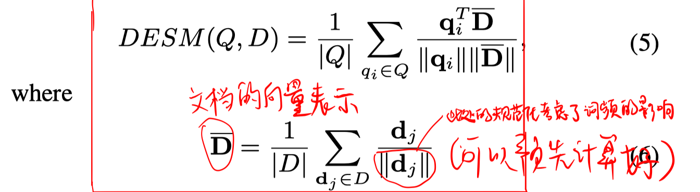
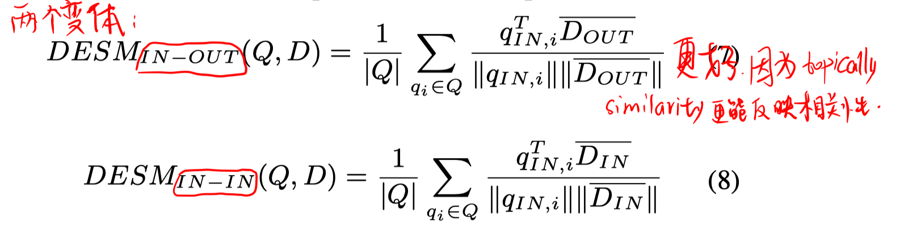
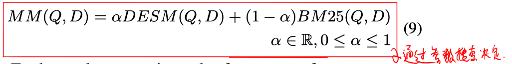
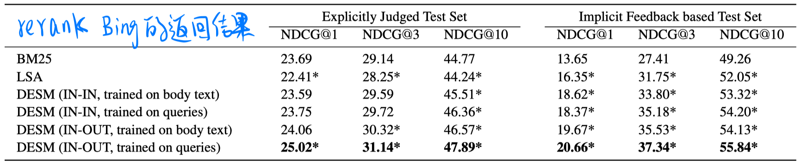
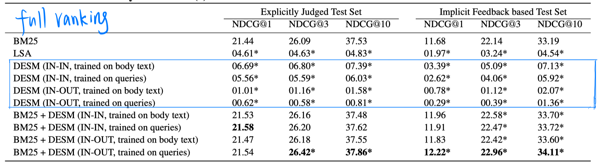

> > 2016，DESM

## 背景

传统的计算document和query的相关度的方法一般是基于精确匹配，例如概率模型衍生出的BM25。

本文提出Dual Embedding Space Model（DESM模型），探究使用neural word embedding的方法来捕捉非精确匹配信号。该模型创新性地提出使用$W_{in}$和$W_{out}$两个embedding空间。

## 方法

#### DESM模型

基于CBOW的模型。

> 普通的word2vec训练的词向量都舍弃了$W_{out}$，只留下$W_{in}$作为训练得到的词向量。
>
> 需要注意的是，仅使用$W_{in}$ （或$W_{out}$）计算得到的是typically similarity，使用$W_{in}$和$W_{out}$计算得到的是topically similarity。

两个变体：

#### Mixture模型

## 实验

##### 数据集

训练word2vec的数据集：分别用Bing中query语料和document语料训练2个word2vec模型。

显式相关性评估测试集：7741个Bing的query，有人工标注者对Bing的top result进行5级评估。

隐式相关性评估测试集：7477个Bing的query及42573个document，由用户点击记录作为二进制标注。

隐式相关性评估训练集：同上，但有不同的7429个query和42253个document，用于调节超参数。

##### 实验结果

1. rerank Bing top result

   

2. fullrank

   

   - 实验结果可以看出，在fullrank中，仅使用DESM效果会很差。通过分析得知，模型主要受到**假正例**的困扰。。。通过和BM25的结合，模型的性能可以稍超过传统方法。
   - 总体而言，DESM可以很好地区分top result中的相关和不相关文档；BM25可以区分随机文档的相关或不相关。
   - 对于DESM模型，使用query语料训练的词向量比使用document语料更好。

## 思考

1. 本文的一些结论（基于embedding的方法不适合用于full ranking）在目前看来比较武断。。。