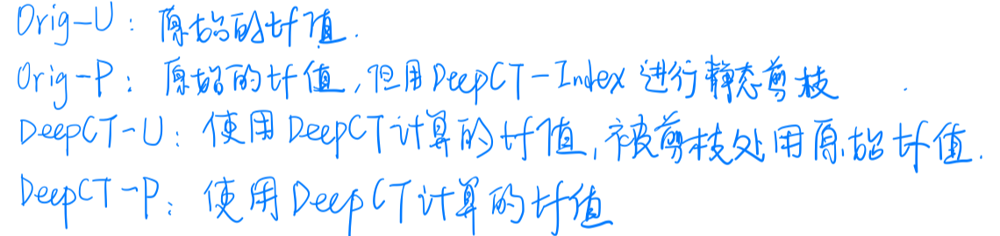
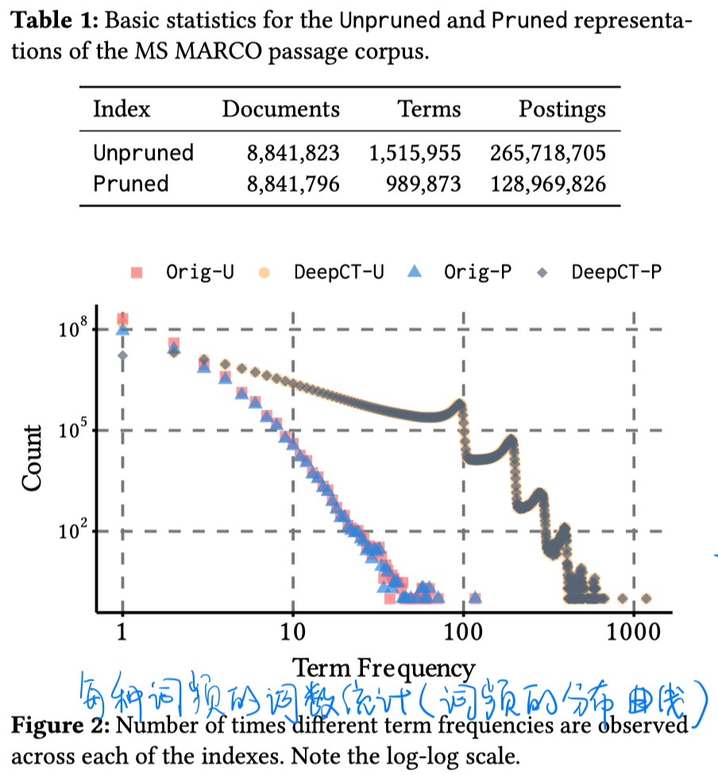
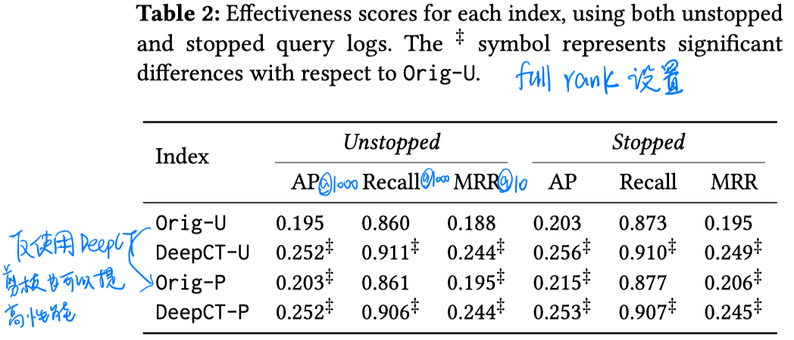
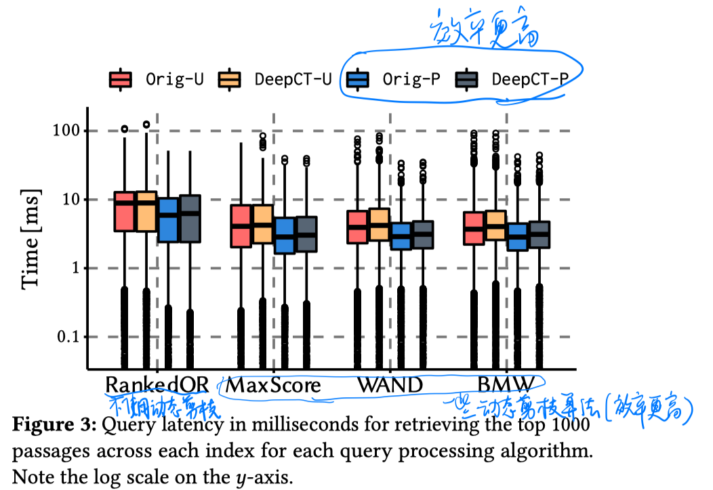
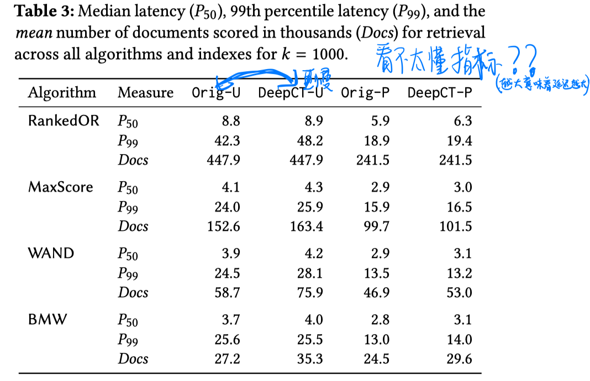
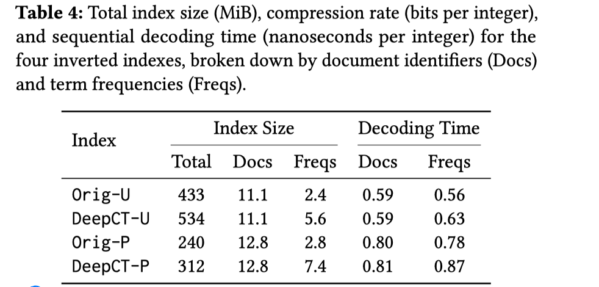

> > SIGIR2020，分析类文章

# 背景

之前有人提出了DeepCT-Index来改进BM25检索，但它的效率问题没有充分得到探讨。本文主要探讨DeepCT-Index的效率问题。

# 实验

##### 实验设置

##### 数据集：MSMARCO

##### 实验结果

- 有效性实验

  

- 效率实验

  

  

  

# 结论

- DeepCT-Index的有效性主要在于term re-weight，尽管它所带来的的静态剪枝也可以稍微提高性能。
- 从效率角度，使用DeepCT-Index进行静态剪枝是很好的。
- 静态剪枝和动态剪枝都可以提高效率，而且这种提升是可以叠加的。
- term re-weight会增加索引压缩和解压的难度，导致DeepCT-U相比Origin-U效率更低。
- Pruned-Index 压缩比更低，解压更慢，但在线检索效率更高，空间占用更少。