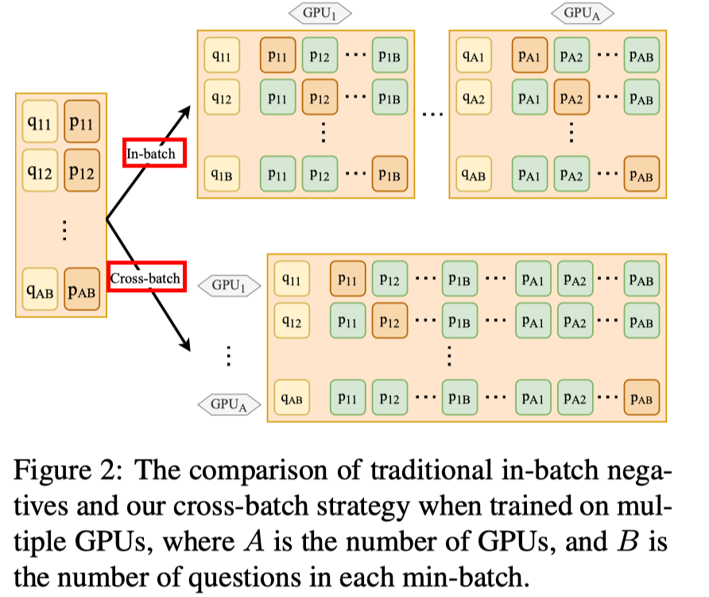
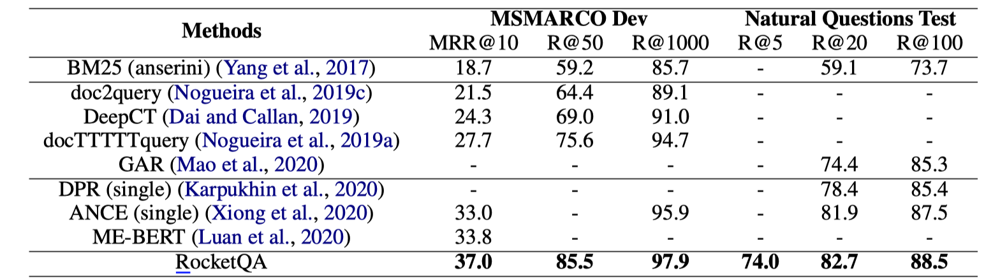
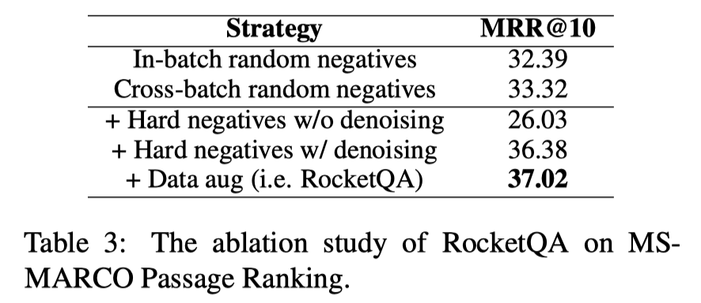
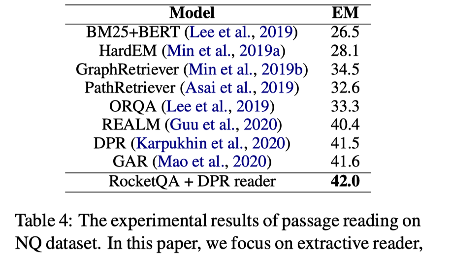

## 背景与动机

训练dense dual encoder很困难，因为存在训练和测试时的不一致问题，存在假负例，存在有限的训练数据问题。

# 解决思路

We have made three major technical contributions in RocketQA：

1）**cross-batch negatives**：We first compute the passage embeddings within each single GPU, and then share these passage embeddings among all the GPUs. Besides the in-batch negatives, we collect the examples (i.e., their dense representations) from other GPUs as the additional negatives for each question. Comparing to in-batch negatives, it increases the number of available negatives for each question when training, and alleviates the discrepancy between training and inference； 

2）**denoised hard negative sampling**：remove false negatives from the top-ranked results retrieved by a specific retriever, which can derive more reliable hard negatives.（we first train a cross-encoder based on original training data. when sampling hard negatives from the top-ranked passages retrieved by a dense retriever, we remove the passages that are predicted as positives by the cross-encoder with high confidence scores. our idea is to utilize a well-trained cross-encoder to remove top-retrieved passages that are likely to be false negatives (i.e., unlabeled positives). The left top-retrieved passages can be considered as denosied samples that are more reliable to be used as hard negatives.）；

3）**data augmentation**：leverages largescale unsupervised data “labeled” by a cross-encoder based on pre-trained LMs for data augmentation（Since the cross-encoder is more powerful in measuring the similarity between questions and passages, we utilize it to annotate unlabeled questions for data augmentation. We first learn the cross-encoder with the original training data. Then, we use the learned cross-encoder to predict the passage labels for the new questions. To ensure the quality of the automatically labeled data, we only select the predicted positive and negative passages with high confidence scores estimated by the crossencoder. Finally, the automatically labeled data is used as augmented training data to learn the dual encoder.）.

## 实验

