## ------------- 使用word embedding

- [ ] NLM：Neural probabilistic language models.（2006，Bengio）

- [x] 【Fisher】Aggregating continuous word embeddings for information retrieval.（2013，最早使用word embedding，使用了1999年提出的Fisher Kernel（Exploiting generative models in discriminative classifiers））

  > 先使用LSI得到word embedding，再用Fisher Kernel Framework映射到高维空间，得到document representation·。
  >
  > We propose a novel document representation based on such continuous word embeddings. It consists in non-linearly mapping the wordembeddings in a higher-dimensional space and in aggregating them into a documentlevel representation.
  >
  > XXX et al. generated document representations using the Fisher kernel framework.
  >
  > a document representation framework based on continuous word embeddings, which aggregates the nonlinear mapping of word vectors into a document-level representation. Although FV outperforms latent semantic indexing (LSI) in ad-hoc retrieval, it does not perform better than popular IR frameworks, such as TF-IDF and the divergence from randomness retrieval model.

- [ ] Learning Concept Embeddings for Query Expansion by Quantum Entropy Minimization.（2014，用于查询扩展）

  > employed word embedding techniques for expanding queries in a supervised manner. They used click-through and task-specific data.

- [x] 【DeepTR】Learning to reweight terms with distributed representations（2015，基于embedding的term reweight）

  > 使用word embedding计算term weight（BM25中相当于用IDF作为term weight），来改进BM25和LM。
  >
  > 使用word embedding的平均计算query embedding，根据word embedding和query embedding得到特征向量，再映射到term weight，去拟合ground truth。
  >
  > Zheng and Callan proposed a word-embedding based method called DeepTR. DeepTR constructs a feature vector for each query term using the difference between the term’s word2vec embedding and the average query embedding. It then learns a regression model to map the feature vector onto the term’s ground truth weight (term recall weight [35]). The estimated weights are used to generate bag-of-words queries that can be searched in firststage retrieval.
  >
  > proposed a supervised embedding-based technique to reweight terms for the IR models, e.g., BM25. They learned term weights using the distributed semantic representations.

- [x] Monolingual and cross-lingual information retrieval models based on (bilingual) word embeddings.（2015，第一个融合word embedding学习和上下文预测的分布式语义模型）

  > 学习跨语言的word embedding，然后基于word embedding的相加或加权相加得到document的向量表示（注意 query只有相加一种方式，因为不可知collection信息，无法计算加权的权重），然后用cos计算相似度和排序。（因为学习的是跨语言embedding，因此单语和双语是相同的检索架构）
  >
  > 使用方式有两种：1）只使用word embedding；2）线性结合，两个socre加权。
  >
  > 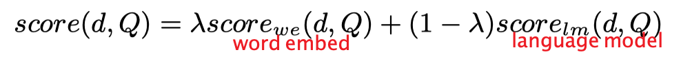
  >
  > 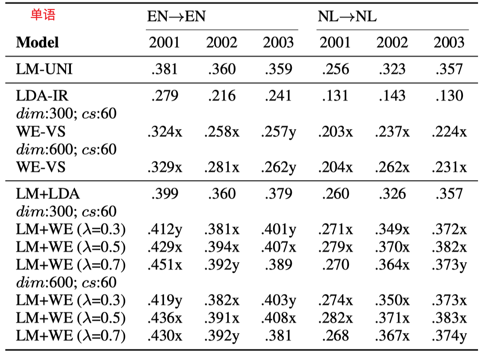
  >
  > 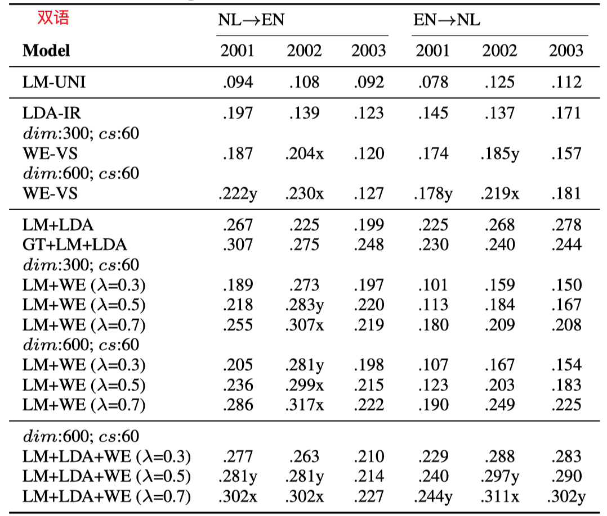
  >
  > constructed query and document representations by the weighted sum of word vectors for monlingual and bilingual retrieval. The proposed model does not improve on the traditional language model in the monolingual retrieval task. The best results are obtained by the combination of the word embedding based method and a unigram language model.
  >
  > This model learns bilingual embedding vectors from document-aligned comparable corpora.

- [x] 【GLM】 Word embedding based generalized language model for information retrieval.（2015，基于embedding的document term expand，把word embedding 融合到QL中）

  > 用word embedding inprove language model，线性结合的方法。
  >
  > 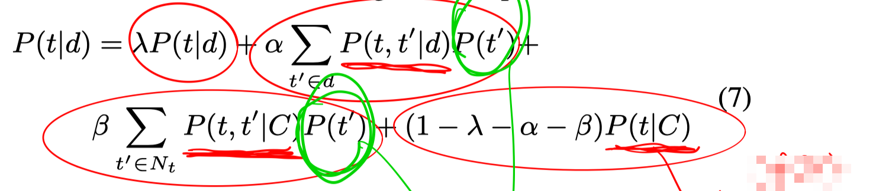
  >
  > the event of observing a term t in the query from a document d is modeled by two distinct events, that of generating a different term t 0 , either from the document itself or from the collection, respectively, and then eventually transforming it to the observed query term t. The first event of generating an intermediate term from the document intends to capture how well a term fits contextually within a document, whereas the second one of generating it from the collection aims to address the vocabulary mismatch problem by taking into account other related terms in the collection.
  >
  > the GLM is an embedding based translation model linearly combined with a traditional language model.
  >
  > words in a query are assumed to be generated independently in three possible ways, i.e., direct term sampling, transformation via document sampling, and transformation via collection sampling. The final GLM is a combination of the three events. The empirical results show that GLM can perform better than the traditional language model. However, it is not difficult to show that GLM is inherently an embedding based translation model linearly combined with a traditional language model.
  >
  > considered the semantic similarities between vocabulary terms to smooth document language models.

- [x] 【NTLM】Integrating and evaluating neural word embeddings in information retrieval.（2015，把word embedding和翻译模型融合，用word embedding计算词之间的翻译概率，再进行query-likelihood IR）

  > 用word embedding inprove language model，用word embedding计算翻译概率。
  >
  > 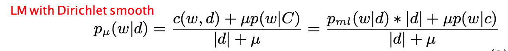
  >
  > 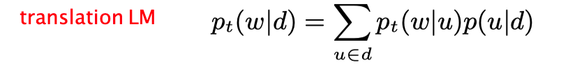
  >
  > 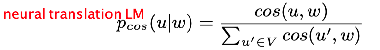
  >
  > we use neural word embeddings within the well known translation language model for information retrieval. This language model captures implicit semantic relations between the words in queries and those in relevant documents, thus producing more accurate estimations of document relevance.
  >
  > leveraged word embeddings for the estimation of translation probability between words, and combined the neural translation language model with collection background probabilities using the Dirichlet smoothing strategy.

- [x] Using word embeddings for automatic query expansion.（2016，使用word embedding进行查询扩展）

  > 用word embedding进行查询扩展。
  >
  > 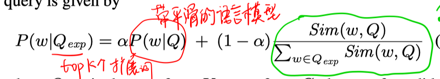
  >
  > proposed a method that select expansion terms by their cosine similarity to the query terms calculated from corpus-trained word2vec. The expansion terms are pruned by only keeping terms that appear in the query-specific pseudo-relevance documents. Experiments show that the query-specific pruning improved the quality of expansion terms, indicating the necessity of topic-specific statistics.

- [x] Query expansion with locally-trained word embeddings（2016，对每个query使用其伪相关反馈文档训练word embedding，会效率比较低，因为对每个query都要重新训练一个word2vec模型）

  > 用word embedding进行查询扩展。
  >
  > 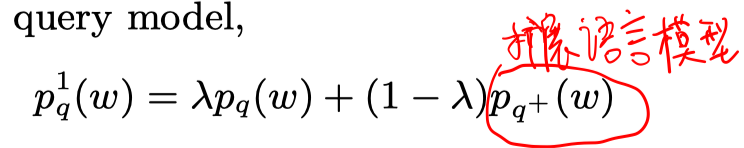
  >
  > proposed locally-trained word embeddings for query expansion.
  >
  > proposed to train word embedding vectors on topically-constrained corpora, instead of large topically-unconstrained corpora. These locally-trained embedding vectors were shown to perform well for the query expansion task.
  >
  > compared the effectiveness of corpus-trained global word embeddings and queryspecific local word embeddings on query expansion. The local word embedding is trained on a sample of pseudo-relevant documents that are retrieved for the query on high-quality external corpora (Gigaword and Wikipedia). The local word embeddings are then used to derive an expansion language model for the query. The results show that query-specific word embeddings outperform the global word embeddings due to the ability to capture topic-specific statistics.
  >
  > train word embeddings using pseudo-relevance feedback (PRF) documents for each individual query. This approach is effective but faces efficiency challenges because it trains a new word2vec every time it receives a new query.

- [x] Embedding-based query language models（2016，使用word embedding进行查询扩展）

  > 提出了三个查询扩展方法，前两个不带相关反馈，最后一个带相关反馈。
  > 方法1：
  >
  > 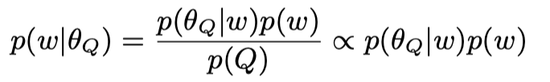
  >
  > 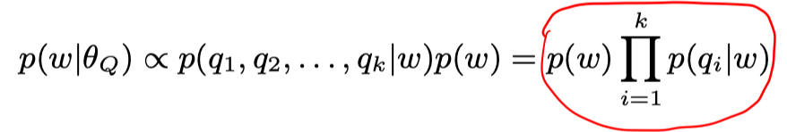
  >
  > 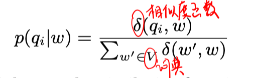
  >
  > 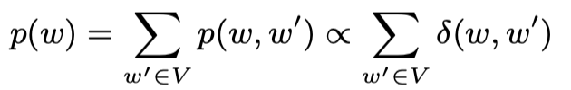
  >
  > 方法2：
  >
  > 
  >
  > 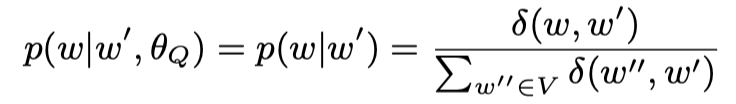
  >
  > 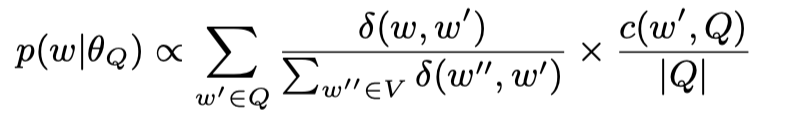
  >
  > 方法3：
  >
  > 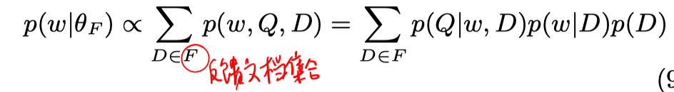
  >
  > 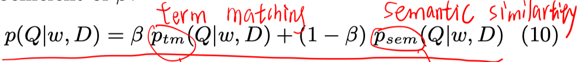
  >
  > 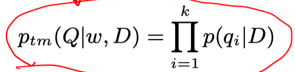
  >
  > 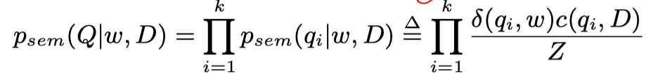
  >
  > 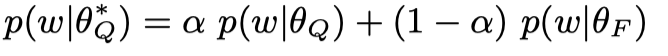

- [x] Representing documents and queries as sets of word embedded vectors for information retrieval.（2016，word embedding for IR）

  > 用word embedding inprove language model。把word embedding 融合到LM中，线性结合的方法。
  >
  > 
  >
  > 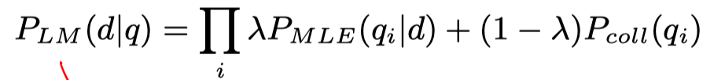
  >
  > 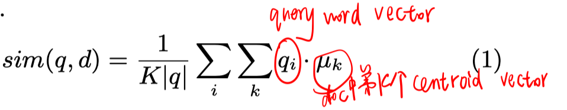

