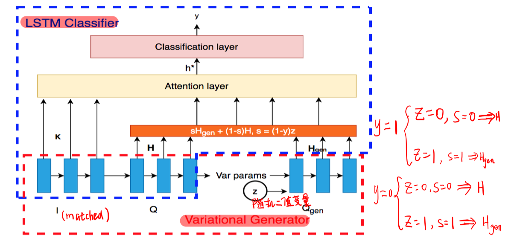
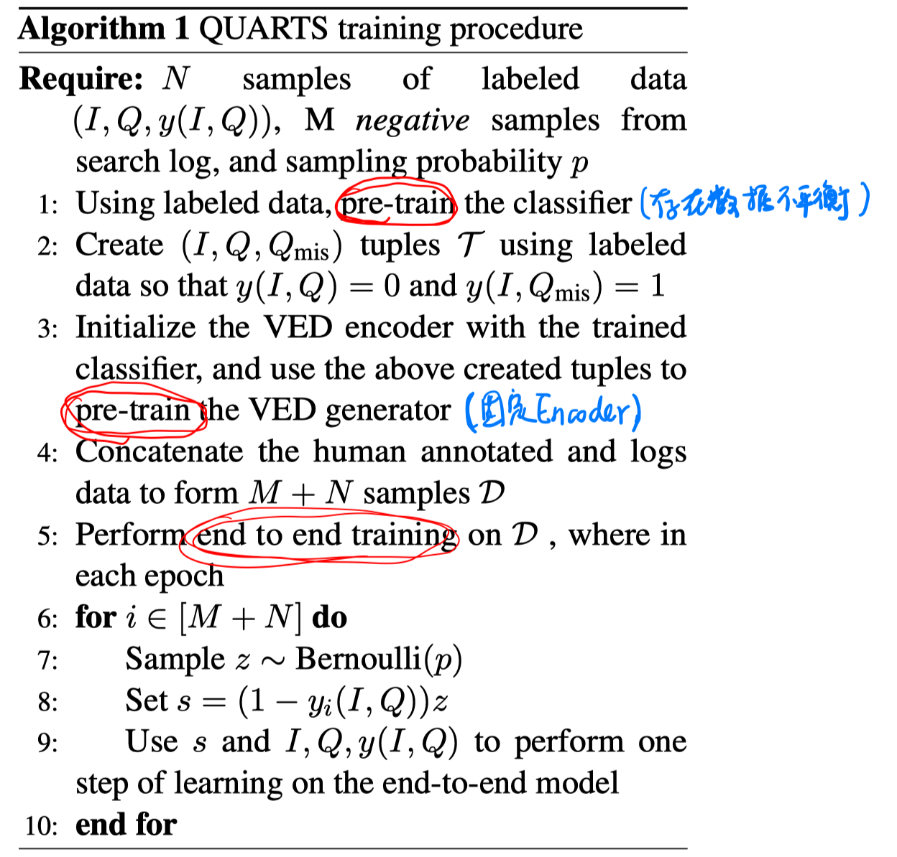
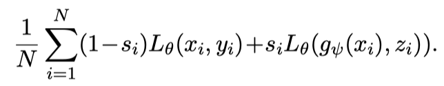
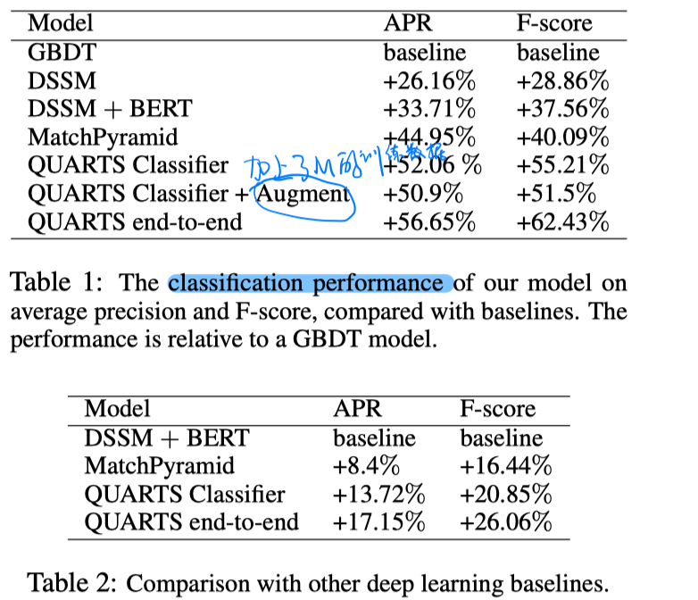
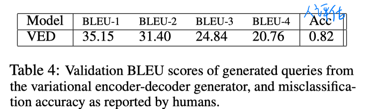

> > ACL2020

# 背景

在商品检索中，可能query和item的描述之间词汇有重叠，但并不是匹配的query-item pair。

本文考虑能够更好地识别不匹配的query-item pair（通过生成一些负例query），从而提高商品搜索中的排序性能。

# 基本思路

学习一个分类器来判别query-item pair的匹配性；

学习一个生成器来根据匹配的query-item pair生成一个和item不匹配的query。

# 模型

目标函数：

# 实验

实验指标：Area under the Precision-Recall curve (APR)、F1

实验结果：

- 分类器的性能

- 生成器的性能

# 结论

- 可以生成不匹配的question-item pair，解决样本不平衡问题
- 可以学习更鲁邦的分类器界面