> > SIGIR2020，京东

# 背景

搜索系统的三个模块：

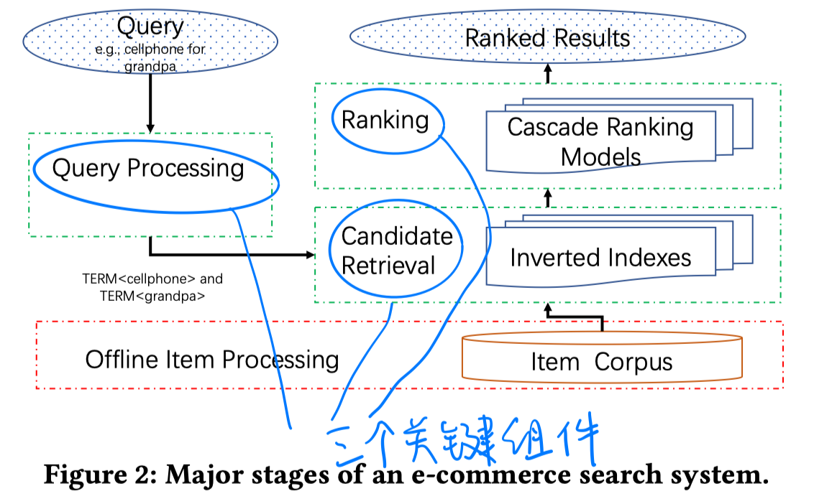

本文的关注点在于candidate retrieval部分，该部分存在的挑战在于：

1）语义检索（query和item之间存在词汇鸿沟，传统的检索都通过query重新来解决这个问题）；

2）个性化检索（已有的解决方案是基于规则的方法）

# 模型

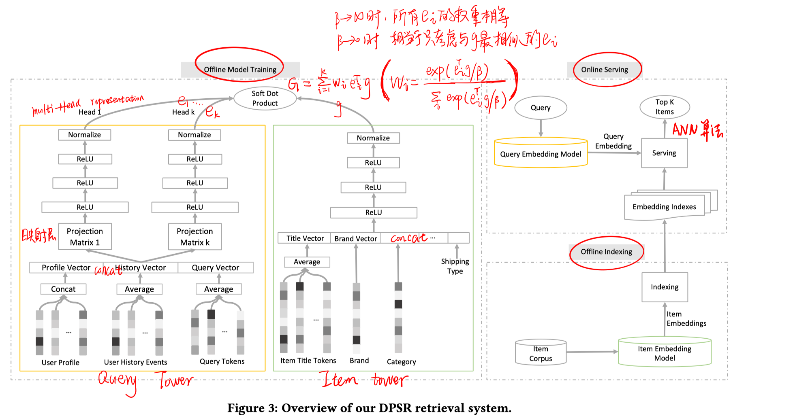

##### 训练

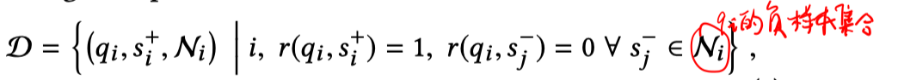

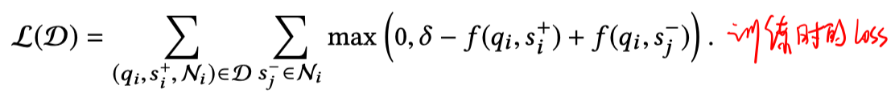

##### 在线检索

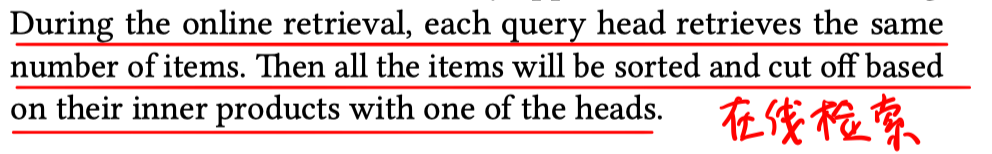

##### 负采样策略

两种采样策略的混合：batch内随机采样；batch内其他query的正例

混合超参数$\alpha$越大，负样本中随机采样的样本越多。$\alpha$越小，负样本中的样本更接近商品的真实的流行度（排序的时候就会降低流行商品的排序）。

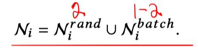

# 实验

实验结果

- 学到的item embedding的情况

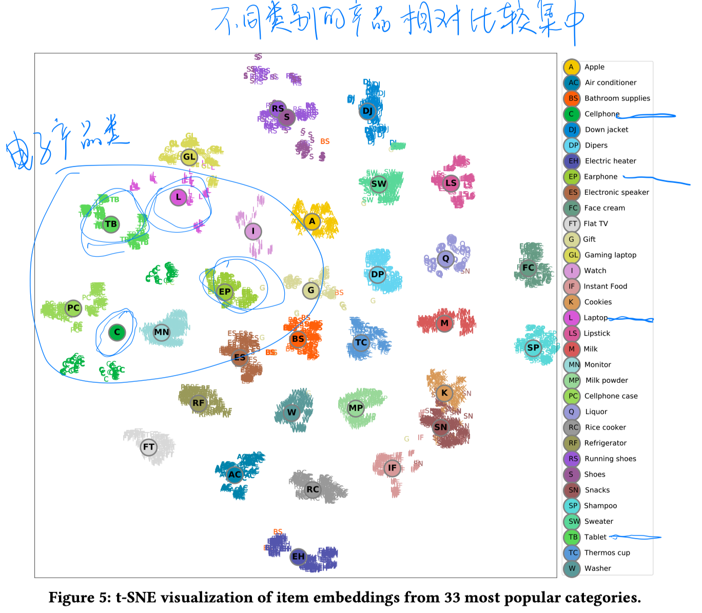

- 使用多头注意力的结果

  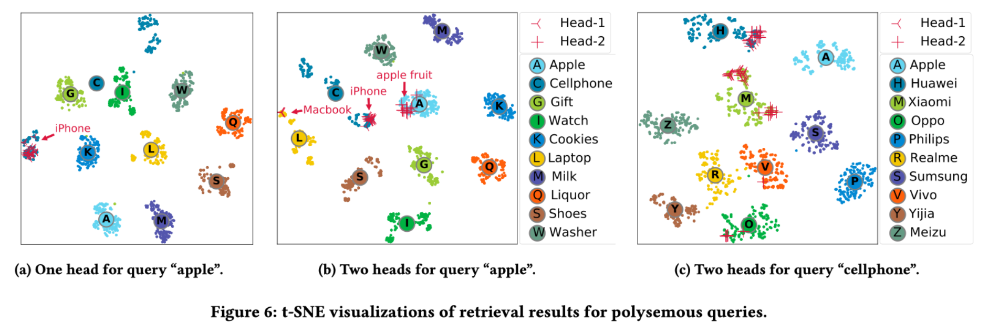

  可以更好地解决多义query。

- 离线测试

  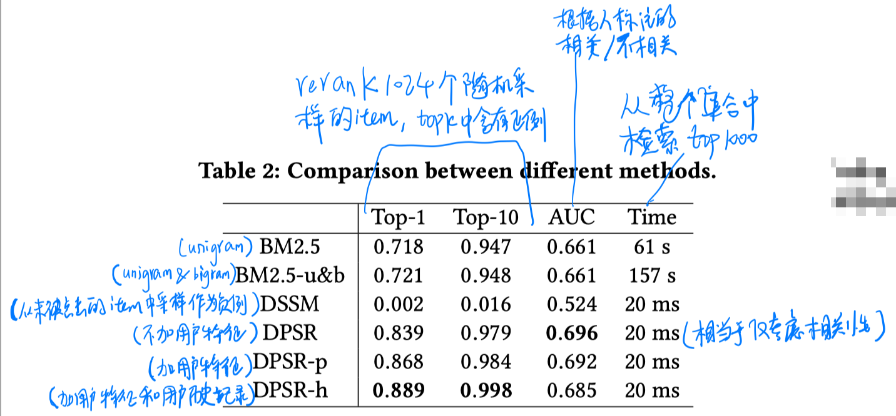

  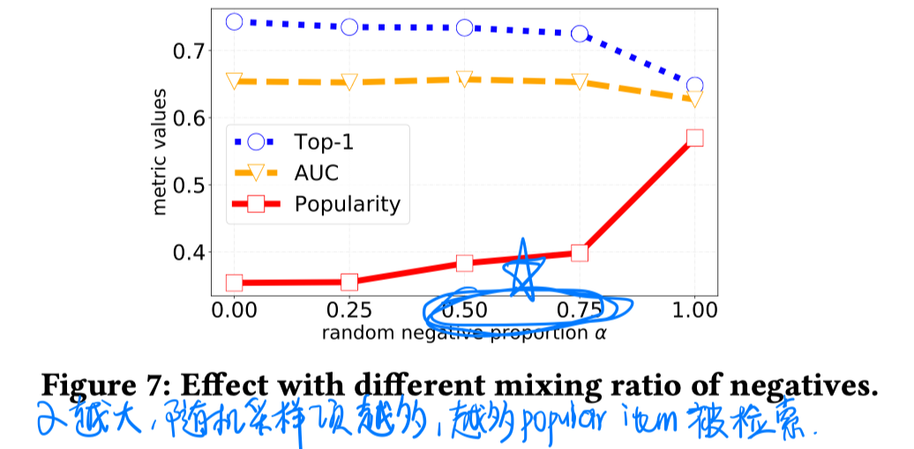

- 在线A/B测试

  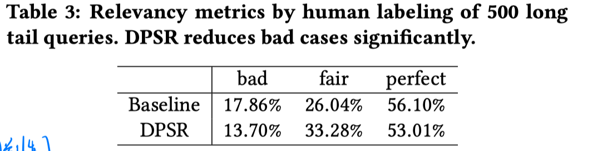

  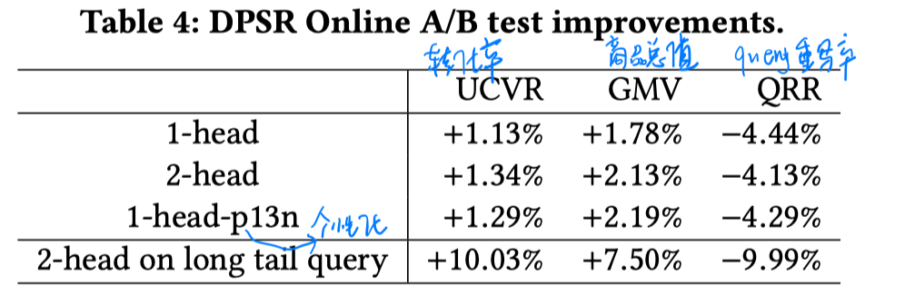

- 效率

  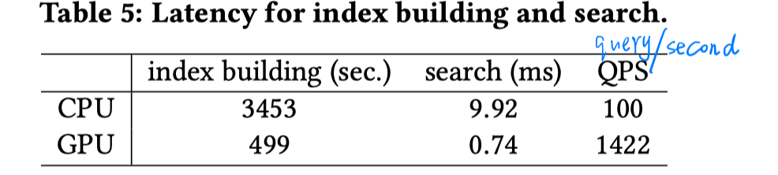

  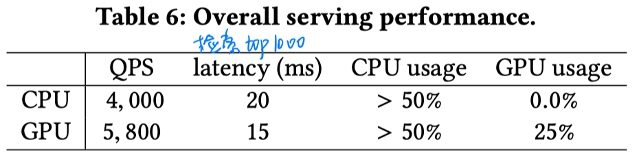

# 结论

- 通过对query tower使用multi-head来建模多个query向量表示，解决多义query问题，从而更好地理解用户意图。