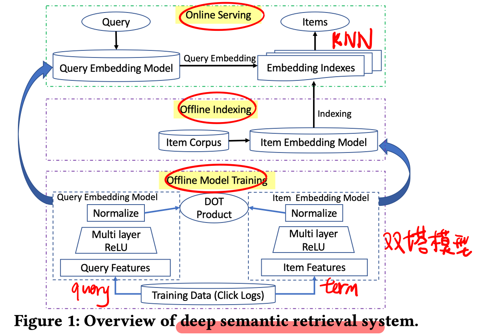
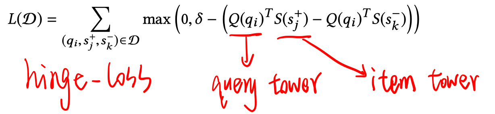
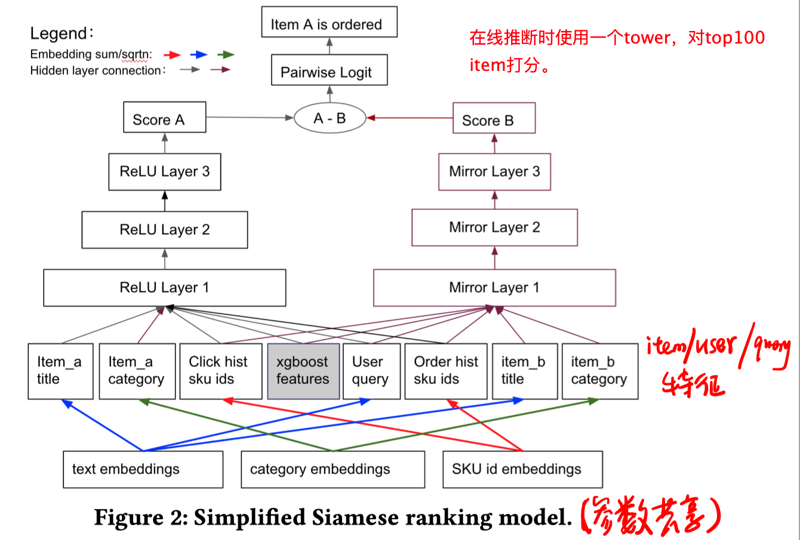
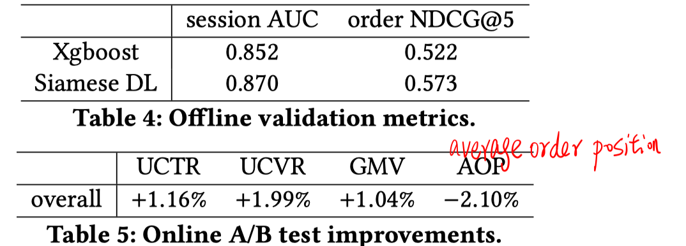

> > SIGIR2019，京东

# 背景

在ranking阶段使用深度模型，是为了减少query和item之间的语义鸿沟。

在reranking阶段使用深度模型，是为了更好地利用稀疏特征，e.g.用户点击/购买历史。（因为可以把原始特征转化成embedding）

# 模型

- ranking 阶段：deep semantic retrieval

  

  

  

- reranking阶段：Deep pairwise ranking

  

  

