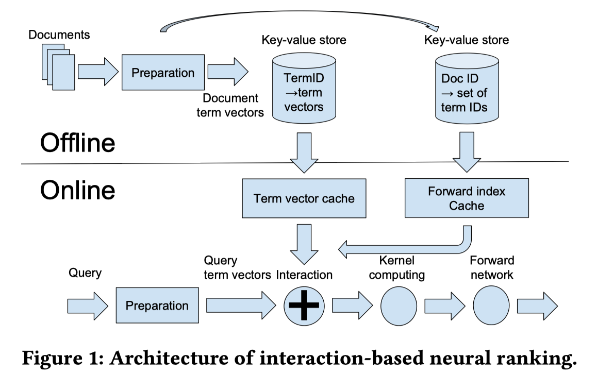
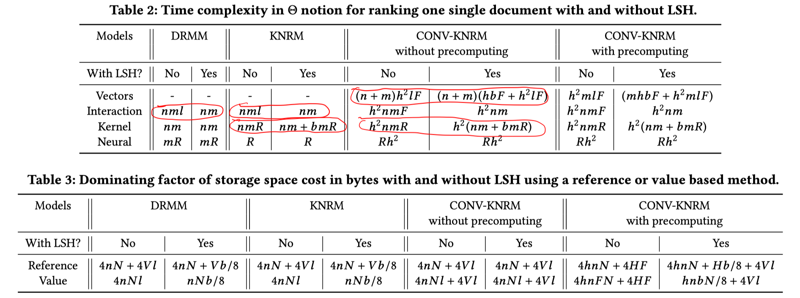
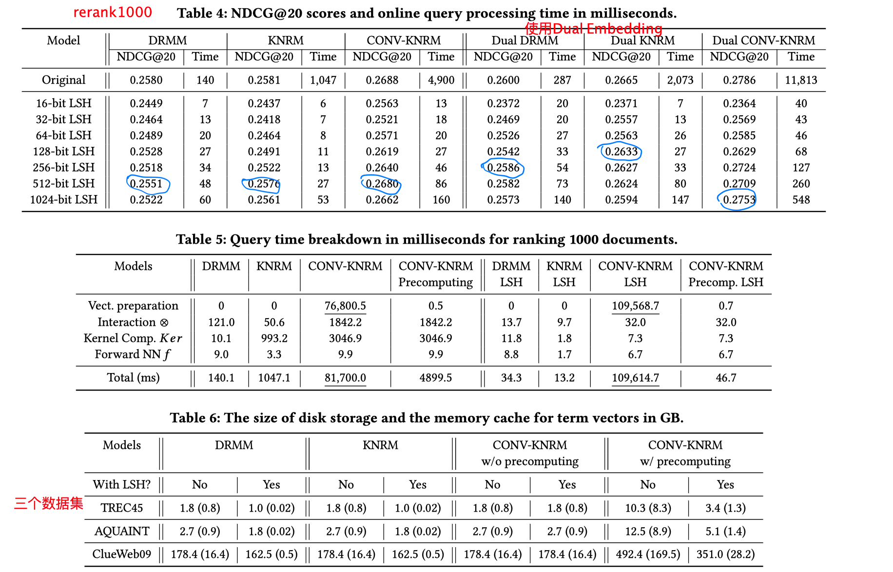

> > > WWW2019

# 背景

使用局部敏感哈希来实现三个交互模型（DRMM、KNRM、Conv-KNRM）的快速近似计算。

# 模型

改进措施：

- Vectors：把词向量转化成哈希向量
- Interaction：词的相似度计算用汉明距离
- Kernel：把核计算转化成基于直方图的形式
- 预先准备词向量

# 实验

注：实验设置是rerank1000，不是fullrank。

# 结论

- 方法上的细节看不太懂