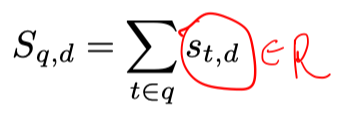
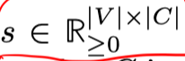
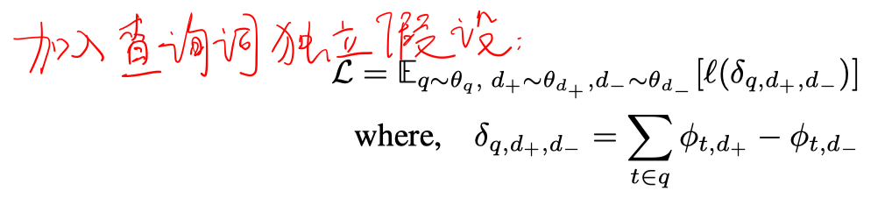
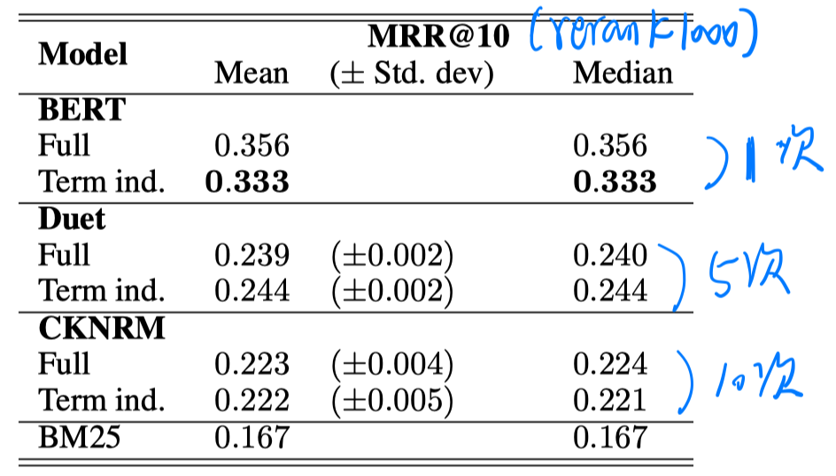
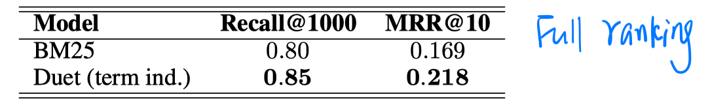

> > 2019

# 背景

BM25、QL这些模型都含有query term独立性的假设。但neural reranking model中是把query整体和document整体进行匹配的，导致他们的效率很低，无法用到ranking阶段。

本文考虑在neural reranking model中引入query term独立性假设，从而可以预先计算每个word和document的分值并存储下来，当新的query到来时，使用倒排索引找到相应term的分数，并使用线性加和得到query与每个document的相关度。

# 模型

# 实验

数据集：MSMARCO passage reranking

模型：

- BERT：we input the query term as sentence A and the passage as sentence B
- DUET：正常的把每个term作为query。
- CKNRM：we only consider the interactions between the query unigrams and passage ngrams.

实验结果：

- DUET和CKNRM的性能都没有明显下降。
- BERT的性能有下降。

# 结论

- 引入独立性假设在一部分neural model上是可行的，可以带来效率的提高，而且性能下降相对较小。

- DRMM本身具有这样的特点。
- 虽然可以用倒排索引，但由于不再稀疏，其实倒排索引的优势不再明显。