> > ACL2019，分析类论文，heads in transformer

代码：https://github.com/lena-voita/the-story-of-heads

## 本文贡献点

- 评估了transformer中每个head的作用大小，发现只有小部分head很重要，且具有语言学可解释性。
- 本文提出一些方法（stochastic gates 和 a differentiable relaxation of the L0 penalty），可以裁剪掉不重要的head，同时使模型性能不受到很大影响。

【注：transformer中有三个部分使用attention（encoder self-attention、decoder self-attention、decoder-encoder attention），但本文只考虑encoder self-attention】

## 实验数据集

- EN-RU, EN-DE, EN-FR on WMT 
- EN-RU on OpenSubtitles

## 分析哪些head是重要的

> 评估重要性的方法：
>
> - LRP：a method for computing the relative contribution of neurons at one point in a network to neurons at another.
>
> - head的confidence定义：the “confidence” of a head as the average of its maximum attention weight excluding the end of sentence symbol。（直观上看，confidence越大的head越重要）

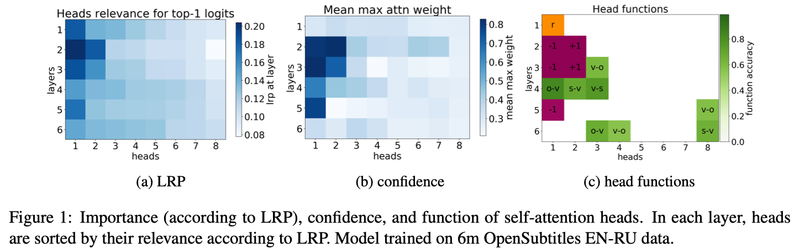

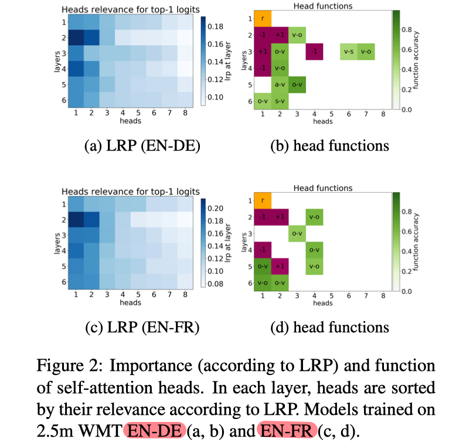

- 从LRP的结果来看，只有少部分head是重要的。
- 从大体上看，通过confidence评估head的重要性，和通过LRP得到的结果基本是一致的（除了第一层）。

## 分析重要head的作用

> 主要考虑head可能具有的三种作用：
>
> - positional：the head points to an adjacent token（We refer to a head as “positional” if at least 90% of the time its maximum attention weight is assigned to a specific relative position (in practice either -1 or +1, i.e. attention to adjacent tokens)）
> - syntactic：the head points to tokens in a specific syntactic relation（We say that a head is “syntactic” if its accuracy is at least 10% higher than the baseline that looks at the most frequent relative position for this dependency relation）
> - rare words：the head points to the least frequent tokens in a sentence
>

- 从上面两个图来看，大部分positional head（紫色的）都是被LRP评估为比较重要的head。

- 对于syntactic head的实验结果说明，和假设相同，的确有部分head是起到了句法消歧的作用。

  同时，从上面两个图来看，有些syntactic head（绿色的）是起到同种类型的依赖关系。

  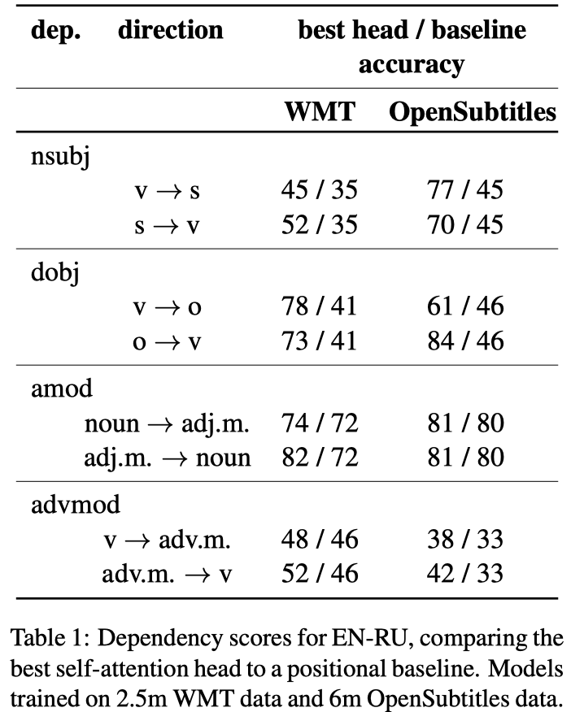      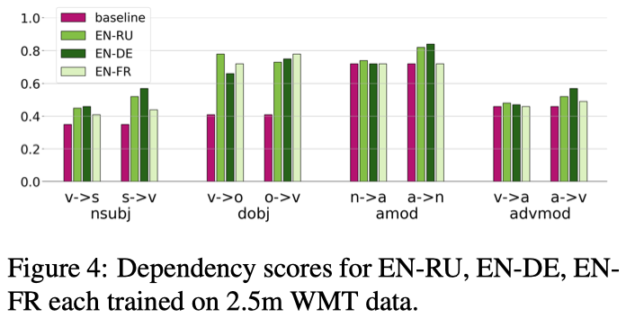

- 所有的实验都发现，在第一层中有一个head的重要度明显比该层的其他head高。同时发现，这个head指向了句子中的不频繁词。

## 裁剪剩余的head

#### 实验方法

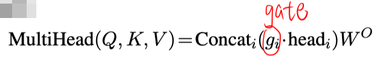

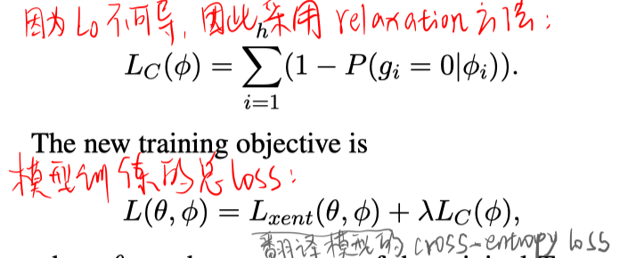

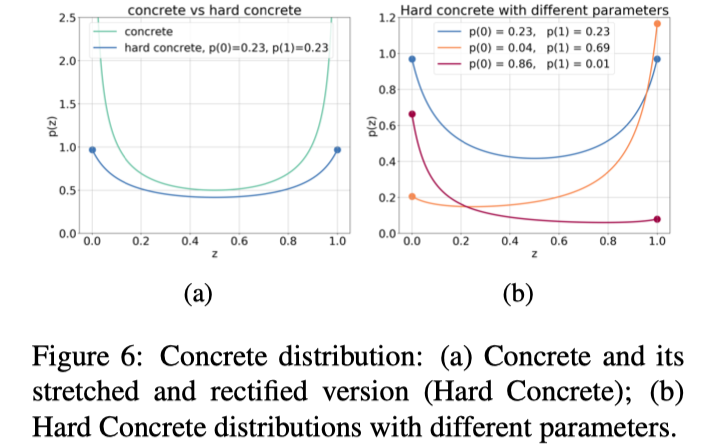

#### 实验设置

在一个只使用翻译loss训练好的模型上，再加上正则化loss进行微调。在微调时，decoder的参数是固定的。

$\lambda$设置不同的值，被裁剪掉的head数不同。

#### 实验结果

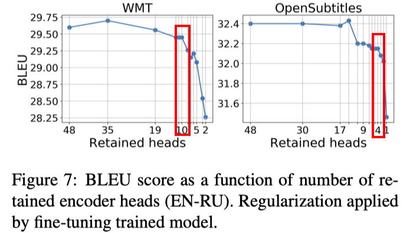

- 上图可见，可以在模型性能不受很大影响的情况下，裁剪掉大部分head。

  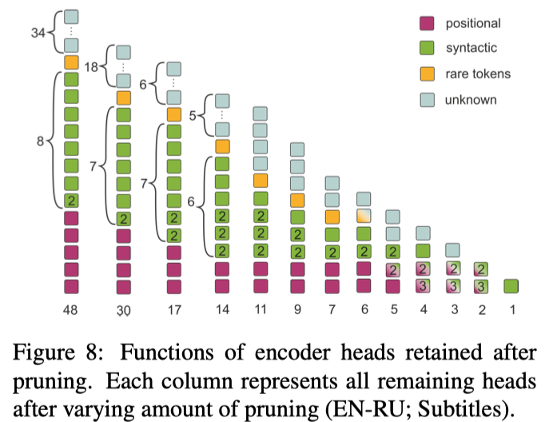

- 上图展示了在裁剪掉不同数量的head后，剩余head的作用。
- 当越来越多的head被裁剪掉时，剩余的部分head可能会发生功能的变化。

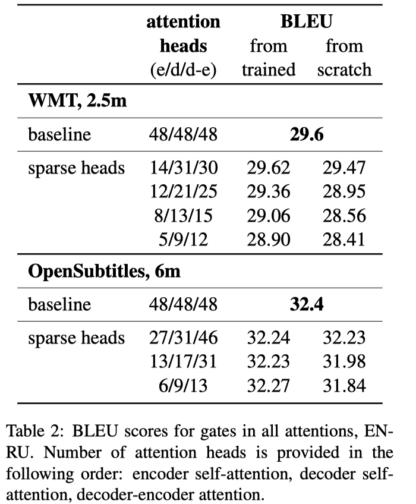

- 上表展示了，当裁剪机制用于transformer的三个attention模块时的结果。

- 结果表明，裁剪掉 3/4的encoder head 和 1/3的decoder head，不会造成性能的明显下降。

- 但是，**上表的最右列说明，如果模型从头开始训练，直接使用少量的head会对性能造成影响。（这也符合之前模型裁剪的工作中的结论：sparse architectures learned through pruning cannot be trained from scratch to the same test set performance as a model trained with joint sparsification and optimization）**

  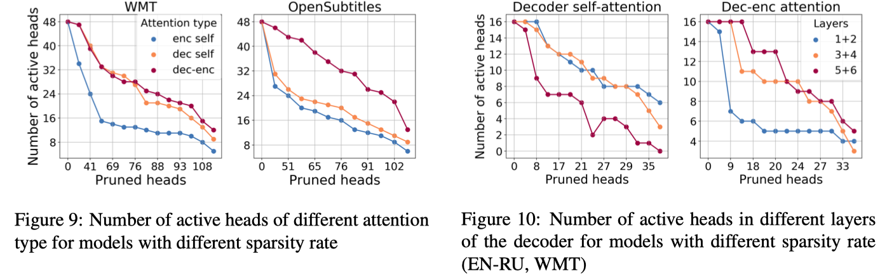

  

- Fig9的结果说明，dec-enc的head最重要。在WMT中decoder-self重要是因为训练集句子是长句子。
- decoder的低层主要用于语言建模，高层用于在原句子的条件下生成单词。

