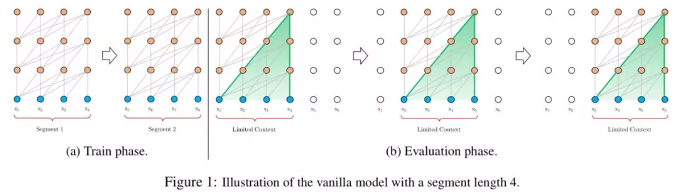
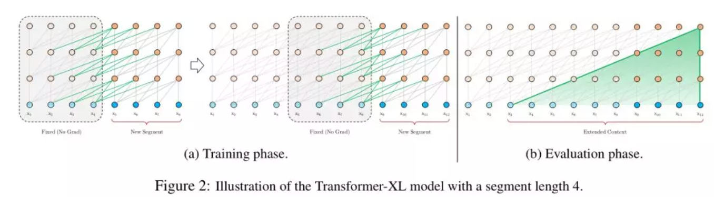
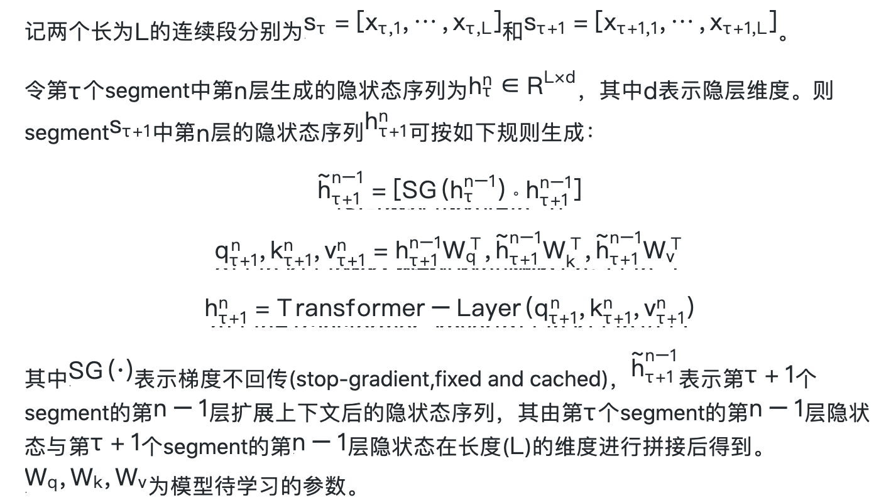
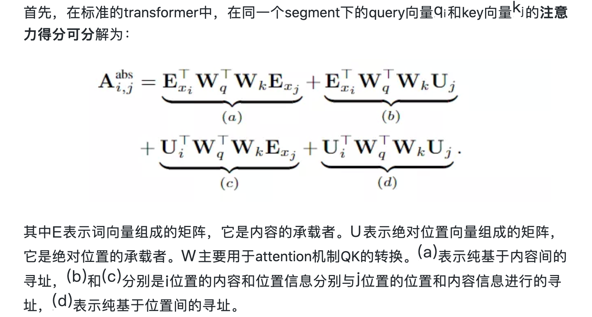
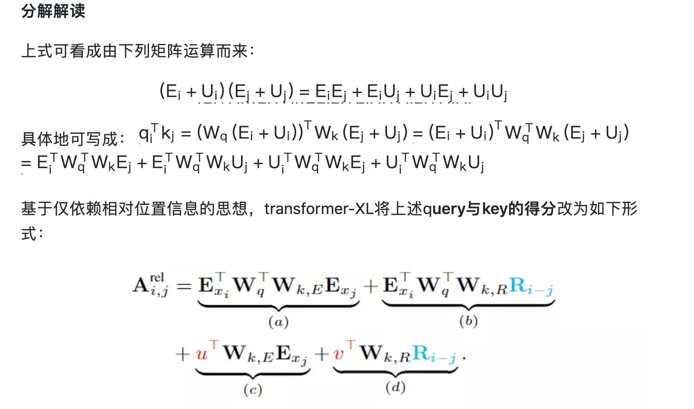
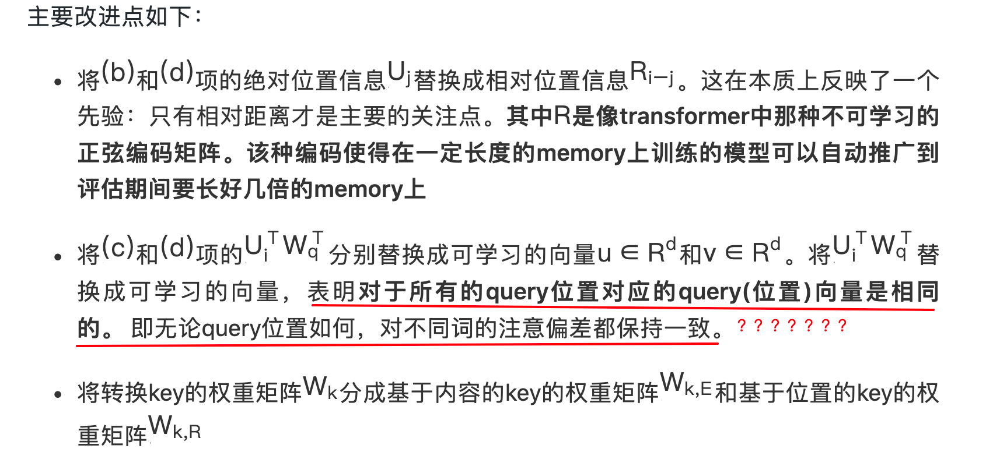
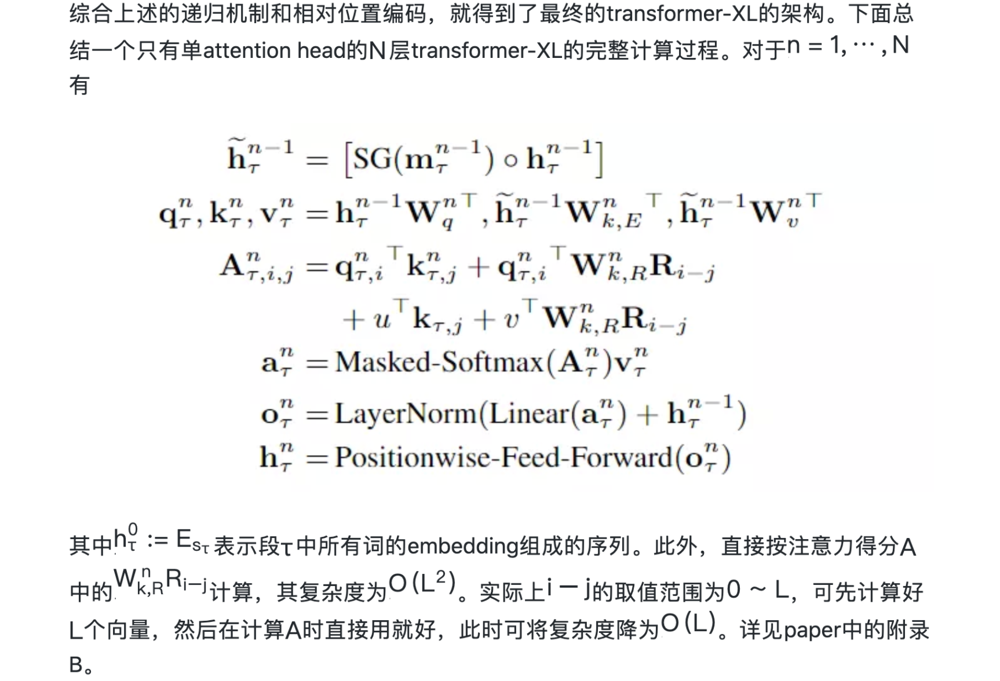

> > ACL2019，transformer-XL

中文参考资料：https://mp.weixin.qq.com/s/VBX-EezsgK4QkQqaOKqObQ

代码：https://github.com/kimiyoung/transformer-xl

# 背景

在对语言建模时，针对如何提升编码器捕获长距离依赖关系能力的问题，有几种比较有效的编码器。LSTM为了建模长距离依赖，利用门控机制和梯度裁剪，有paper验证目前可编码的最长平均距离在200左右。Transformer利用self-attention机制，允许词之间直接建立联系，能更好地捕获长距离依赖，其编码能力超过了LSTM，但局限于固定长度的上下文。

# 方法

### 整体思路

Transformer编码固定长度的上下文。具体地，将一个长文本序列截断为几个固定长度的片段(segment)，然后分别编码每个片段，片段间没有任何的信息交互(如BERT的预训练模型中序列长度的极限为512)。

上述编码策略有如下弊端：

- 对超过固定长度的依赖关系无法建模编码
- 对长文本的分割破坏了语义边界，导致上下文碎片化(context fragmentation)

为了克服上述弊端，有效建模长距离依赖关系，就有了transformer-XL (XL = eXtra Long)，其与传统(Vanilla)的Transformer相比，有如下两个特点：

- **片段级的递归机制**(Segment-Level Recurrence with State Reuse)，引入memory模块(cache之前一个或多个segment的隐状态信息)，循环建模片段间的联系

  - 使超长距离依赖关系的编码成为可能

  - 使得片段之间产生交互，解决了上下文碎片化问题

- **相对位置编码**(Relative Positional Encodings)，代替绝对位置编码

  - 避免了memory中缓存的片段的位置信息与当前片段中的位置信息相互混淆

### 片段级的递归机制（Segment-Level Recurrence with State Reuse）

为了解决transformer模型使用固定上下文的限制，transformer-xl引入了循环机制。具体地，在训练阶段，当模型处理下一个新段(segment)时，前一段序列中的隐状态信息被固定并缓存，作为扩展上下文重用，如图2a所示。尽管梯度只保持在一个独立的段中，但额外的输入信息(扩展上下文)允许网络利用历史信息，从而能够对长期依赖关系进行建模并避免上下文碎片化(context fragmentation)。

### 相对位置编码(Relative Positional Encodings)

recurrent机制使得先前的绝对位置编码方案不再适用，因为在多个segment中会出现多个同样的位置信息。 为此，作者们提出一种新的相对位置编码形式。其不仅与绝对位置一一对应，而且具有更好的泛化性。

### 整体模型 Transformer-XL

# 实验

作者们将transformer-XL应用于词级和字符级语言建模的各种数据集(WikiText-103[词级长依赖-ppl]/enwik8[字符级-bpc]/text8[字符级-bpc]/One Billion Word[词级短依赖-ppl]/PennTreebank[小数据集的词级短依赖-ppl])。基于Transformer-XL的语言模型在以上几个数据集的基准测试中均实现了最先进的（SOTA）结果。

接着做了两种机制(Segment-Level Recurrence和Relative Positional Encodings)的消融(切除)实验，实验表明每种机制对性能提升都有帮助。

然后给出了与RNN、transformer对比后的其可建模的最大依赖长度，进一步表明transformer-XL具有建模更长依赖关系的能力。

接着展示了只在中等大小的WikiText-103语料上训练得到的语言模型，其已可以生成比较一致的文章，而不需要手动挑选，尽管存在微小错误。

最后对比了基于传统transformer的语言模型的推理速度，由于引入状态重用机制，transformer-XL在推理速度上最大获得了1874倍的加速。

# 思考

- transformer-XL是一种强大的语言模型。其有较低的困惑度，与RNN和Transformer相比，可建模**更长**的依赖关系。
- 在评估过程中实现了实质性的**加速**，并能够生成连贯的文章。

