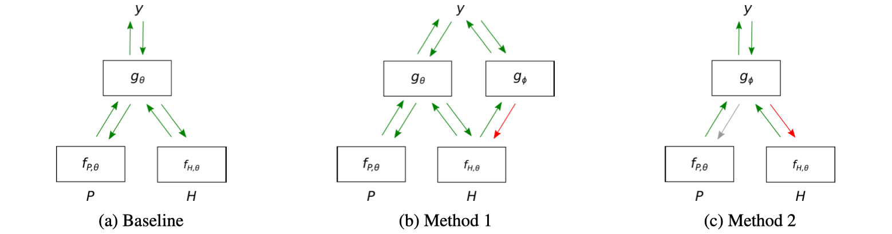

> >ACL2019，NLI，数据集的bias

code：https://github.com/azpoliak/robust-nli

## Motivation-论文解决什么问题

- NLI 数据集中经常包含一些人为的bias，比如仅靠假设H的特征就可以判断label（例如，出现否定词not、none就意味着矛盾关系），从而使模型根本没学到假设H和前提P之间的关系。
- 为了解决该问题，之前的工作包括，构造新的数据集；过滤掉比较简单的样本；构造对抗样本等。
- 本文提出了两种方法可以规避这种偏置，使模型更加鲁棒，泛化和迁移能力更好。

## Motivation-本文的方法思路

- baseline的做法是，给定前提和假设去预测label。本文的方法是通过给定的假设和label，预测前提。

- 基于这个目标，提出了两个近似的训练方法。

## Method-模型概述

我们的目标是最大化logP(P|H,y), 通过写成贝叶斯的形式，得到如下公式：

公式中p(P|H)可以看做是常数，因此我们需要去估计分母p(y|H)。

本文提出两个方法去估计p(y|H)：

- 一种是直接估计，如图1中b所示，f是encoder，g_fai 是hypothesis-only classifier, 训练的loss如下两个，作者使用了[gradient reversal layer ](http://proceedings.mlr.press/v37/ganin15.pdf)技术，训练时先用L2把梯度回传到$g_{\phi}$，再逆转梯度后回传到$f_{\theta}$。

  

- 第二种方法是负采样，对前提P进行随机采样，但是在梯度反向传播的时候，不向P传播（只在采样的样本中，正常样本还是会进行梯度反向传播。。。P被随机采样的概率是$\alpha$）

  

模型上使用了基于Bilstm的[InferSent](https://arxiv.org/pdf/1705.02364.pdf)模型

## Experiment-数据集

#### 数据集

- 1个train + 10个traget se：SNLI（被证明有明显的bais，作为trainset），，SNLI-hard、DPR、SPR、FN+、SCITAIL、SICK、MPE、JOCI、MNLI、ADD-1
- 两个自己合成的数据集：测试集是当P和H是相同的单符号字符串是label为true，否则为false。。。训练集是对测试集中label为true的样本的H后面加上字符c。。训练集和测试集都是1K个样本。  

>使用inferSent作为baseline。
>
>使用BiLSTM作为encoder。

#### 结果和分析

1. 在合成的数据集上进行实验

- 结果表明，只要超参数足够大，模型就可以既在训练集上表现好，也可以在无偏测试集上表现好。

- 对方法1，超参数越大，表现越好。。但对方法2，更大的超参数反而会使性能下降（很显然是因为

  $\alpha$越大，随机采样的样本越多）。

- 方法1表现好所需的$\beta$没有方法2大。 更近一步地，方法1对超参数的要求没有方法2大。

2. 在现有NLI数据集上进行实验

- 在10个测试数据集上，方法1在9个上面超过baseline，方法2在5个数据集上超过baseline。
- 在SNLI test上，方法1的性能没有严重下降，，但方法2有严重下降。
- 方法2更不稳定，而且更严重依赖于超参数的正确。

## Highlight

方法新颖，而且可迁移到其他任务。