> > ACL2019

## 背景

目前有很多在大量语料上通过监督或非监督方法训练得到的general的句子表示，但这些表示一般都是连续实值向量，对于存储和计算时要耗费的资源（内存、算力）都很大。

本文提出4种转换方法，把这些连续实值向量转换成二进制的向量，在减少资源消耗的同时，仍然尽量保持在下游任务上的性能。最终可以在性能下降2%的情况下，减少98%的资源消耗。

注：变换成二进制向量后，两个句子的相似度计算就可以不用cos相似度，而是用汉明距离（计算有多少位不同）了。

## 方法

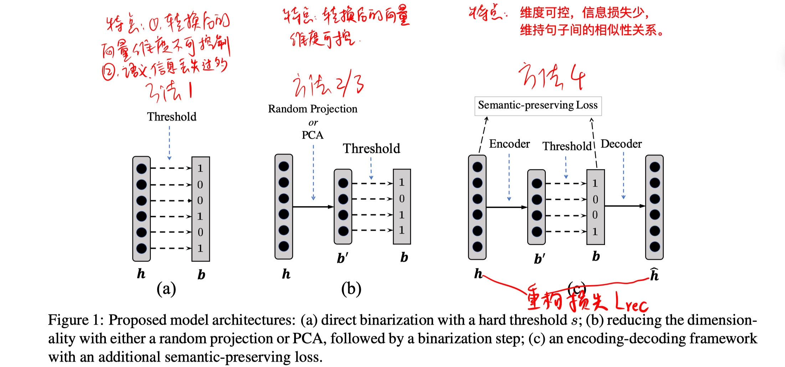

##### 方法1：Hard Threshold

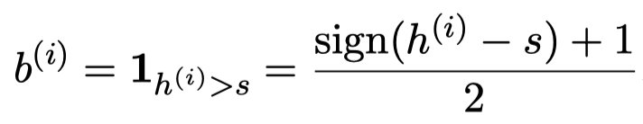

h表示任何可得的预训练的连续实值向量，b表示二进制化后的向量。s是阈值，一个超参数。

##### 方法2：RandomProjection

先用一个随机的映射矩阵W对h进行降维，再采用hard threshold方法进行二进制化。

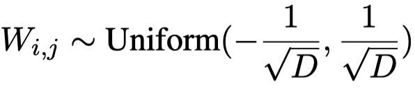

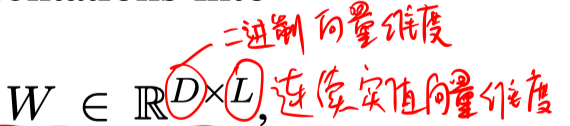

##### 方法2：PCA

先通过PCA将L维的向量h进行降维到D维，再采用hard threshold方法进行二进制化。

##### 方法4：Autoencoder 架构

- encoder

  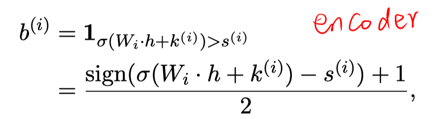

  k和s的值可以是规定的，也可以是随机采样的。

- decoder

  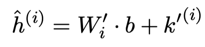

- 重构损失

  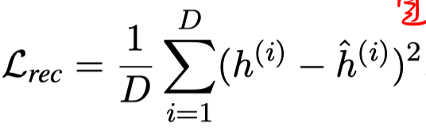

- 语义保持正则化项

  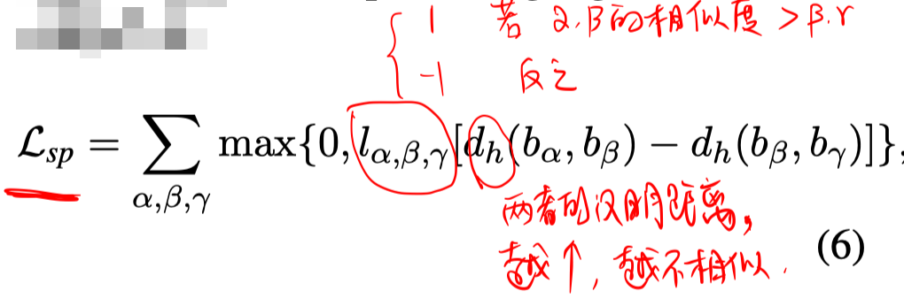

  其中 α、β、γ分别表示句子。

- 总损失函数

  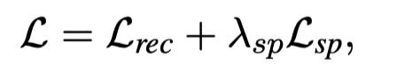

## 实验

实验设置：主要是以InferSent预训练的sentence embedding作为初始的连续实值向量。

结果：

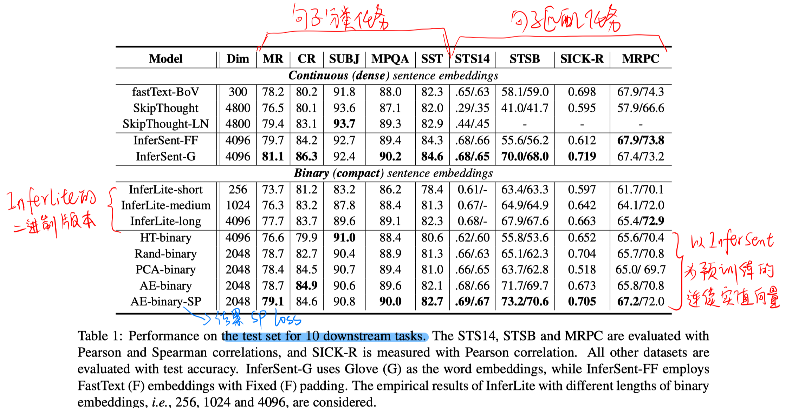

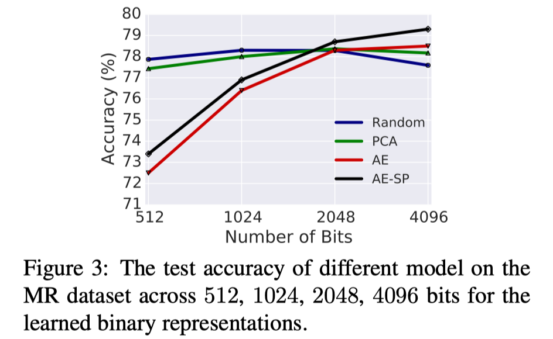

## 思考