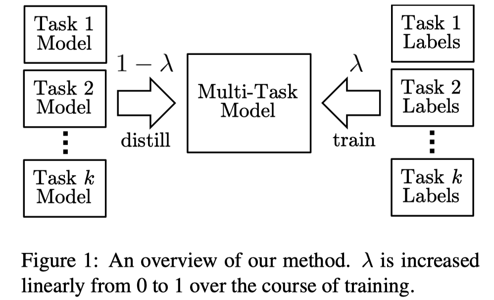
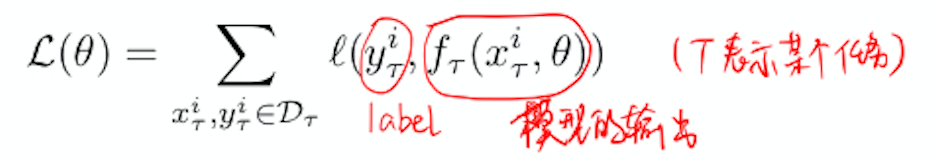
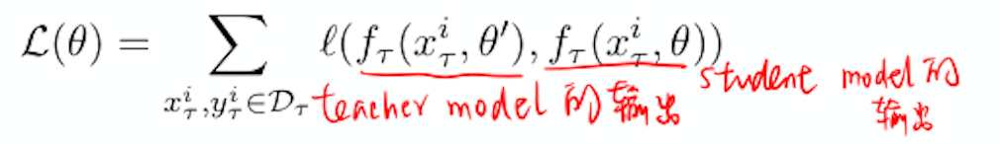
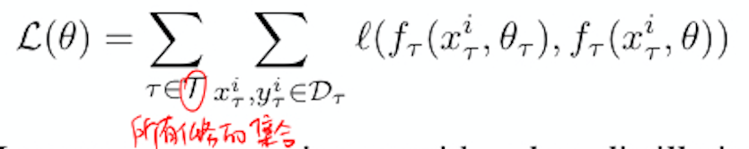
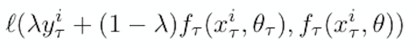
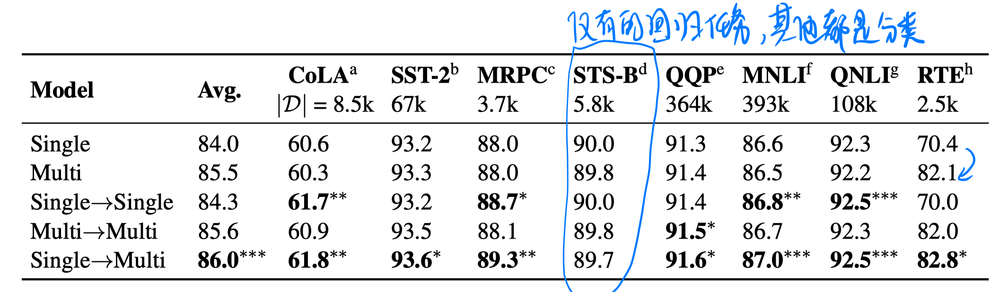
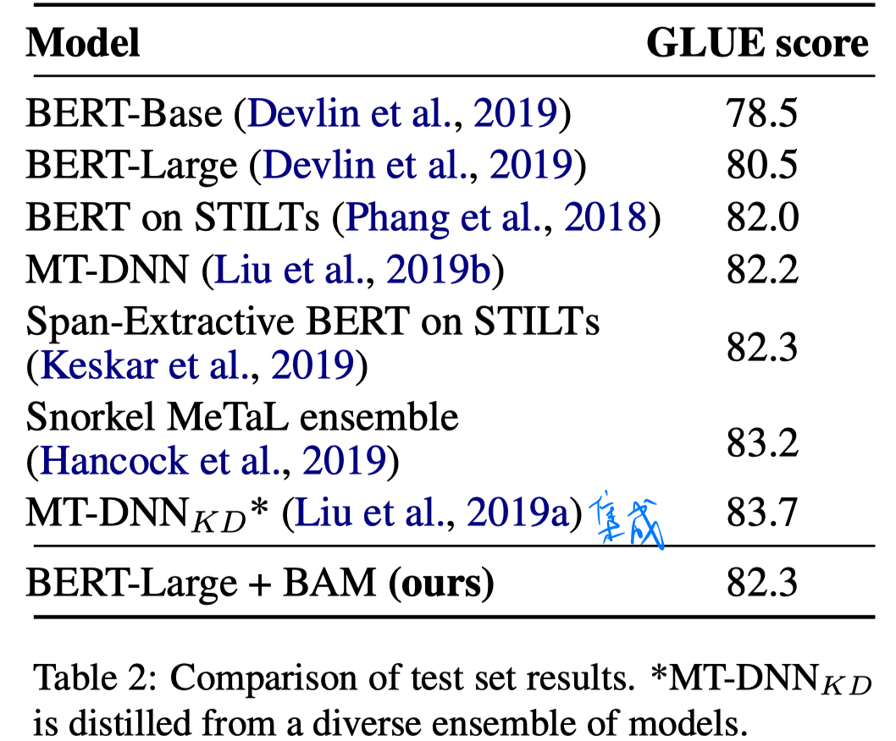
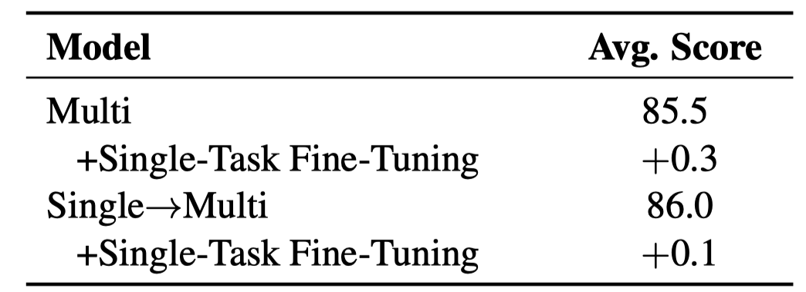
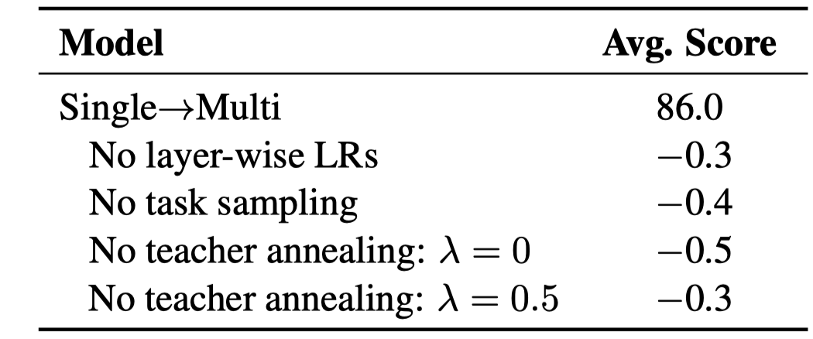
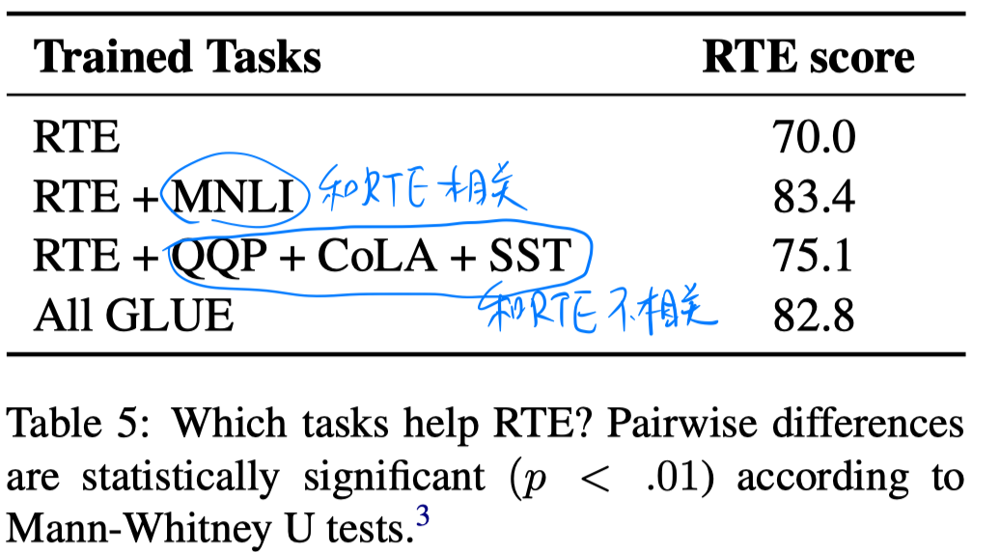

> > ACL2019

## 背景

一般来说训练多任务神经网络的性能很难超过或匹敌同等的单任务网络。

本文提出利用知识蒸馏方法，让单任务模型教导多任务模型。在训练过程中采用教师退火的方法，逐渐地把模型从蒸馏转移到监督学习，从而让多任务模型超过它的单任务教师模型。

> ’Born-again networks‘：教师和学生具备**同样的神经网络架构和模型大小**，然而令人惊讶的是，学生网络的性能超越了教师网络。

## 基本思路

该研究是将 born-again network 扩展到多任务训练的设定中，提出 **Born-Again Multi-tasking模型**。

本文使用多个变体对比 Single->Multi 的born-again知识蒸馏，这些变体包括single->single的知识蒸馏和multi->multi的知识蒸馏，还有single->multi->single->multi的多轮蒸馏。

该研究还提出了一个简单的教师退火（teacher annealing）方法，帮助学生模型超越教师模型。教师退火使得学生模型先从教师模型进行学习，再转移到从gold label进行学习。确保学生模型在训练早期有丰富的训练信号，但又不局限于仅仅模拟教师模型。

## 方法

#### 模型

所有模型均基于BERT构建（即born -again）。

把最后一层[CLS]处的输出表达传到任务特定的分类器中。对于分类任务，使用标准softmax层直接分类。对于回归任务，接一个size是1的nn并使用sigmoid激活函数。

#### 训练

单任务训练和BERT原文一样。

多任务训练，将所有任务的数据混合在一起进行shuffle，最后模型的训练为最小化所有任务上的损失之和。

#### 知识蒸馏

一般的模型训练的损失函数：

知识蒸馏的模型训练的损失函数：

多任务知识蒸馏：

教师退火：

知识蒸馏中**学生**网络要**模仿教师**网络，这有可能导致学生网络受限于教师网络的性能，无法超过教师网络。为了解决该问题，该研究提出**teacher annealing**，在训练过程中混合教师预测和gold label，即

最开始由多个单任务模型教多任务模型学习，而随着**训练的进行**，多任务模型将**更多使用真实任务标签**进行训练(即`λ`从0慢慢变到1)。

## 实验

数据集：GLUE

实验设置：1）多任务训练时，防止大数据集的任务起主导作用，采用 $\left|\mathcal{D}_{\tau}\right|^{0.75}$ 进行任务采样。2）每层使用不同的学习率 $\mathrm{BASE\_LR} \cdot \alpha^{d}$，越底层的学习率越小。（从高层到底层，d逐渐增加，α<1，所以学习率逐渐减小）。

结果：

1. 不同蒸馏变体的结果比较

   

   - 从结果看，知识蒸馏好像不适合回归任务，因为教师模型没有提供类别上的输出分布。
   - single->single相比single的提升  小于 single->multi相比multi的提升，说明知识蒸馏结合多任务学习会更好。
   - single->multi->single->multi的多轮蒸馏 和 single->multi的方式效果差不多。

2. 和GLUE榜单上的其他模型比较

   

3. 多任务训练后再在单个任务上微调

   

   - 使用知识蒸馏的话，再用单任务进行微调提升并不明显。说明蒸馏提供了单任务训练的很多好处。

4. 不同训练策略的消融实验

   

   

5. 结合不同的训练任务进行知识蒸馏的结果比较

   

## 总结

本文结合知识蒸馏和教师退火的方法进行多任务学习，使其结果超过单任务学习的性能。。这在以前的研究中是很难达到的，这种方法的提出使得多任务学习变得更有用。

