> > EMNLP2019

源码：https://github.com/PaddlePaddle/models/tree/develop/PaddleNLP/Research/EMNLP2019-GELE

## 背景

目前对于文本分类任务，局部特征驱动的模型需要叠加多层才能学到长期依赖。这样的方法在有标签数据不足够时可能训练不充分。

本文提出了Encoder1-Encoder2的架构，把全局信息合并到局部信息的抽取过程，使得提取到的局部信息更加instance specific：

- Encoder1负责提供全局信息
- Encoder2是局部特征提取器，输出的结果用于分类器。
- 两个模块之间的交互机制

## 方法

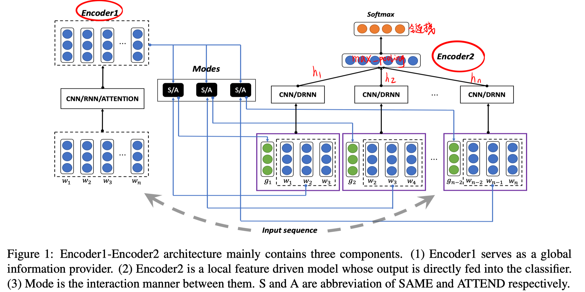

本文只是提出了一个通用架构，三个模块（Encoder1、Encoder2、交互mode）可以使用任何现有的模型。

本文对每个模块都提出了几个示例，在实验部分进行性能比较。

##### Encoder1：全局特征提取

- CNN：CNN（多种宽度的核） + same_pooling

  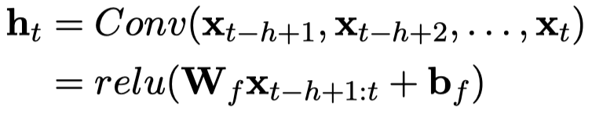

  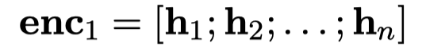

- RNN

  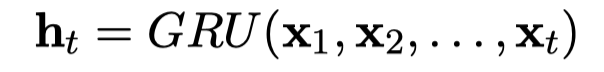

  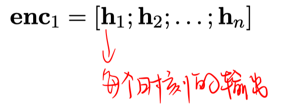

- Attention（在RNN基础上）

  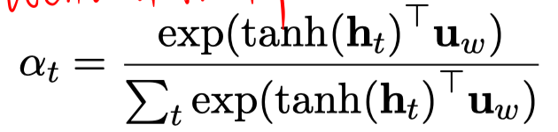

  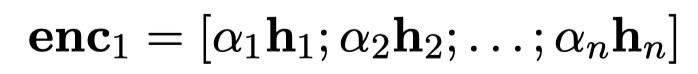

##### Encoder2：局部特征提取

- CNN

  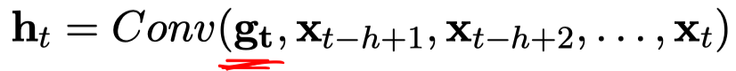

  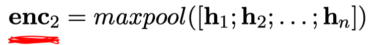

- DRNN

  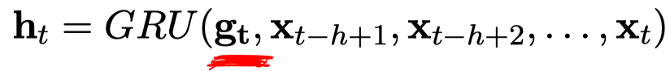

##### 交互模式

- Same

  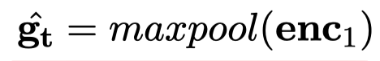

- Atten

  此处的$h_t$是Encoder1的。

  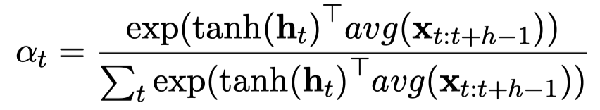

  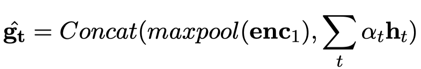

将 $\hat{\mathbf{g}_{\mathrm{t}}}$ 通过MLP得到$g_t$，主要是控制维度和$x_t$一致，以便用到局部特征提取器中。

##### 分类器

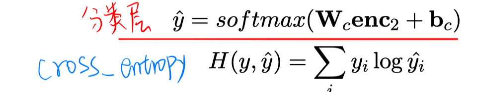

## 实验

##### 数据集

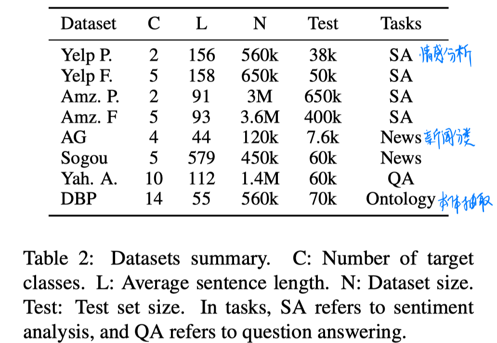

##### 实验结果

1. 基本实验结果

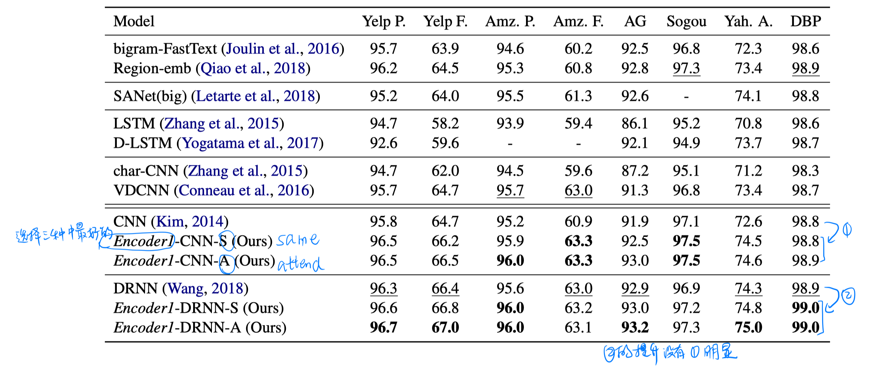

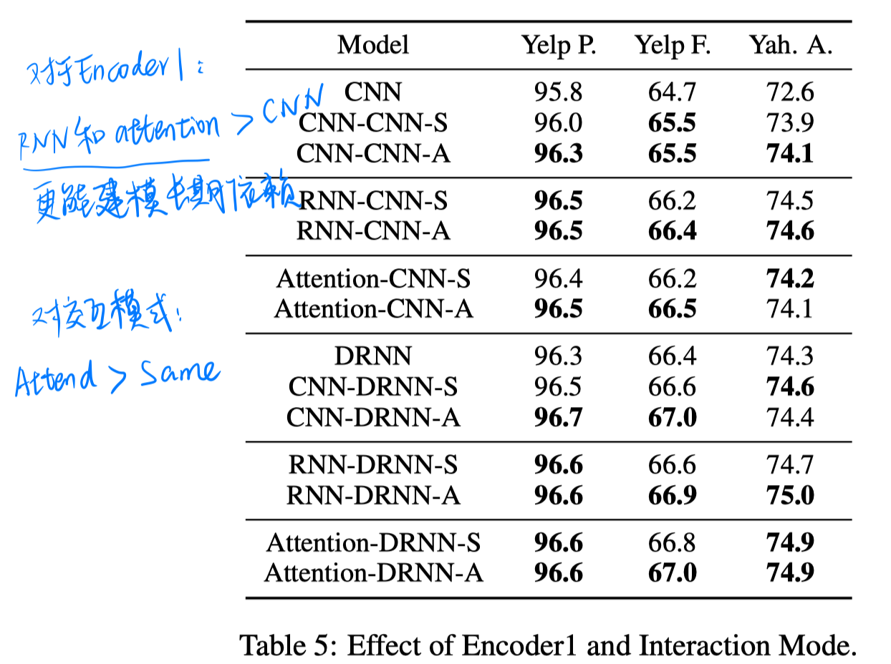

2. 消融实验

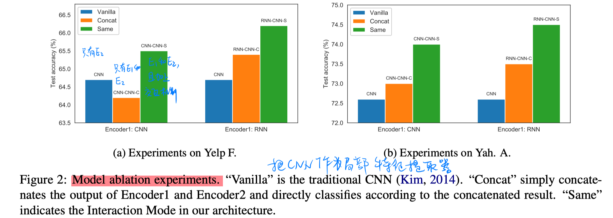

3. 测试窗口大小的影响

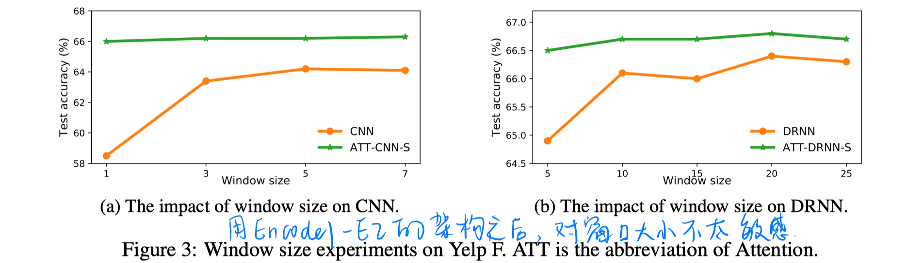

## 思考

1. 从结果来看，这样简单、低量级的方式的确可以使结果有一定的提升。

