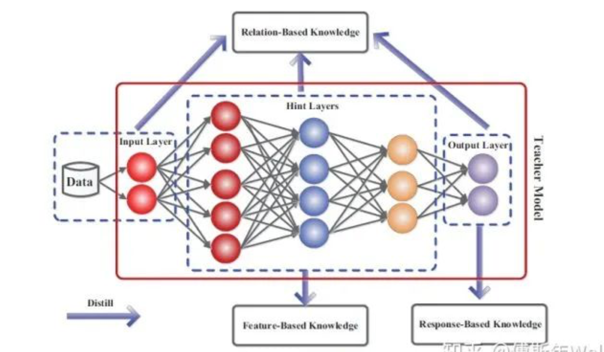
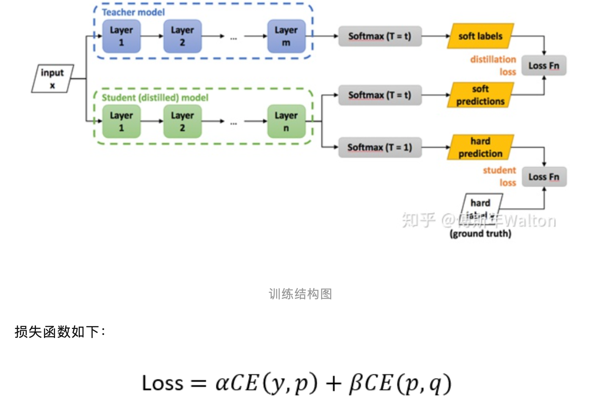
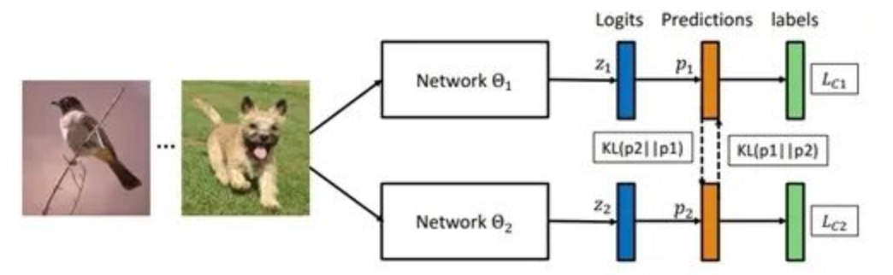
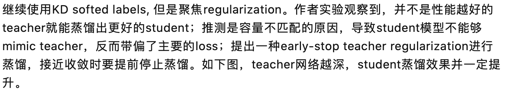
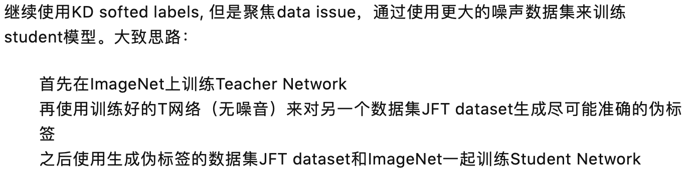
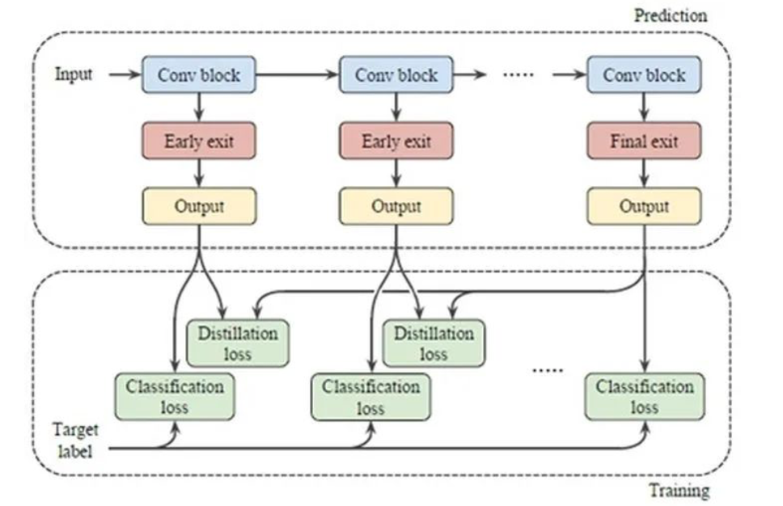

##### Logits(Response)-based knowledge：

- Distilling the Knowledge in a Neural Network Hilton NIPS 2014

  

- Deep mutual learning CVPR 2018

  

- On the efficacy of knowledge distillation, ICCV 2019

  

- Self-training with noisy student improves imagenet classification 2019

  

- Training deep neural networks in generations: A more tolerant teacher educates better students AAAI 2019

- Distillation-based training for multi-exit architectures ICCV 2019

  

##### Feature-based：

- Fitnets: Hints for thin deep nets. ICLR 2015
- Paying more attention to attention: Improving the performance of convolutional neural networks via attention transfer. ICLR 2017

##### Relation-based：

- A gift from knowledge distillation: Fast optimization, network minimization and transfer learning CVPR 2017
- Similarity-preserving knowledge distillation ICCV 2019