> > CoNLL2019，DEER

源码：https://github.com/google-research/google-research/tree/master/dense_representations_for_entity_retrieval/

# 背景

一般的实体消解分两个步骤：1）先检索出一个候选实体集合；2）从这些候选实体中rerank得到最可能的实体。

一般第一阶段通常采用 alias table，其中包含了一些由先验知识计算出的每个mention最可能的对应的topK实体。但是alias table不能覆盖所有情况，而且无法利用上下文信息。

本文提出了DEER（Dual Encoder for Entity Resolution）模型，利用上下文信息分别得到mention和entity的向量表示，再使用近似近邻搜索得到候选实体。

# 模型

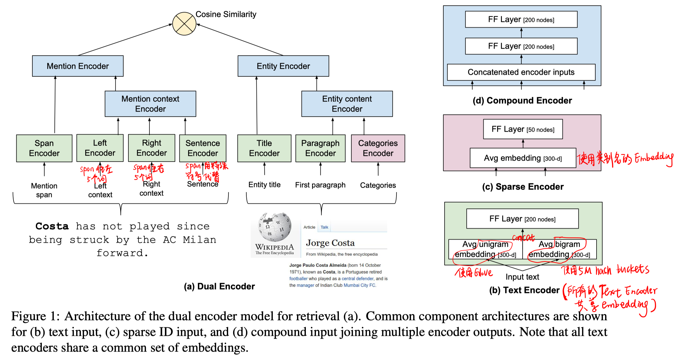

- dual encoder架构（具有层次的子模块）

  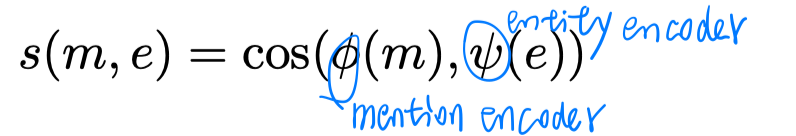

- 负采样策略及模型训练

  - 第一阶段的训练：in-batch random negative（使用cross entropy loss）

    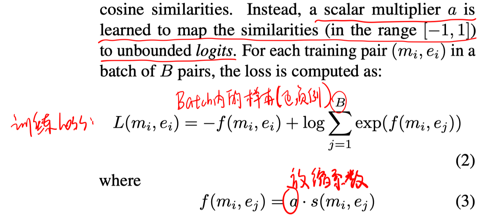

  - 后续的迭代训练：hard negative（多任务训练）

    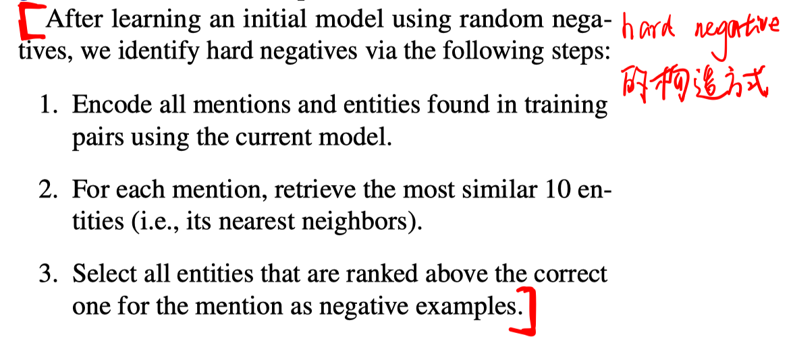

    把这些hard negative和正例混合起来，进行分类任务的训练。

    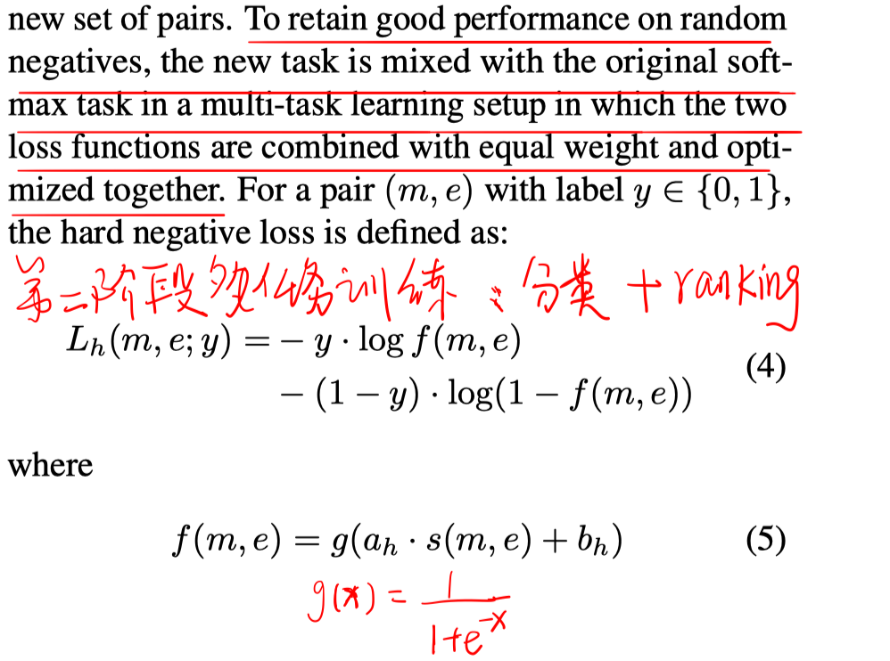

    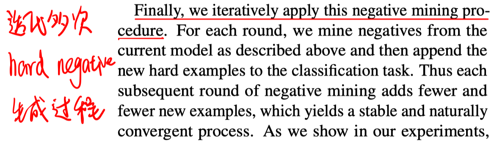

# 实验

##### 数据集

训练数据：Wikipedia中的锚文本和链接页面

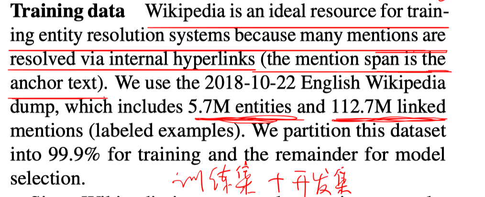

评估集（没有在特定数据集上进行微调）：TACKBP-2010、Wikinews

##### 对比实验

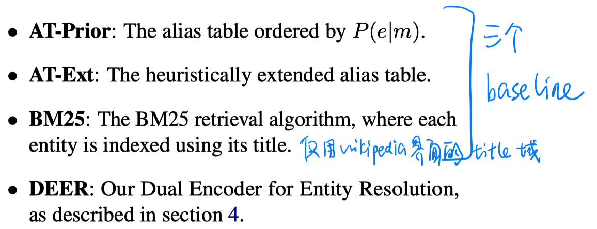

##### 实验结论

- 和fullrank或者rerank模型的recall@1性能对比

  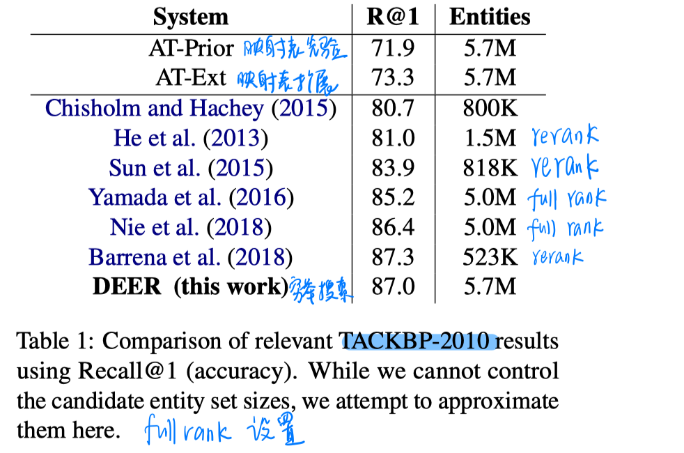

- 和first-stage的检索模型对比recall@100

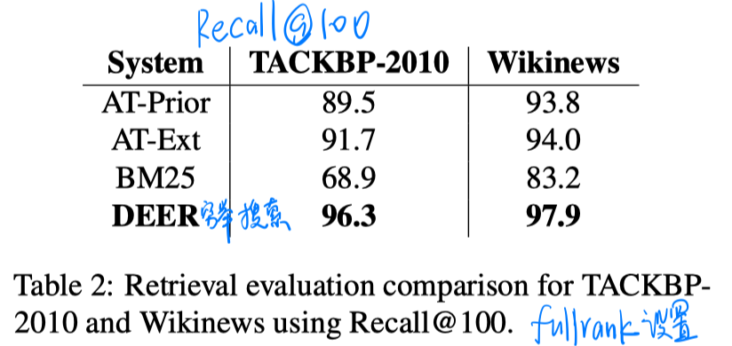

- 近似检索算法效率-性能平衡

  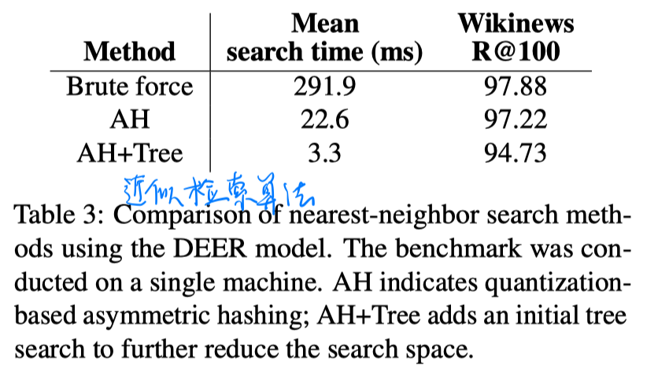

- 负采样策略

  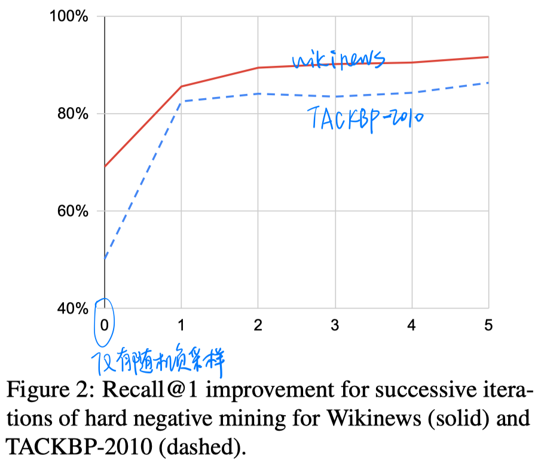

# 结论

- 设计好的负采样策略也很重要（尤其是hard negative）